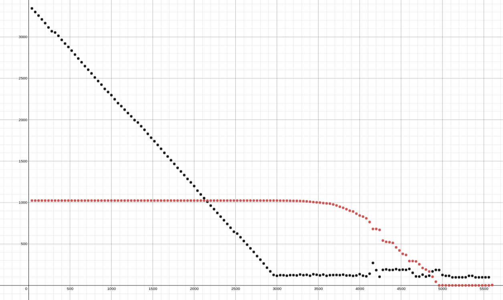
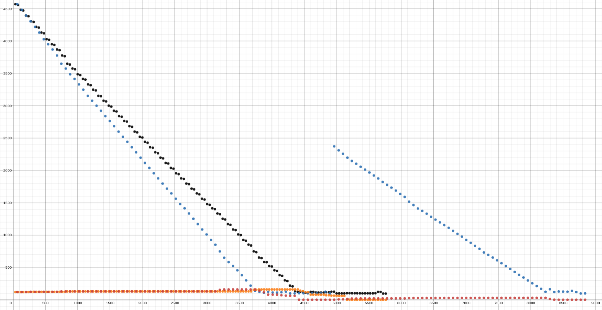

1. **Total RAM**: 7117652 _kB_
2. **Swap size**: 4194300 _kB_
3. **Page size** 2048 _kB_
4. **Mem free** 3413900 _kB_
5. **Free swap size**: 4194300 _kB_

### First test
#### 1.First stage
```
[ 1277.197708] oom-kill:constraint=CONSTRAINT_NONE,nodemask=(null),cpuset=/,mems_allowed=0,global_oom,task_memcg=/user.slice/user-1000.slice/user@1000.service,task=mem.bash,pid=4420,uid=1000
[ 1277.197718] Out of memory: Killed process 4420 (mem.bash) total-vm:7402356kB, anon-rss:4543356kB, file-rss:0kB, shmem-rss:0kB, UID:1000 pgtables:14520kB oom_score_adj:0
[ 1278.433565] oom_reaper: reaped process 4420 (mem.bash), now anon-rss:0kB, file-rss:0kB, shmem-rss:0kB
 ```

**Last log line**: 67000000
```
MiB Mem :   6950.8 total,   3344.7 free,   2152.2 used,   1453.9 buff/cache
MiB Swap:   1024.0 total,   1024.0 free,      0.0 used.   4401.2 avail Mem
   3464 chopchop  20   0    9432   5356   2956 R 100.0   0.1   0:00.17 mem.bash
MiB Mem :   6950.8 total,   3301.6 free,   2194.2 used,   1455.1 buff/cache
MiB Swap:   1024.0 total,   1024.0 free,      0.0 used.   4359.3 avail Mem
   3464 chopchop  20   0   54180  50236   2956 R  99.7   0.7   0:03.17 mem.bash
MiB Mem :   6950.8 total,   3258.2 free,   2237.6 used,   1455.1 buff/cache
MiB Swap:   1024.0 total,   1024.0 free,      0.0 used.   4315.9 avail Mem
   3464 chopchop  20   0   99456  95644   2956 R  99.7   1.3   0:06.18 mem.bash
MiB Mem :   6950.8 total,   3212.0 free,   2283.6 used,   1455.2 buff/cache
MiB Swap:   1024.0 total,   1024.0 free,      0.0 used.   4269.8 avail Mem
   3464 chopchop  20   0  144600 140524   2956 R 100.0   2.0   0:09.20 mem.bash
MiB Mem :   6950.8 total,   3167.0 free,   2328.6 used,   1455.3 buff/cache
MiB Swap:   1024.0 total,   1024.0 free,      0.0 used.   4224.9 avail Mem
   3464 chopchop  20   0  189612 185668   2956 R  99.7   2.6   0:12.21 mem.bash
MiB Mem :   6950.8 total,   3115.1 free,   2380.4 used,   1455.3 buff/cache
MiB Swap:   1024.0 total,   1024.0 free,      0.0 used.   4173.0 avail Mem
   3464 chopchop  20   0  234624 230548   2956 R  99.7   3.2   0:15.21 mem.bash
MiB Mem :   6950.8 total,   3069.3 free,   2426.2 used,   1455.3 buff/cache
MiB Swap:   1024.0 total,   1024.0 free,      0.0 used.   4127.3 avail Mem
   3464 chopchop  20   0  279636 275692   2956 R 100.0   3.9   0:18.22 mem.bash
MiB Mem :   6950.8 total,   3053.8 free,   2441.7 used,   1455.4 buff/cache
MiB Swap:   1024.0 total,   1024.0 free,      0.0 used.   4112.7 avail Mem
   3464 chopchop  20   0  324516 320572   2956 R 100.0   4.5   0:21.24 mem.bash
MiB Mem :   6950.8 total,   3014.1 free,   2481.3 used,   1455.4 buff/cache
MiB Swap:   1024.0 total,   1024.0 free,      0.0 used.   4073.1 avail Mem
   3464 chopchop  20   0  369396 365452   2956 R  99.7   5.1   0:24.25 mem.bash
MiB Mem :   6950.8 total,   2964.8 free,   2530.6 used,   1455.4 buff/cache
MiB Swap:   1024.0 total,   1024.0 free,      0.0 used.   4023.8 avail Mem
   3464 chopchop  20   0  414540 410596   2956 R  99.7   5.8   0:27.25 mem.bash
MiB Mem :   6950.8 total,   2920.3 free,   2575.0 used,   1455.5 buff/cache
MiB Swap:   1024.0 total,   1024.0 free,      0.0 used.   3976.9 avail Mem
   3464 chopchop  20   0  459288 455476   2956 R 100.0   6.4   0:30.26 mem.bash
MiB Mem :   6950.8 total,   2879.1 free,   2616.2 used,   1455.5 buff/cache
MiB Swap:   1024.0 total,   1024.0 free,      0.0 used.   3935.7 avail Mem
   3464 chopchop  20   0  504300 500356   2956 R 100.0   7.0   0:33.27 mem.bash
MiB Mem :   6950.8 total,   2835.2 free,   2660.1 used,   1455.6 buff/cache
MiB Swap:   1024.0 total,   1024.0 free,      0.0 used.   3891.9 avail Mem
   3464 chopchop  20   0  549444 545500   2956 R 100.0   7.7   0:36.28 mem.bash
MiB Mem :   6950.8 total,   2787.7 free,   2707.6 used,   1455.6 buff/cache
MiB Swap:   1024.0 total,   1024.0 free,      0.0 used.   3844.9 avail Mem
   3464 chopchop  20   0  594456 590644   2956 R  99.7   8.3   0:39.28 mem.bash
MiB Mem :   6950.8 total,   2740.0 free,   2755.2 used,   1455.6 buff/cache
MiB Swap:   1024.0 total,   1024.0 free,      0.0 used.   3797.2 avail Mem
   3464 chopchop  20   0  639600 635524   2956 R 100.0   8.9   0:42.29 mem.bash
MiB Mem :   6950.8 total,   2694.7 free,   2800.5 used,   1455.7 buff/cache
MiB Swap:   1024.0 total,   1024.0 free,      0.0 used.   3752.0 avail Mem
   3464 chopchop  20   0  684480 680668   2956 R  99.7   9.6   0:45.29 mem.bash
MiB Mem :   6950.8 total,   2647.6 free,   2847.5 used,   1455.7 buff/cache
MiB Swap:   1024.0 total,   1024.0 free,      0.0 used.   3705.9 avail Mem
   3464 chopchop  20   0  729492 725548   2956 R 100.0  10.2   0:48.30 mem.bash
MiB Mem :   6950.8 total,   2604.5 free,   2890.6 used,   1455.7 buff/cache
MiB Swap:   1024.0 total,   1024.0 free,      0.0 used.   3662.8 avail Mem
   3464 chopchop  20   0  774636 770692   2956 R 100.0  10.8   0:51.32 mem.bash
MiB Mem :   6950.8 total,   2559.7 free,   2935.4 used,   1455.7 buff/cache
MiB Swap:   1024.0 total,   1024.0 free,      0.0 used.   3618.0 avail Mem
   3464 chopchop  20   0  819516 815572   2956 R  99.7  11.5   0:54.33 mem.bash
MiB Mem :   6950.8 total,   2511.0 free,   2984.1 used,   1455.7 buff/cache
MiB Swap:   1024.0 total,   1024.0 free,      0.0 used.   3569.4 avail Mem
   3464 chopchop  20   0  864264 860188   2956 R  99.7  12.1   0:57.33 mem.bash
MiB Mem :   6950.8 total,   2467.9 free,   3027.1 used,   1455.8 buff/cache
MiB Swap:   1024.0 total,   1024.0 free,      0.0 used.   3526.3 avail Mem
   3464 chopchop  20   0  909144 905068   2956 R 100.0  12.7   1:00.34 mem.bash
MiB Mem :   6950.8 total,   2424.2 free,   3070.8 used,   1455.8 buff/cache
MiB Swap:   1024.0 total,   1024.0 free,      0.0 used.   3482.6 avail Mem
   3464 chopchop  20   0  953892 949948   2956 R 100.0  13.3   1:03.35 mem.bash
MiB Mem :   6950.8 total,   2372.9 free,   3116.3 used,   1461.6 buff/cache
MiB Swap:   1024.0 total,   1024.0 free,      0.0 used.   3431.4 avail Mem
   3464 chopchop  20   0  997848 993772   2956 R 100.0  14.0   1:06.36 mem.bash
MiB Mem :   6950.8 total,   2335.1 free,   3154.3 used,   1461.4 buff/cache
MiB Swap:   1024.0 total,   1024.0 free,      0.0 used.   3394.7 avail Mem
   3464 chopchop  20   0 1041804   1.0g   2956 R 100.0  14.6   1:09.37 mem.bash
MiB Mem :   6950.8 total,   2297.2 free,   3197.2 used,   1456.5 buff/cache
MiB Swap:   1024.0 total,   1024.0 free,      0.0 used.   3356.9 avail Mem
   3464 chopchop  20   0 1086552   1.0g   2956 R  99.7  15.2   1:12.37 mem.bash
MiB Mem :   6950.8 total,   2248.0 free,   3246.5 used,   1456.4 buff/cache
MiB Swap:   1024.0 total,   1024.0 free,      0.0 used.   3308.2 avail Mem
   3464 chopchop  20   0 1130904   1.1g   2956 R 100.0  15.8   1:15.38 mem.bash
MiB Mem :   6950.8 total,   2200.7 free,   3293.7 used,   1456.4 buff/cache
MiB Swap:   1024.0 total,   1024.0 free,      0.0 used.   3261.0 avail Mem
   3464 chopchop  20   0 1175652   1.1g   2956 R  99.7  16.5   1:18.38 mem.bash
MiB Mem :   6950.8 total,   2164.8 free,   3329.6 used,   1456.4 buff/cache
MiB Swap:   1024.0 total,   1024.0 free,      0.0 used.   3225.2 avail Mem
   3464 chopchop  20   0 1220004   1.2g   2956 R 100.0  17.1   1:21.40 mem.bash
MiB Mem :   6950.8 total,   2122.0 free,   3372.4 used,   1456.4 buff/cache
MiB Swap:   1024.0 total,   1024.0 free,      0.0 used.   3182.4 avail Mem
   3464 chopchop  20   0 1264620   1.2g   2956 R 100.0  17.7   1:24.41 mem.bash
MiB Mem :   6950.8 total,   2080.7 free,   3413.7 used,   1456.5 buff/cache
MiB Swap:   1024.0 total,   1024.0 free,      0.0 used.   3141.2 avail Mem
   3464 chopchop  20   0 1309368   1.2g   2956 R  99.3  18.3   1:27.41 mem.bash
MiB Mem :   6950.8 total,   2041.4 free,   3452.9 used,   1456.5 buff/cache
MiB Swap:   1024.0 total,   1024.0 free,      0.0 used.   3098.9 avail Mem
   3464 chopchop  20   0 1353852   1.3g   2956 R 100.0  19.0   1:30.42 mem.bash
MiB Mem :   6950.8 total,   1996.0 free,   3498.3 used,   1456.5 buff/cache
MiB Swap:   1024.0 total,   1024.0 free,      0.0 used.   3053.5 avail Mem
   3464 chopchop  20   0 1398864   1.3g   2956 R 100.0  19.6   1:33.43 mem.bash
MiB Mem :   6950.8 total,   1966.9 free,   3527.3 used,   1456.6 buff/cache
MiB Swap:   1024.0 total,   1024.0 free,      0.0 used.   3024.5 avail Mem
   3464 chopchop  20   0 1443480   1.4g   2956 R  99.7  20.2   1:36.44 mem.bash
MiB Mem :   6950.8 total,   1922.1 free,   3572.1 used,   1456.6 buff/cache
MiB Swap:   1024.0 total,   1024.0 free,      0.0 used.   2980.2 avail Mem
   3464 chopchop  20   0 1488228   1.4g   2956 R 100.0  20.9   1:39.45 mem.bash
MiB Mem :   6950.8 total,   1878.6 free,   3615.6 used,   1456.6 buff/cache
MiB Swap:   1024.0 total,   1024.0 free,      0.0 used.   2936.7 avail Mem
   3464 chopchop  20   0 1533108   1.5g   2956 R 100.0  21.5   1:42.46 mem.bash
MiB Mem :   6950.8 total,   1830.0 free,   3664.2 used,   1456.7 buff/cache
MiB Swap:   1024.0 total,   1024.0 free,      0.0 used.   2889.1 avail Mem
   3464 chopchop  20   0 1577988   1.5g   2956 R 100.0  22.1   1:45.47 mem.bash
MiB Mem :   6950.8 total,   1782.9 free,   3711.2 used,   1456.7 buff/cache
MiB Swap:   1024.0 total,   1024.0 free,      0.0 used.   2842.1 avail Mem
   3464 chopchop  20   0 1623000   1.5g   2956 R  99.7  22.7   1:48.48 mem.bash
MiB Mem :   6950.8 total,   1740.8 free,   3753.3 used,   1456.7 buff/cache
MiB Swap:   1024.0 total,   1024.0 free,      0.0 used.   2800.0 avail Mem
   3464 chopchop  20   0 1667748   1.6g   2956 R 100.0  23.4   1:51.49 mem.bash
MiB Mem :   6950.8 total,   1696.3 free,   3797.8 used,   1456.7 buff/cache
MiB Swap:   1024.0 total,   1024.0 free,      0.0 used.   2755.5 avail Mem
   3464 chopchop  20   0 1712760   1.6g   2956 R  99.7  24.0   1:54.49 mem.bash
MiB Mem :   6950.8 total,   1649.5 free,   3844.6 used,   1456.8 buff/cache
MiB Swap:   1024.0 total,   1024.0 free,      0.0 used.   2708.8 avail Mem
   3464 chopchop  20   0 1757244   1.7g   2956 R 100.0  24.6   1:57.51 mem.bash
MiB Mem :   6950.8 total,   1600.5 free,   3893.5 used,   1456.8 buff/cache
MiB Swap:   1024.0 total,   1024.0 free,      0.0 used.   2659.8 avail Mem
   3464 chopchop  20   0 1801992   1.7g   2956 R 100.0  25.3   2:00.52 mem.bash
MiB Mem :   6950.8 total,   1556.6 free,   3937.4 used,   1456.8 buff/cache
MiB Swap:   1024.0 total,   1024.0 free,      0.0 used.   2616.0 avail Mem
   3464 chopchop  20   0 1846608   1.8g   2956 R  99.7  25.9   2:03.52 mem.bash
MiB Mem :   6950.8 total,   1511.3 free,   3982.6 used,   1456.9 buff/cache
MiB Swap:   1024.0 total,   1024.0 free,      0.0 used.   2570.7 avail Mem
   3464 chopchop  20   0 1891356   1.8g   2956 R 100.0  26.5   2:06.53 mem.bash
MiB Mem :   6950.8 total,   1466.5 free,   4027.4 used,   1456.9 buff/cache
MiB Swap:   1024.0 total,   1024.0 free,      0.0 used.   2525.8 avail Mem
   3464 chopchop  20   0 1936368   1.8g   2956 R  99.7  27.1   2:09.54 mem.bash
MiB Mem :   6950.8 total,   1419.3 free,   4074.6 used,   1456.9 buff/cache
MiB Swap:   1024.0 total,   1024.0 free,      0.0 used.   2479.7 avail Mem
   3464 chopchop  20   0 1981116   1.9g   2956 R 100.0  27.8   2:12.55 mem.bash
MiB Mem :   6950.8 total,   1375.7 free,   4118.2 used,   1456.9 buff/cache
MiB Swap:   1024.0 total,   1024.0 free,      0.0 used.   2436.1 avail Mem
   3464 chopchop  20   0 2025996   1.9g   2956 R 100.0  28.4   2:15.56 mem.bash
MiB Mem :   6950.8 total,   1331.9 free,   4161.9 used,   1457.0 buff/cache
MiB Swap:   1024.0 total,   1024.0 free,      0.0 used.   2392.8 avail Mem
   3464 chopchop  20   0 2070876   2.0g   2956 R  99.7  29.0   2:18.57 mem.bash
MiB Mem :   6950.8 total,   1285.3 free,   4208.5 used,   1457.0 buff/cache
MiB Swap:   1024.0 total,   1024.0 free,      0.0 used.   2346.2 avail Mem
   3464 chopchop  20   0 2115624   2.0g   2956 R 100.0  29.7   2:21.59 mem.bash
MiB Mem :   6950.8 total,   1243.7 free,   4250.1 used,   1457.1 buff/cache
MiB Swap:   1024.0 total,   1024.0 free,      0.0 used.   2304.7 avail Mem
   3464 chopchop  20   0 2160372   2.1g   2956 R 100.0  30.3   2:24.60 mem.bash
MiB Mem :   6950.8 total,   1199.3 free,   4294.4 used,   1457.1 buff/cache
MiB Swap:   1024.0 total,   1024.0 free,      0.0 used.   2260.3 avail Mem
   3464 chopchop  20   0 2204988   2.1g   2956 R  99.3  30.9   2:27.60 mem.bash
MiB Mem :   6950.8 total,   1144.0 free,   4349.5 used,   1457.3 buff/cache
MiB Swap:   1024.0 total,   1024.0 free,      0.0 used.   2202.3 avail Mem
   3464 chopchop  20   0 2249868   2.1g   2956 R 100.0  31.6   2:30.62 mem.bash
MiB Mem :   6950.8 total,   1098.6 free,   4394.9 used,   1457.3 buff/cache
MiB Swap:   1024.0 total,   1024.0 free,      0.0 used.   2156.9 avail Mem
   3464 chopchop  20   0 2294484   2.2g   2956 R  99.7  32.2   2:33.62 mem.bash
MiB Mem :   6950.8 total,   1053.8 free,   4439.6 used,   1457.4 buff/cache
MiB Swap:   1024.0 total,   1024.0 free,      0.0 used.   2112.2 avail Mem
   3464 chopchop  20   0 2339496   2.2g   2956 R 100.0  32.8   2:36.64 mem.bash
MiB Mem :   6950.8 total,   1010.3 free,   4483.2 used,   1457.4 buff/cache
MiB Swap:   1024.0 total,   1024.0 free,      0.0 used.   2069.1 avail Mem
   3464 chopchop  20   0 2384244   2.3g   2956 R  99.3  33.4   2:39.64 mem.bash
MiB Mem :   6950.8 total,    963.1 free,   4530.4 used,   1457.4 buff/cache
MiB Swap:   1024.0 total,   1024.0 free,      0.0 used.   2021.9 avail Mem
   3464 chopchop  20   0 2429124   2.3g   2956 R 100.0  34.1   2:42.66 mem.bash
MiB Mem :   6950.8 total,    920.7 free,   4572.7 used,   1457.4 buff/cache
MiB Swap:   1024.0 total,   1024.0 free,      0.0 used.   1979.6 avail Mem
   3464 chopchop  20   0 2474004   2.4g   2956 R  99.7  34.7   2:45.66 mem.bash
MiB Mem :   6950.8 total,    875.2 free,   4618.2 used,   1457.5 buff/cache
MiB Swap:   1024.0 total,   1024.0 free,      0.0 used.   1935.1 avail Mem
   3464 chopchop  20   0 2518884   2.4g   2956 R 100.0  35.3   2:48.67 mem.bash
MiB Mem :   6950.8 total,    830.1 free,   4663.3 used,   1457.5 buff/cache
MiB Swap:   1024.0 total,   1024.0 free,      0.0 used.   1890.0 avail Mem
   3464 chopchop  20   0 2563764   2.4g   2956 R 100.0  36.0   2:51.69 mem.bash
MiB Mem :   6950.8 total,    786.8 free,   4706.5 used,   1457.5 buff/cache
MiB Swap:   1024.0 total,   1024.0 free,      0.0 used.   1846.8 avail Mem
   3464 chopchop  20   0 2608512   2.5g   2956 R  99.7  36.6   2:54.69 mem.bash
MiB Mem :   6950.8 total,    742.0 free,   4751.3 used,   1457.5 buff/cache
MiB Swap:   1024.0 total,   1024.0 free,      0.0 used.   1802.0 avail Mem
   3464 chopchop  20   0 2653524   2.5g   2956 R 100.0  37.2   2:57.71 mem.bash
MiB Mem :   6950.8 total,    696.2 free,   4797.1 used,   1457.5 buff/cache
MiB Swap:   1024.0 total,   1024.0 free,      0.0 used.   1756.3 avail Mem
   3464 chopchop  20   0 2698140   2.6g   2956 R 100.0  37.9   3:00.72 mem.bash
MiB Mem :   6950.8 total,    648.0 free,   4845.3 used,   1457.5 buff/cache
MiB Swap:   1024.0 total,   1024.0 free,      0.0 used.   1708.0 avail Mem
   3464 chopchop  20   0 2743020   2.6g   2956 R  99.7  38.5   3:03.72 mem.bash
MiB Mem :   6950.8 total,    625.3 free,   4868.0 used,   1457.6 buff/cache
MiB Swap:   1024.0 total,   1024.0 free,      0.0 used.   1686.3 avail Mem
   3464 chopchop  20   0 2787636   2.7g   2956 R 100.0  39.1   3:06.73 mem.bash
MiB Mem :   6950.8 total,    581.7 free,   4911.5 used,   1457.6 buff/cache
MiB Swap:   1024.0 total,   1024.0 free,      0.0 used.   1642.8 avail Mem
   3464 chopchop  20   0 2832384   2.7g   2956 R 100.0  39.7   3:09.75 mem.bash
MiB Mem :   6950.8 total,    536.0 free,   4957.2 used,   1457.6 buff/cache
MiB Swap:   1024.0 total,   1024.0 free,      0.0 used.   1597.1 avail Mem
   3464 chopchop  20   0 2877264   2.7g   2956 R  99.7  40.4   3:12.75 mem.bash
MiB Mem :   6950.8 total,    492.1 free,   5001.0 used,   1457.6 buff/cache
MiB Swap:   1024.0 total,   1024.0 free,      0.0 used.   1553.3 avail Mem
   3464 chopchop  20   0 2922144   2.8g   2956 R 100.0  41.0   3:15.76 mem.bash
MiB Mem :   6950.8 total,    447.2 free,   5046.0 used,   1457.6 buff/cache
MiB Swap:   1024.0 total,   1024.0 free,      0.0 used.   1508.3 avail Mem
   3464 chopchop  20   0 2966892   2.8g   2956 R 100.0  41.6   3:18.78 mem.bash
MiB Mem :   6950.8 total,    403.4 free,   5089.7 used,   1457.7 buff/cache
MiB Swap:   1024.0 total,   1024.0 free,      0.0 used.   1464.6 avail Mem
   3464 chopchop  20   0 3011772   2.9g   2956 R 100.0  42.3   3:21.79 mem.bash
MiB Mem :   6950.8 total,    353.5 free,   5139.7 used,   1457.7 buff/cache
MiB Swap:   1024.0 total,   1024.0 free,      0.0 used.   1414.7 avail Mem
   3464 chopchop  20   0 3056652   2.9g   2956 R 100.0  42.9   3:24.80 mem.bash
MiB Mem :   6950.8 total,    310.4 free,   5182.7 used,   1457.7 buff/cache
MiB Swap:   1024.0 total,   1024.0 free,      0.0 used.   1371.6 avail Mem
   3464 chopchop  20   0 3101400   3.0g   2956 R  99.3  43.5   3:27.80 mem.bash
MiB Mem :   6950.8 total,    264.1 free,   5229.0 used,   1457.7 buff/cache
MiB Swap:   1024.0 total,   1024.0 free,      0.0 used.   1322.9 avail Mem
   3464 chopchop  20   0 3146016   3.0g   2956 R 100.0  44.1   3:30.81 mem.bash
MiB Mem :   6950.8 total,    213.8 free,   5279.3 used,   1457.8 buff/cache
MiB Swap:   1024.0 total,   1024.0 free,      0.0 used.   1272.5 avail Mem
   3464 chopchop  20   0 3190896   3.0g   2956 R 100.0  44.8   3:33.82 mem.bash
MiB Mem :   6950.8 total,    169.3 free,   5323.7 used,   1457.8 buff/cache
MiB Swap:   1024.0 total,   1024.0 free,      0.0 used.   1228.1 avail Mem
   3464 chopchop  20   0 3235644   3.1g   2956 R 100.0  45.4   3:36.84 mem.bash
MiB Mem :   6950.8 total,    125.8 free,   5367.2 used,   1457.8 buff/cache
MiB Swap:   1024.0 total,   1024.0 free,      0.0 used.   1185.6 avail Mem
   3464 chopchop  20   0 3279996   3.1g   2956 R  99.7  46.0   3:39.85 mem.bash
MiB Mem :   6950.8 total,    115.7 free,   5403.0 used,   1432.0 buff/cache
MiB Swap:   1024.0 total,   1024.0 free,      0.0 used.   1152.4 avail Mem
   3464 chopchop  20   0 3324480   3.2g   2956 R 100.0  46.7   3:42.86 mem.bash
MiB Mem :   6950.8 total,    123.3 free,   5442.8 used,   1384.6 buff/cache
MiB Swap:   1024.0 total,   1023.2 free,      0.8 used.   1114.1 avail Mem
   3464 chopchop  20   0 3369228   3.2g   2956 R 100.0  47.3   3:45.87 mem.bash
MiB Mem :   6950.8 total,    122.4 free,   5485.4 used,   1343.0 buff/cache
MiB Swap:   1024.0 total,   1023.2 free,      0.8 used.   1072.8 avail Mem
   3464 chopchop  20   0 3413976   3.3g   2956 R  99.3  47.9   3:48.87 mem.bash
MiB Mem :   6950.8 total,    116.8 free,   5528.0 used,   1306.0 buff/cache
MiB Swap:   1024.0 total,   1023.2 free,      0.8 used.   1030.2 avail Mem
   3464 chopchop  20   0 3458724   3.3g   2956 R 100.0  48.5   3:51.89 mem.bash
MiB Mem :   6950.8 total,    123.5 free,   5575.6 used,   1251.7 buff/cache
MiB Swap:   1024.0 total,   1021.7 free,      2.3 used.    985.3 avail Mem
   3464 chopchop  20   0 3503340   3.3g   2956 R 100.0  49.2   3:54.90 mem.bash
MiB Mem :   6950.8 total,    123.7 free,   5620.2 used,   1206.9 buff/cache
MiB Swap:   1024.0 total,   1020.7 free,      3.3 used.    942.2 avail Mem
   3464 chopchop  20   0 3547956   3.4g   2956 R  99.7  49.8   3:57.91 mem.bash
MiB Mem :   6950.8 total,    119.9 free,   5665.1 used,   1165.9 buff/cache
MiB Swap:   1024.0 total,   1020.7 free,      3.3 used.    897.7 avail Mem
   3464 chopchop  20   0 3592572   3.4g   2956 R  99.7  50.4   4:00.91 mem.bash
MiB Mem :   6950.8 total,    131.2 free,   5703.0 used,   1116.6 buff/cache
MiB Swap:   1024.0 total,   1019.2 free,      4.8 used.    862.2 avail Mem
   3464 chopchop  20   0 3637188   3.5g   2956 R 100.0  51.0   4:03.92 mem.bash
MiB Mem :   6950.8 total,    123.0 free,   5743.3 used,   1084.5 buff/cache
MiB Swap:   1024.0 total,   1017.4 free,      6.5 used.    823.7 avail Mem
   3464 chopchop  20   0 3681804   3.5g   2956 R 100.0  51.7   4:06.93 mem.bash
MiB Mem :   6950.8 total,    127.6 free,   5784.2 used,   1039.0 buff/cache
MiB Swap:   1024.0 total,   1014.7 free,      9.3 used.    783.8 avail Mem
   3464 chopchop  20   0 3726420   3.6g   2956 R 100.0  52.3   4:09.94 mem.bash
MiB Mem :   6950.8 total,    116.8 free,   5825.8 used,   1008.3 buff/cache
MiB Swap:   1024.0 total,   1010.7 free,     13.3 used.    744.1 avail Mem
   3464 chopchop  20   0 3771168   3.6g   2956 R 100.0  52.9   4:12.95 mem.bash
MiB Mem :   6950.8 total,    134.8 free,   5868.2 used,    947.9 buff/cache
MiB Swap:   1024.0 total,   1005.9 free,     18.1 used.    702.0 avail Mem
   3464 chopchop  20   0 3816048   3.6g   2956 R  99.7  53.6   4:15.95 mem.bash
MiB Mem :   6950.8 total,    128.3 free,   5911.7 used,    910.8 buff/cache
MiB Swap:   1024.0 total,   1002.6 free,     21.4 used.    659.7 avail Mem
   3464 chopchop  20   0 3860796   3.7g   2956 R 100.0  54.2   4:18.96 mem.bash
MiB Mem :   6950.8 total,    120.5 free,   5956.2 used,    874.2 buff/cache
MiB Swap:   1024.0 total,    999.6 free,     24.4 used.    619.5 avail Mem
   3464 chopchop  20   0 3905676   3.7g   2956 R 100.0  54.8   4:21.97 mem.bash
MiB Mem :   6950.8 total,    130.4 free,   5998.3 used,    822.1 buff/cache
MiB Swap:   1024.0 total,    993.8 free,     30.2 used.    581.4 avail Mem
   3464 chopchop  20   0 3950424   3.8g   2944 R  99.7  55.4   4:24.97 mem.bash
MiB Mem :   6950.8 total,    115.6 free,   6044.7 used,    790.5 buff/cache
MiB Swap:   1024.0 total,    990.0 free,     33.9 used.    537.5 avail Mem
   3464 chopchop  20   0 3995304   3.8g   2944 R 100.0  56.1   4:27.99 mem.bash
MiB Mem :   6950.8 total,    123.2 free,   6086.1 used,    741.5 buff/cache
MiB Swap:   1024.0 total,    987.0 free,     37.0 used.    496.4 avail Mem
   3464 chopchop  20   0 4039920   3.8g   2944 R  99.7  56.7   4:30.99 mem.bash
MiB Mem :   6950.8 total,    124.9 free,   6128.0 used,    698.0 buff/cache
MiB Swap:   1024.0 total,    977.7 free,     46.3 used.    457.6 avail Mem
   3464 chopchop  20   0 4084668   3.9g   2944 R 100.0  57.3   4:34.00 mem.bash
MiB Mem :   6950.8 total,    125.6 free,   6166.5 used,    658.7 buff/cache
MiB Swap:   1024.0 total,    964.9 free,     59.1 used.    421.1 avail Mem
   3464 chopchop  20   0 4129416   3.9g   2868 R  99.7  58.0   4:37.01 mem.bash
MiB Mem :   6950.8 total,    123.5 free,   6204.1 used,    623.2 buff/cache
MiB Swap:   1024.0 total,    949.6 free,     74.4 used.    386.6 avail Mem
   3464 chopchop  20   0 4174164   4.0g   2568 R 100.0  58.6   4:40.02 mem.bash
MiB Mem :   6950.8 total,    129.2 free,   6232.0 used,    589.7 buff/cache
MiB Swap:   1024.0 total,    936.5 free,     87.5 used.    354.6 avail Mem
   3464 chopchop  20   0 4218912   4.0g   2568 R 100.0  59.2   4:43.03 mem.bash
MiB Mem :   6950.8 total,    119.1 free,   6273.1 used,    558.6 buff/cache
MiB Swap:   1024.0 total,    920.1 free,    103.9 used.    324.3 avail Mem
   3464 chopchop  20   0 4263660   4.1g   2568 R 100.0  59.8   4:46.04 mem.bash
MiB Mem :   6950.8 total,    120.8 free,   6312.0 used,    518.1 buff/cache
MiB Swap:   1024.0 total,    901.8 free,    122.2 used.    290.5 avail Mem
   3464 chopchop  20   0 4307616   4.1g   2568 R  97.7  60.5   4:48.99 mem.bash
MiB Mem :   6950.8 total,    114.7 free,   6346.1 used,    490.0 buff/cache
MiB Swap:   1024.0 total,    892.7 free,    131.3 used.    259.7 avail Mem
   3464 chopchop  20   0 4352496   4.1g   2568 R 100.0  61.1   4:52.00 mem.bash
MiB Mem :   6950.8 total,    119.4 free,   6371.2 used,    460.2 buff/cache
MiB Swap:   1024.0 total,    866.3 free,    157.7 used.    234.6 avail Mem
   3464 chopchop  20   0 4397244   4.2g   2568 R 100.0  61.7   4:55.02 mem.bash
MiB Mem :   6950.8 total,    135.5 free,   6381.4 used,    433.9 buff/cache
MiB Swap:   1024.0 total,    843.7 free,    180.3 used.    224.1 avail Mem
   3464 chopchop  20   0 4441992   4.2g   2568 R  99.3  62.3   4:58.02 mem.bash
MiB Mem :   6950.8 total,    117.1 free,   6400.8 used,    432.9 buff/cache
MiB Swap:   1024.0 total,    830.4 free,    193.6 used.    205.0 avail Mem
   3464 chopchop  20   0 4486740   4.3g   2568 R 100.0  63.0   5:01.03 mem.bash
MiB Mem :   6950.8 total,    109.3 free,   6431.6 used,    409.9 buff/cache
MiB Swap:   1024.0 total,    809.7 free,    214.3 used.    174.1 avail Mem
   3464 chopchop  20   0 4531488   4.3g   2568 R 100.0  63.6   5:04.04 mem.bash
MiB Mem :   6950.8 total,    140.9 free,   6445.9 used,    364.1 buff/cache
MiB Swap:   1024.0 total,    765.2 free,    258.8 used.    143.7 avail Mem
   3464 chopchop  20   0 4575972   4.4g   2568 R 100.0  64.2   5:07.06 mem.bash
MiB Mem :   6950.8 total,    271.1 free,   6428.4 used,    251.3 buff/cache
MiB Swap:   1024.0 total,    681.4 free,    342.6 used.    216.1 avail Mem
   3464 chopchop  20   0 4620456   4.4g   2032 R  99.7  64.8   5:10.07 mem.bash
MiB Mem :   6950.8 total,    183.9 free,   6470.9 used,    296.0 buff/cache
MiB Swap:   1024.0 total,    681.6 free,    342.4 used.    152.0 avail Mem
   3464 chopchop  20   0 4665204   4.4g   2032 R  99.7  65.5   5:13.07 mem.bash
MiB Mem :   6950.8 total,    104.1 free,   6519.7 used,    327.1 buff/cache
MiB Swap:   1024.0 total,    670.1 free,    353.9 used.     87.8 avail Mem
   3464 chopchop  20   0 4709688   4.5g   2032 R  99.7  66.1   5:16.07 mem.bash
MiB Mem :   6950.8 total,    187.3 free,   6435.2 used,    328.3 buff/cache
MiB Swap:   1024.0 total,    541.5 free,    482.5 used.    171.8 avail Mem
   3464 chopchop  20   0 4710348   4.5g   2032 D   3.4  66.1   5:16.20 mem.bash
MiB Mem :   6950.8 total,    193.6 free,   6428.3 used,    328.9 buff/cache
MiB Swap:   1024.0 total,    525.7 free,    498.3 used.    178.5 avail Mem
   3464 chopchop  20   0 4710348   4.5g   2032 D   0.3  66.1   5:16.21 mem.bash
MiB Mem :   6950.8 total,    185.6 free,   6433.4 used,    331.8 buff/cache
MiB Swap:   1024.0 total,    521.5 free,    502.5 used.    172.3 avail Mem
   3464 chopchop  20   0 4710612   4.5g   2032 D   2.7  66.1   5:16.29 mem.bash
MiB Mem :   6950.8 total,    186.9 free,   6428.2 used,    335.8 buff/cache
MiB Swap:   1024.0 total,    513.2 free,    510.8 used.    175.0 avail Mem
   3464 chopchop  20   0 4710612   4.5g   2032 D   0.0  66.1   5:16.29 mem.bash
MiB Mem :   6950.8 total,    196.4 free,   6422.4 used,    332.0 buff/cache
MiB Swap:   1024.0 total,    459.5 free,    564.5 used.    182.4 avail Mem
   3464 chopchop  20   0 4740576   4.5g   2032 R  71.8  66.5   5:18.45 mem.bash
MiB Mem :   6950.8 total,    186.7 free,   6434.4 used,    329.7 buff/cache
MiB Swap:   1024.0 total,    421.6 free,    602.4 used.    171.6 avail Mem
   3464 chopchop  20   0 4782024   4.6g   2032 R  98.7  67.1   5:21.43 mem.bash
MiB Mem :   6950.8 total,    190.2 free,   6441.2 used,    319.4 buff/cache
MiB Swap:   1024.0 total,    380.5 free,    643.5 used.    169.9 avail Mem
   3464 chopchop  20   0 4817796   4.6g   2032 D  87.4  67.6   5:24.06 mem.bash
MiB Mem :   6950.8 total,    187.7 free,   6443.0 used,    320.2 buff/cache
MiB Swap:   1024.0 total,    367.4 free,    656.6 used.    168.2 avail Mem
   3464 chopchop  20   0 4826112   4.6g   2032 R  22.2  67.7   5:24.73 mem.bash
MiB Mem :   6950.8 total,    198.4 free,   6438.7 used,    313.8 buff/cache
MiB Swap:   1024.0 total,    293.8 free,    730.2 used.    175.7 avail Mem
   3464 chopchop  20   0 4870332   4.6g   2032 R  99.7  68.4   5:27.73 mem.bash
MiB Mem :   6950.8 total,    152.0 free,   6484.6 used,    314.2 buff/cache
MiB Swap:   1024.0 total,    294.3 free,    729.7 used.    129.5 avail Mem
   3464 chopchop  20   0 4915344   4.7g   2032 R 100.0  69.0   5:30.74 mem.bash
MiB Mem :   6950.8 total,    108.1 free,   6526.3 used,    316.4 buff/cache
MiB Swap:   1024.0 total,    289.6 free,    734.4 used.     87.3 avail Mem
   3464 chopchop  20   0 4959960   4.7g   2032 R 100.0  69.6   5:33.75 mem.bash
MiB Mem :   6950.8 total,    106.4 free,   6541.2 used,    303.3 buff/cache
MiB Swap:   1024.0 total,    255.2 free,    768.8 used.     79.0 avail Mem
   3464 chopchop  20   0 5004708   4.8g   2032 R 100.0  70.2   5:36.76 mem.bash
MiB Mem :   6950.8 total,    129.1 free,   6549.0 used,    272.8 buff/cache
MiB Swap:   1024.0 total,    210.0 free,    814.0 used.     86.0 avail Mem
   3464 chopchop  20   0 5044836   4.8g   2032 R  92.7  70.8   5:39.55 mem.bash
MiB Mem :   6950.8 total,    105.2 free,   6564.5 used,    281.1 buff/cache
MiB Swap:   1024.0 total,    191.2 free,    832.8 used.     66.3 avail Mem
   3464 chopchop  20   0 5076516   4.8g   2032 D  70.2  71.3   5:41.67 mem.bash
MiB Mem :   6950.8 total,    116.8 free,   6553.0 used,    281.0 buff/cache
MiB Swap:   1024.0 total,    167.6 free,    856.4 used.     78.0 avail Mem
   3464 chopchop  20   0 5076912   4.8g   2020 D   2.3  71.3   5:41.74 mem.bash
MiB Mem :   6950.8 total,    168.9 free,   6505.0 used,    276.9 buff/cache
MiB Swap:   1024.0 total,    104.5 free,    919.5 used.    127.6 avail Mem
   3464 chopchop  20   0 5079024   4.8g   2020 R  10.3  71.3   5:42.05 mem.bash
MiB Mem :   6950.8 total,    186.8 free,   6486.6 used,    277.4 buff/cache
MiB Swap:   1024.0 total,     44.3 free,    979.7 used.    145.9 avail Mem
   3464 chopchop  20   0 5101068   4.9g   2020 D  35.5  71.6   5:43.81 mem.bash
MiB Mem :   6950.8 total,    185.4 free,   6484.3 used,    281.2 buff/cache
MiB Swap:   1024.0 total,      0.2 free,   1023.8 used.    146.9 avail Mem
   3464 chopchop  20   0 5136708   4.9g   2020 R  81.4  72.1   5:46.26 mem.bash
MiB Mem :   6950.8 total,    125.4 free,   6529.6 used,    295.9 buff/cache
MiB Swap:   1024.0 total,      0.9 free,   1023.1 used.     94.0 avail Mem
   3464 chopchop  20   0 5181324   4.9g   2020 R  99.7  72.7   5:49.27 mem.bash
MiB Mem :   6950.8 total,    115.4 free,   6579.8 used,    255.6 buff/cache
MiB Swap:   1024.0 total,      0.2 free,   1023.8 used.     63.5 avail Mem
   3464 chopchop  20   0 5226072   5.0g   1748 R  99.7  73.4   5:52.27 mem.bash
MiB Mem :   6950.8 total,    115.1 free,   6618.6 used,    217.2 buff/cache
MiB Swap:   1024.0 total,      0.0 free,   1024.0 used.     43.6 avail Mem
   3464 chopchop  20   0 5270424   5.0g    644 R 100.0  74.0   5:55.28 mem.bash
MiB Mem :   6950.8 total,     97.1 free,   6634.4 used,    219.4 buff/cache
MiB Swap:   1024.0 total,      0.0 free,   1024.0 used.     25.0 avail Mem
   3464 chopchop  20   0 5286792   5.0g    576 R  40.7  74.2   5:56.51 mem.bash
MiB Mem :   6950.8 total,     96.7 free,   6648.9 used,    205.2 buff/cache
MiB Swap:   1024.0 total,      0.0 free,   1024.0 used.     17.6 avail Mem
   3464 chopchop  20   0 5297352   5.0g    296 D  29.5  74.3   5:57.40 mem.bash
MiB Mem :   6950.8 total,     97.5 free,   6651.2 used,    202.2 buff/cache
MiB Swap:   1024.0 total,      0.0 free,   1024.0 used.     16.8 avail Mem
   3464 chopchop  20   0 5297352   5.0g    108 D   0.0  74.3   5:57.40 mem.bash
MiB Mem :   6950.8 total,     97.3 free,   6653.1 used,    200.4 buff/cache
MiB Swap:   1024.0 total,      0.0 free,   1024.0 used.     15.8 avail Mem
   3464 chopchop  20   0 5297352   5.0g     96 D   0.0  74.3   5:57.40 mem.bash
MiB Mem :   6950.8 total,     97.8 free,   6677.7 used,    175.3 buff/cache
MiB Swap:   1024.0 total,      0.0 free,   1024.0 used.      3.5 avail Mem
   3464 chopchop  20   0 5321244   5.1g    340 R  70.1  74.7   5:59.51 mem.bash
MiB Mem :   6950.8 total,    115.4 free,   6579.8 used,    255.6 buff/cache
MiB Swap:   1024.0 total,      0.2 free,   1023.8 used.     63.5 avail Mem
   3464 chopchop  20   0 5226072   5.0g   1748 R  99.7  73.4   5:52.27 mem.bash
MiB Mem :   6950.8 total,    115.1 free,   6618.6 used,    217.2 buff/cache
MiB Swap:   1024.0 total,      0.0 free,   1024.0 used.     43.6 avail Mem
   3464 chopchop  20   0 5270424   5.0g    644 R 100.0  74.0   5:55.28 mem.bash
MiB Mem :   6950.8 total,     97.1 free,   6634.4 used,    219.4 buff/cache
MiB Swap:   1024.0 total,      0.0 free,   1024.0 used.     25.0 avail Mem
   3464 chopchop  20   0 5286792   5.0g    576 R  40.7  74.2   5:56.51 mem.bash
MiB Mem :   6950.8 total,     96.7 free,   6648.9 used,    205.2 buff/cache
MiB Swap:   1024.0 total,      0.0 free,   1024.0 used.     17.6 avail Mem
   3464 chopchop  20   0 5297352   5.0g    296 D  29.5  74.3   5:57.40 mem.bash
MiB Mem :   6950.8 total,     97.5 free,   6651.2 used,    202.2 buff/cache
MiB Swap:   1024.0 total,      0.0 free,   1024.0 used.     16.8 avail Mem
   3464 chopchop  20   0 5297352   5.0g    108 D   0.0  74.3   5:57.40 mem.bash
MiB Mem :   6950.8 total,     97.3 free,   6653.1 used,    200.4 buff/cache
MiB Swap:   1024.0 total,      0.0 free,   1024.0 used.     15.8 avail Mem
   3464 chopchop  20   0 5297352   5.0g     96 D   0.0  74.3   5:57.40 mem.bash
MiB Mem :   6950.8 total,     97.8 free,   6677.7 used,    175.3 buff/cache
MiB Swap:   1024.0 total,      0.0 free,   1024.0 used.      3.5 avail Mem
   3464 chopchop  20   0 5321244   5.1g    340 R  70.1  74.7   5:59.51 mem.bash
MiB Mem :   6950.8 total,   5143.8 free,   1483.0 used,    324.0 buff/cache
MiB Swap:   1024.0 total,      4.7 free,   1019.3 used.   5124.0 avail Mem
```
```
[  784.989050] Out of memory: Killed process 3464 (mem.bash) total-vm:5327316kB, anon-rss:5320592kB, file-rss:196kB, shmem-rss:0kB, UID:1000 pgtables:10468kB oom_score_adj:0
[  785.197505] oom_reaper: reaped process 3464 (mem.bash), now anon-rss:0kB, file-rss:0kB, shmem-rss:0kB

```
**Last log line**: 68000000
\
FreeMem

#### 2.Second stage
mem.bash
```

MiB Mem :   6950.8 total,   4571.6 free,   1823.8 used,    555.4 buff/cache
MiB Swap:   1024.0 total,    119.6 free,    904.4 used.   4783.4 avail Mem
   6663 chopchop  20   0    9828   5776   2856 R  93.8   0.1   0:00.17 mem.bash
MiB Mem :   6950.8 total,   4558.1 free,   1837.2 used,    555.4 buff/cache
MiB Swap:   1024.0 total,    119.6 free,    904.4 used.   4770.0 avail Mem
   6663 chopchop  20   0   15240  11056   2856 R  17.6   0.2   0:00.53 mem.bash
MiB Mem :   6950.8 total,   4484.1 free,   1911.2 used,    555.6 buff/cache
MiB Swap:   1024.0 total,    119.6 free,    904.4 used.   4696.1 avail Mem
   6663 chopchop  20   0   54180  50128   2856 R  98.3   0.7   0:03.13 mem.bash
MiB Mem :   6950.8 total,   4473.1 free,   1922.1 used,    555.6 buff/cache
MiB Swap:   1024.0 total,    119.6 free,    904.4 used.   4685.1 avail Mem
   6663 chopchop  20   0   59592  55672   2856 R  98.7   0.8   0:03.50 mem.bash
MiB Mem :   6950.8 total,   4395.1 free,   2000.2 used,    555.6 buff/cache
MiB Swap:   1024.0 total,    120.8 free,    903.2 used.   4607.1 avail Mem
   6663 chopchop  20   0   98532  94480   2856 R  99.7   1.3   0:06.13 mem.bash
MiB Mem :   6950.8 total,   4384.8 free,   2010.4 used,    555.6 buff/cache
MiB Swap:   1024.0 total,    120.8 free,    903.2 used.   4596.8 avail Mem
   6663 chopchop  20   0  103944 100024   2856 R  99.7   1.4   0:06.50 mem.bash
MiB Mem :   6950.8 total,   4306.2 free,   2089.0 used,    555.6 buff/cache
MiB Swap:   1024.0 total,    122.8 free,    901.2 used.   4519.3 avail Mem
   6663 chopchop  20   0  143280 139096   2856 R 100.0   2.0   0:09.14 mem.bash
MiB Mem :   6950.8 total,   4296.4 free,   2098.8 used,    555.6 buff/cache
MiB Swap:   1024.0 total,    122.8 free,    901.2 used.   4509.5 avail Mem
   6663 chopchop  20   0  148692 144640   2856 R 100.0   2.0   0:09.51 mem.bash
MiB Mem :   6950.8 total,   4220.3 free,   2174.8 used,    555.7 buff/cache
MiB Swap:   1024.0 total,    122.8 free,    901.2 used.   4433.4 avail Mem
   6663 chopchop  20   0  187632 183712   2856 R 100.0   2.6   0:12.15 mem.bash
MiB Mem :   6950.8 total,   4209.1 free,   2186.1 used,    555.7 buff/cache
MiB Swap:   1024.0 total,    122.8 free,    901.2 used.   4422.2 avail Mem
   6663 chopchop  20   0  193176 188992   2856 R 100.0   2.7   0:12.52 mem.bash
MiB Mem :   6950.8 total,   4132.4 free,   2262.7 used,    555.7 buff/cache
MiB Swap:   1024.0 total,    122.8 free,    901.2 used.   4345.5 avail Mem
   6663 chopchop  20   0  232512 228328   2856 R  99.7   3.2   0:15.16 mem.bash
MiB Mem :   6950.8 total,   4120.1 free,   2275.0 used,    555.7 buff/cache
MiB Swap:   1024.0 total,    122.8 free,    901.2 used.   4333.2 avail Mem
   6663 chopchop  20   0  237792 233872   2856 R  99.7   3.3   0:15.52 mem.bash
MiB Mem :   6950.8 total,   4030.1 free,   2357.7 used,    563.0 buff/cache
MiB Swap:   1024.0 total,    122.8 free,    901.2 used.   4244.2 avail Mem
   6663 chopchop  20   0  274356 270304   2856 R 100.0   3.8   0:18.16 mem.bash
MiB Mem :   6950.8 total,   4020.4 free,   2367.3 used,    563.2 buff/cache
MiB Swap:   1024.0 total,    122.8 free,    901.2 used.   4234.6 avail Mem
   6663 chopchop  20   0  279504 275320   2856 R 100.0   3.9   0:18.53 mem.bash
MiB Mem :   6950.8 total,   3952.7 free,   2442.0 used,    556.1 buff/cache
MiB Swap:   1024.0 total,    122.8 free,    901.2 used.   4166.9 avail Mem
   6663 chopchop  20   0  317652 313600   2856 R 100.0   4.4   0:21.17 mem.bash
MiB Mem :   6950.8 total,   3941.7 free,   2452.3 used,    556.8 buff/cache
MiB Swap:   1024.0 total,    122.8 free,    901.2 used.   4155.9 avail Mem
   6663 chopchop  20   0  322800 318616   2856 R  99.7   4.5   0:21.53 mem.bash
MiB Mem :   6950.8 total,   3870.9 free,   2523.7 used,    556.3 buff/cache
MiB Swap:   1024.0 total,    122.8 free,    901.2 used.   4085.2 avail Mem
   6663 chopchop  20   0  360948 356896   2856 R  99.7   5.0   0:24.17 mem.bash
MiB Mem :   6950.8 total,   3860.3 free,   2534.2 used,    556.3 buff/cache
MiB Swap:   1024.0 total,    122.8 free,    901.2 used.   4074.6 avail Mem
   6663 chopchop  20   0  366492 362440   2856 R 100.0   5.1   0:24.54 mem.bash
MiB Mem :   6950.8 total,   3778.0 free,   2610.9 used,    561.9 buff/cache
MiB Swap:   1024.0 total,    123.1 free,    900.9 used.   3993.1 avail Mem
   6663 chopchop  20   0  402396 398344   2856 R 100.0   5.6   0:27.18 mem.bash
MiB Mem :   6950.8 total,   3766.6 free,   2622.3 used,    561.9 buff/cache
MiB Swap:   1024.0 total,    123.1 free,    900.9 used.   3981.8 avail Mem
   6663 chopchop  20   0  407676 403624   2856 R 100.0   5.7   0:27.55 mem.bash
MiB Mem :   6950.8 total,   3650.5 free,   2702.4 used,    597.9 buff/cache
MiB Swap:   1024.0 total,    128.1 free,    895.9 used.   3897.9 avail Mem
   6663 chopchop  20   0  444900 440848   2856 R  99.7   6.2   0:30.18 mem.bash
MiB Mem :   6950.8 total,   3638.1 free,   2714.8 used,    597.9 buff/cache
MiB Swap:   1024.0 total,    128.1 free,    895.9 used.   3885.5 avail Mem
   6663 chopchop  20   0  449916 445864   2856 R  99.7   6.3   0:30.55 mem.bash
MiB Mem :   6950.8 total,   3576.0 free,   2782.9 used,    592.0 buff/cache
MiB Swap:   1024.0 total,    128.6 free,    895.4 used.   3823.6 avail Mem
   6663 chopchop  20   0  486084 482032   2856 R 100.0   6.8   0:33.19 mem.bash
MiB Mem :   6950.8 total,   3564.8 free,   2793.8 used,    592.2 buff/cache
MiB Swap:   1024.0 total,    128.6 free,    895.4 used.   3812.4 avail Mem
   6663 chopchop  20   0  490968 487048   2856 R  99.7   6.8   0:33.55 mem.bash
MiB Mem :   6950.8 total,   3487.0 free,   2869.7 used,    594.2 buff/cache
MiB Swap:   1024.0 total,    128.8 free,    895.2 used.   3734.8 avail Mem
   6663 chopchop  20   0  527532 523480   2856 R  99.7   7.4   0:36.19 mem.bash
MiB Mem :   6950.8 total,   3475.0 free,   2881.7 used,    594.2 buff/cache
MiB Swap:   1024.0 total,    128.8 free,    895.2 used.   3722.8 avail Mem
   6663 chopchop  20   0  532548 528496   2856 R 100.0   7.4   0:36.56 mem.bash
MiB Mem :   6950.8 total,   3415.8 free,   2945.4 used,    589.6 buff/cache
MiB Swap:   1024.0 total,    128.8 free,    895.2 used.   3663.7 avail Mem
   6663 chopchop  20   0  568188 564136   2856 R 100.0   7.9   0:39.20 mem.bash
MiB Mem :   6950.8 total,   3405.1 free,   2955.6 used,    590.1 buff/cache
MiB Swap:   1024.0 total,    128.8 free,    895.2 used.   3653.1 avail Mem
   6663 chopchop  20   0  573072 568888   2856 R 100.0   8.0   0:39.57 mem.bash
MiB Mem :   6950.8 total,   3331.1 free,   3030.1 used,    589.6 buff/cache
MiB Swap:   1024.0 total,    128.8 free,    895.2 used.   3579.6 avail Mem
   6663 chopchop  20   0  608976 605056   2856 R  99.7   8.5   0:42.21 mem.bash
MiB Mem :   6950.8 total,   3318.7 free,   3041.3 used,    590.8 buff/cache
MiB Swap:   1024.0 total,    128.8 free,    895.2 used.   3567.2 avail Mem
   6663 chopchop  20   0  613992 609808   2856 R  99.7   8.6   0:42.57 mem.bash
MiB Mem :   6950.8 total,   3249.5 free,   3111.7 used,    589.6 buff/cache
MiB Swap:   1024.0 total,    128.8 free,    895.2 used.   3494.4 avail Mem
   6663 chopchop  20   0  648972 644920   2856 R  99.7   9.1   0:45.21 mem.bash
MiB Mem :   6950.8 total,   3237.6 free,   3122.4 used,    590.9 buff/cache
MiB Swap:   1024.0 total,    128.8 free,    895.2 used.   3482.5 avail Mem
   6663 chopchop  20   0  653724 649672   2856 R 100.0   9.1   0:45.58 mem.bash
MiB Mem :   6950.8 total,   3153.2 free,   3202.9 used,    594.7 buff/cache
MiB Swap:   1024.0 total,    128.8 free,    895.2 used.   3398.2 avail Mem
   6663 chopchop  20   0  688176 684256   2856 R  99.7   9.6   0:48.21 mem.bash
MiB Mem :   6950.8 total,   3148.0 free,   3211.9 used,    591.0 buff/cache
MiB Swap:   1024.0 total,    128.8 free,    895.2 used.   3393.1 avail Mem
   6663 chopchop  20   0  692928 688744   2856 R  99.7   9.7   0:48.58 mem.bash
MiB Mem :   6950.8 total,   3077.9 free,   3283.4 used,    589.6 buff/cache
MiB Swap:   1024.0 total,    128.8 free,    895.2 used.   3322.9 avail Mem
   6663 chopchop  20   0  727248 723328   2856 R 100.0  10.2   0:51.22 mem.bash
MiB Mem :   6950.8 total,   3066.9 free,   3293.5 used,    590.5 buff/cache
MiB Swap:   1024.0 total,    128.8 free,    895.2 used.   3312.9 avail Mem
   6663 chopchop  20   0  731868 727816   2856 R  99.7  10.2   0:51.58 mem.bash
MiB Mem :   6950.8 total,   3001.8 free,   3359.4 used,    589.6 buff/cache
MiB Swap:   1024.0 total,    128.8 free,    895.2 used.   3247.9 avail Mem
   6663 chopchop  20   0  765924 761872   2856 R  99.7  10.7   0:54.22 mem.bash
MiB Mem :   6950.8 total,   2988.0 free,   3371.8 used,    591.0 buff/cache
MiB Swap:   1024.0 total,    128.8 free,    895.2 used.   3234.1 avail Mem
   6663 chopchop  20   0  770544 766360   2856 R 100.0  10.8   0:54.59 mem.bash
MiB Mem :   6950.8 total,   2923.2 free,   3438.1 used,    589.5 buff/cache
MiB Swap:   1024.0 total,    129.1 free,    894.9 used.   3169.3 avail Mem
   6663 chopchop  20   0  804204 800152   2856 R 100.0  11.2   0:57.23 mem.bash
MiB Mem :   6950.8 total,   2912.1 free,   3446.7 used,    592.0 buff/cache
MiB Swap:   1024.0 total,    129.1 free,    894.9 used.   3158.3 avail Mem
   6663 chopchop  20   0  808692 804640   2856 R  99.7  11.3   0:57.59 mem.bash
MiB Mem :   6950.8 total,   2840.9 free,   3520.3 used,    589.6 buff/cache
MiB Swap:   1024.0 total,    129.1 free,    894.9 used.   3087.1 avail Mem
   6663 chopchop  20   0  841956 837904   2856 R 100.0  11.8   1:00.24 mem.bash
MiB Mem :   6950.8 total,   2830.7 free,   3527.7 used,    592.4 buff/cache
MiB Swap:   1024.0 total,    129.1 free,    894.9 used.   3077.0 avail Mem
   6663 chopchop  20   0  846180 842128   2856 R 100.0  11.8   1:00.60 mem.bash
MiB Mem :   6950.8 total,   2765.1 free,   3596.1 used,    589.7 buff/cache
MiB Swap:   1024.0 total,    129.1 free,    894.9 used.   3011.4 avail Mem
   6663 chopchop  20   0  878784 874600   2856 R 100.0  12.3   1:03.25 mem.bash
MiB Mem :   6950.8 total,   2755.6 free,   3602.5 used,    592.7 buff/cache
MiB Swap:   1024.0 total,    129.1 free,    894.9 used.   3001.9 avail Mem
   6663 chopchop  20   0  883140 879088   2856 R 100.0  12.4   1:03.61 mem.bash
MiB Mem :   6950.8 total,   2685.2 free,   3675.9 used,    589.7 buff/cache
MiB Swap:   1024.0 total,    129.1 free,    894.9 used.   2931.5 avail Mem
   6663 chopchop  20   0  916536 912616   2856 R 100.0  12.8   1:06.26 mem.bash
MiB Mem :   6950.8 total,   2673.6 free,   3685.1 used,    592.2 buff/cache
MiB Swap:   1024.0 total,    129.1 free,    894.9 used.   2919.9 avail Mem
   6663 chopchop  20   0  920892 916840   2856 R  99.7  12.9   1:06.61 mem.bash
MiB Mem :   6950.8 total,   2600.3 free,   3760.8 used,    589.8 buff/cache
MiB Swap:   1024.0 total,    129.1 free,    894.9 used.   2846.7 avail Mem
   6663 chopchop  20   0  954024 950104   2856 R  99.3  13.3   1:09.26 mem.bash
MiB Mem :   6950.8 total,   2588.7 free,   3769.6 used,    592.6 buff/cache
MiB Swap:   1024.0 total,    129.1 free,    894.9 used.   2835.1 avail Mem
   6663 chopchop  20   0  958248 954064   2856 R  99.7  13.4   1:09.61 mem.bash
MiB Mem :   6950.8 total,   2519.9 free,   3841.1 used,    589.8 buff/cache
MiB Swap:   1024.0 total,    129.1 free,    894.9 used.   2766.3 avail Mem
   6663 chopchop  20   0  991380 987328   2856 R 100.0  13.9   1:12.27 mem.bash
MiB Mem :   6950.8 total,   2509.3 free,   3849.0 used,    592.5 buff/cache
MiB Swap:   1024.0 total,    129.1 free,    894.9 used.   2755.7 avail Mem
   6663 chopchop  20   0  995472 991552   2856 R 100.0  13.9   1:12.63 mem.bash
MiB Mem :   6950.8 total,   2442.2 free,   3918.8 used,    589.8 buff/cache
MiB Swap:   1024.0 total,    129.1 free,    894.9 used.   2688.7 avail Mem
   6663 chopchop  20   0 1028736   1.0g   2856 R 100.0  14.4   1:15.28 mem.bash
MiB Mem :   6950.8 total,   2428.5 free,   3929.5 used,    592.8 buff/cache
MiB Swap:   1024.0 total,    129.1 free,    894.9 used.   2674.9 avail Mem
   6663 chopchop  20   0 1032828   1.0g   2856 R  99.7  14.5   1:15.63 mem.bash
MiB Mem :   6950.8 total,   2358.7 free,   4002.3 used,    589.8 buff/cache
MiB Swap:   1024.0 total,    129.1 free,    894.9 used.   2605.1 avail Mem
   6663 chopchop  20   0 1066092   1.0g   2856 R  99.7  14.9   1:18.29 mem.bash
MiB Mem :   6950.8 total,   2350.7 free,   4007.7 used,    592.4 buff/cache
MiB Swap:   1024.0 total,    129.1 free,    894.9 used.   2597.1 avail Mem
   6663 chopchop  20   0 1070316   1.0g   2856 R  99.7  15.0   1:18.63 mem.bash
MiB Mem :   6950.8 total,   2280.6 free,   4080.4 used,    589.8 buff/cache
MiB Swap:   1024.0 total,    129.1 free,    894.9 used.   2527.0 avail Mem
   6663 chopchop  20   0 1103052   1.0g   2856 R 100.0  15.4   1:21.30 mem.bash
MiB Mem :   6950.8 total,   2266.2 free,   4091.8 used,    592.8 buff/cache
MiB Swap:   1024.0 total,    129.1 free,    894.9 used.   2512.7 avail Mem
   6663 chopchop  20   0 1107408   1.1g   2856 R 100.0  15.5   1:21.64 mem.bash
MiB Mem :   6950.8 total,   2197.9 free,   4163.1 used,    589.9 buff/cache
MiB Swap:   1024.0 total,    129.1 free,    894.9 used.   2445.4 avail Mem
   6663 chopchop  20   0 1140672   1.1g   2856 R  99.7  16.0   1:24.30 mem.bash
MiB Mem :   6950.8 total,   2186.5 free,   4171.7 used,    592.7 buff/cache
MiB Swap:   1024.0 total,    129.1 free,    894.9 used.   2434.0 avail Mem
   6663 chopchop  20   0 1144764   1.1g   2856 R  99.7  16.0   1:24.64 mem.bash
MiB Mem :   6950.8 total,   2115.8 free,   4245.2 used,    589.9 buff/cache
MiB Swap:   1024.0 total,    129.1 free,    894.9 used.   2363.3 avail Mem
   6663 chopchop  20   0 1177632   1.1g   2856 R  99.7  16.5   1:27.31 mem.bash
MiB Mem :   6950.8 total,   2107.2 free,   4251.6 used,    592.1 buff/cache
MiB Swap:   1024.0 total,    129.1 free,    894.9 used.   2354.7 avail Mem
   6663 chopchop  20   0 1181460   1.1g   2856 R 100.0  16.5   1:27.65 mem.bash
MiB Mem :   6950.8 total,   2038.7 free,   4322.2 used,    589.9 buff/cache
MiB Swap:   1024.0 total,    129.1 free,    894.9 used.   2286.7 avail Mem
   6663 chopchop  20   0 1215252   1.2g   2856 R 100.0  17.0   1:30.32 mem.bash
MiB Mem :   6950.8 total,   2027.2 free,   4330.7 used,    592.9 buff/cache
MiB Swap:   1024.0 total,    129.1 free,    894.9 used.   2275.2 avail Mem
   6663 chopchop  20   0 1219344   1.2g   2856 R  99.7  17.1   1:30.65 mem.bash
MiB Mem :   6950.8 total,   1956.3 free,   4404.6 used,    589.9 buff/cache
MiB Swap:   1024.0 total,    129.3 free,    894.7 used.   2204.3 avail Mem
   6663 chopchop  20   0 1252740   1.2g   2856 R 100.0  17.5   1:33.33 mem.bash
MiB Mem :   6950.8 total,   1943.0 free,   4414.9 used,    592.9 buff/cache
MiB Swap:   1024.0 total,    129.3 free,    894.7 used.   2191.1 avail Mem
   6663 chopchop  20   0 1256832   1.2g   2856 R 100.0  17.6   1:33.66 mem.bash
MiB Mem :   6950.8 total,   1877.4 free,   4483.5 used,    589.9 buff/cache
MiB Swap:   1024.0 total,    129.3 free,    894.7 used.   2125.5 avail Mem
   6663 chopchop  20   0 1289964   1.2g   2856 R  99.7  18.1   1:36.34 mem.bash
MiB Mem :   6950.8 total,   1867.8 free,   4489.1 used,    594.0 buff/cache
MiB Swap:   1024.0 total,    129.3 free,    894.7 used.   2115.9 avail Mem
   6663 chopchop  20   0 1293924   1.2g   2856 R  99.7  18.1   1:36.66 mem.bash
MiB Mem :   6950.8 total,   1797.1 free,   4563.8 used,    590.0 buff/cache
MiB Swap:   1024.0 total,    129.3 free,    894.7 used.   2045.2 avail Mem
   6663 chopchop  20   0 1326924   1.3g   2856 R 100.0  18.6   1:39.35 mem.bash
MiB Mem :   6950.8 total,   1787.8 free,   4568.9 used,    594.1 buff/cache
MiB Swap:   1024.0 total,    129.3 free,    894.7 used.   2035.9 avail Mem
   6663 chopchop  20   0 1330752   1.3g   2856 R 100.0  18.6   1:39.67 mem.bash
MiB Mem :   6950.8 total,   1718.6 free,   4642.2 used,    590.0 buff/cache
MiB Swap:   1024.0 total,    129.3 free,    894.7 used.   1966.8 avail Mem
   6663 chopchop  20   0 1367316   1.3g   2856 R 100.0  19.2   1:42.36 mem.bash
MiB Mem :   6950.8 total,   1707.5 free,   4650.4 used,    592.9 buff/cache
MiB Swap:   1024.0 total,    129.3 free,    894.7 used.   1955.6 avail Mem
   6663 chopchop  20   0 1371144   1.3g   2856 R 100.0  19.2   1:42.68 mem.bash
MiB Mem :   6950.8 total,   1645.0 free,   4715.8 used,    590.0 buff/cache
MiB Swap:   1024.0 total,    129.3 free,    894.7 used.   1890.2 avail Mem
   6663 chopchop  20   0 1400712   1.3g   2856 R  99.3  19.6   1:45.36 mem.bash
MiB Mem :   6950.8 total,   1630.9 free,   4727.4 used,    592.5 buff/cache
MiB Swap:   1024.0 total,    129.3 free,    894.7 used.   1876.1 avail Mem
   6663 chopchop  20   0 1404936   1.3g   2856 R  99.3  19.7   1:45.68 mem.bash
MiB Mem :   6950.8 total,   1562.7 free,   4798.0 used,    590.0 buff/cache
MiB Swap:   1024.0 total,    129.3 free,    894.7 used.   1807.9 avail Mem
   6663 chopchop  20   0 1442556   1.4g   2856 R 100.0  20.2   1:48.37 mem.bash
MiB Mem :   6950.8 total,   1550.1 free,   4807.8 used,    592.9 buff/cache
MiB Swap:   1024.0 total,    129.3 free,    894.7 used.   1795.8 avail Mem
   6663 chopchop  20   0 1446780   1.4g   2856 R  99.7  20.3   1:48.68 mem.bash
MiB Mem :   6950.8 total,   1479.7 free,   4881.1 used,    590.0 buff/cache
MiB Swap:   1024.0 total,    129.3 free,    894.7 used.   1725.4 avail Mem
   6663 chopchop  20   0 1482684   1.4g   2856 R 100.0  20.8   1:51.38 mem.bash
MiB Mem :   6950.8 total,   1467.7 free,   4890.1 used,    593.0 buff/cache
MiB Swap:   1024.0 total,    129.3 free,    894.7 used.   1713.5 avail Mem
   6663 chopchop  20   0 1486776   1.4g   2856 R 100.0  20.8   1:51.70 mem.bash
MiB Mem :   6950.8 total,   1414.0 free,   4946.8 used,    590.1 buff/cache
MiB Swap:   1024.0 total,    129.3 free,    894.7 used.   1660.7 avail Mem
   6663 chopchop  20   0 1525056   1.5g   2856 R  99.7  21.4   1:54.38 mem.bash
MiB Mem :   6950.8 total,   1401.4 free,   4956.4 used,    593.0 buff/cache
MiB Swap:   1024.0 total,    129.3 free,    894.7 used.   1648.1 avail Mem
   6663 chopchop  20   0 1529412   1.5g   2856 R  99.7  21.4   1:54.70 mem.bash
MiB Mem :   6950.8 total,   1334.1 free,   5026.6 used,    590.1 buff/cache
MiB Swap:   1024.0 total,    129.3 free,    894.7 used.   1580.9 avail Mem
   6663 chopchop  20   0 1567296   1.5g   2856 R 100.0  22.0   1:57.39 mem.bash
MiB Mem :   6950.8 total,   1322.6 free,   5035.3 used,    592.9 buff/cache
MiB Swap:   1024.0 total,    129.3 free,    894.7 used.   1569.4 avail Mem
   6663 chopchop  20   0 1571784   1.5g   2856 R 100.0  22.0   1:57.71 mem.bash
MiB Mem :   6950.8 total,   1252.9 free,   5107.9 used,    590.1 buff/cache
MiB Swap:   1024.0 total,    129.3 free,    894.7 used.   1499.6 avail Mem
   6663 chopchop  20   0 1609272   1.5g   2856 R 100.0  22.6   2:00.40 mem.bash
MiB Mem :   6950.8 total,   1241.8 free,   5116.2 used,    592.8 buff/cache
MiB Swap:   1024.0 total,    129.3 free,    894.7 used.   1488.5 avail Mem
   6663 chopchop  20   0 1613496   1.5g   2856 R 100.0  22.6   2:00.72 mem.bash
MiB Mem :   6950.8 total,   1170.8 free,   5189.9 used,    590.1 buff/cache
MiB Swap:   1024.0 total,    129.3 free,    894.7 used.   1417.6 avail Mem
   6663 chopchop  20   0 1650852   1.6g   2856 R 100.0  23.1   2:03.41 mem.bash
MiB Mem :   6950.8 total,   1158.1 free,   5199.9 used,    592.9 buff/cache
MiB Swap:   1024.0 total,    129.3 free,    894.7 used.   1404.8 avail Mem
   6663 chopchop  20   0 1655208   1.6g   2856 R 100.0  23.2   2:03.73 mem.bash
MiB Mem :   6950.8 total,   1087.2 free,   5273.5 used,    590.1 buff/cache
MiB Swap:   1024.0 total,    129.6 free,    894.4 used.   1334.0 avail Mem
   6663 chopchop  20   0 1693092   1.6g   2856 R  99.7  23.7   2:06.41 mem.bash
MiB Mem :   6950.8 total,   1076.8 free,   5281.0 used,    593.0 buff/cache
MiB Swap:   1024.0 total,    129.6 free,    894.4 used.   1323.6 avail Mem
   6663 chopchop  20   0 1697448   1.6g   2856 R  99.7  23.8   2:06.73 mem.bash
MiB Mem :   6950.8 total,   1010.3 free,   5350.3 used,    590.2 buff/cache
MiB Swap:   1024.0 total,    129.6 free,    894.4 used.   1257.2 avail Mem
   6663 chopchop  20   0 1734936   1.7g   2856 R  99.7  24.3   2:09.41 mem.bash
MiB Mem :   6950.8 total,    999.6 free,   5358.0 used,    593.3 buff/cache
MiB Swap:   1024.0 total,    129.6 free,    894.4 used.   1246.4 avail Mem
   6663 chopchop  20   0 1739160   1.7g   2856 R  99.7  24.4   2:09.73 mem.bash
MiB Mem :   6950.8 total,    924.3 free,   5436.4 used,    590.2 buff/cache
MiB Swap:   1024.0 total,    129.6 free,    894.4 used.   1171.1 avail Mem
   6663 chopchop  20   0 1777176   1.7g   2856 R 100.0  24.9   2:12.43 mem.bash
MiB Mem :   6950.8 total,    912.3 free,   5445.3 used,    593.2 buff/cache
MiB Swap:   1024.0 total,    129.6 free,    894.4 used.   1159.2 avail Mem
   6663 chopchop  20   0 1781268   1.7g   2856 R 100.0  25.0   2:12.74 mem.bash
MiB Mem :   6950.8 total,    853.0 free,   5507.6 used,    590.2 buff/cache
MiB Swap:   1024.0 total,    129.6 free,    894.4 used.   1099.9 avail Mem
   6663 chopchop  20   0 1806612   1.7g   2856 R  99.7  25.3   2:15.43 mem.bash
MiB Mem :   6950.8 total,    838.9 free,   5519.0 used,    592.9 buff/cache
MiB Swap:   1024.0 total,    129.6 free,    894.4 used.   1086.7 avail Mem
   6663 chopchop  20   0 1810308   1.7g   2856 R  99.7  25.4   2:15.75 mem.bash
MiB Mem :   6950.8 total,    748.5 free,   5614.0 used,    588.3 buff/cache
MiB Swap:   1024.0 total,    153.8 free,    870.2 used.    997.4 avail Mem
   6663 chopchop  20   0 1845024   1.8g   2856 R  99.7  25.9   2:18.43 mem.bash
MiB Mem :   6950.8 total,    735.6 free,   5621.1 used,    594.2 buff/cache
MiB Swap:   1024.0 total,    154.6 free,    869.4 used.    987.2 avail Mem
   6663 chopchop  20   0 1849116   1.8g   2856 R  99.3  25.9   2:18.74 mem.bash
MiB Mem :   6950.8 total,    652.8 free,   5700.8 used,    597.2 buff/cache
MiB Swap:   1024.0 total,    158.8 free,    865.2 used.    907.1 avail Mem
   6663 chopchop  20   0 1884492   1.8g   2856 R 100.0  26.4   2:21.44 mem.bash
MiB Mem :   6950.8 total,    644.8 free,   5706.8 used,    599.2 buff/cache
MiB Swap:   1024.0 total,    159.1 free,    864.9 used.    899.3 avail Mem
   6663 chopchop  20   0 1888056   1.8g   2856 R 100.0  26.5   2:21.75 mem.bash
MiB Mem :   6950.8 total,    582.5 free,   5772.0 used,    596.3 buff/cache
MiB Swap:   1024.0 total,    159.3 free,    864.7 used.    837.0 avail Mem
   6663 chopchop  20   0 1926336   1.8g   2856 R  99.7  27.0   2:24.44 mem.bash
MiB Mem :   6950.8 total,    580.3 free,   5777.5 used,    593.0 buff/cache
MiB Swap:   1024.0 total,    159.3 free,    864.7 used.    834.7 avail Mem
   6663 chopchop  20   0 1930692   1.8g   2856 R 100.0  27.1   2:24.76 mem.bash
MiB Mem :   6950.8 total,    522.7 free,   5835.7 used,    592.5 buff/cache
MiB Swap:   1024.0 total,    159.3 free,    864.7 used.    777.2 avail Mem
   6663 chopchop  20   0 1968312   1.9g   2856 R 100.0  27.6   2:27.46 mem.bash
MiB Mem :   6950.8 total,    514.9 free,   5840.4 used,    595.5 buff/cache
MiB Swap:   1024.0 total,    159.3 free,    864.7 used.    769.4 avail Mem
   6663 chopchop  20   0 1972800   1.9g   2856 R 100.0  27.7   2:27.77 mem.bash
MiB Mem :   6950.8 total,    455.8 free,   5902.5 used,    592.5 buff/cache
MiB Swap:   1024.0 total,    159.3 free,    864.7 used.    710.4 avail Mem
   6663 chopchop  20   0 2012268   1.9g   2856 R  99.7  28.2   2:30.47 mem.bash
MiB Mem :   6950.8 total,    445.2 free,   5910.1 used,    595.5 buff/cache
MiB Swap:   1024.0 total,    159.3 free,    864.7 used.    699.8 avail Mem
   6663 chopchop  20   0 2016756   1.9g   2856 R 100.0  28.3   2:30.78 mem.bash
MiB Mem :   6950.8 total,    380.5 free,   5977.8 used,    592.5 buff/cache
MiB Swap:   1024.0 total,    159.3 free,    864.7 used.    635.1 avail Mem
   6663 chopchop  20   0 2055696   2.0g   2856 R 100.0  28.8   2:33.48 mem.bash
MiB Mem :   6950.8 total,    369.0 free,   5986.2 used,    595.7 buff/cache
MiB Swap:   1024.0 total,    159.3 free,    864.7 used.    623.6 avail Mem
   6663 chopchop  20   0 2060184   2.0g   2856 R  99.7  28.9   2:33.79 mem.bash
MiB Mem :   6950.8 total,    300.3 free,   6058.0 used,    592.5 buff/cache
MiB Swap:   1024.0 total,    159.3 free,    864.7 used.    554.9 avail Mem
   6663 chopchop  20   0 2099256   2.0g   2856 R  99.7  29.4   2:36.49 mem.bash
MiB Mem :   6950.8 total,    289.2 free,   6066.2 used,    595.4 buff/cache
MiB Swap:   1024.0 total,    159.3 free,    864.7 used.    543.8 avail Mem
   6663 chopchop  20   0 2103876   2.0g   2856 R 100.0  29.5   2:36.81 mem.bash
MiB Mem :   6950.8 total,    218.6 free,   6139.6 used,    592.6 buff/cache
MiB Swap:   1024.0 total,    159.3 free,    864.7 used.    473.3 avail Mem
   6663 chopchop  20   0 2142420   2.0g   2856 R  99.7  30.0   2:39.49 mem.bash
MiB Mem :   6950.8 total,    207.3 free,   6148.1 used,    595.5 buff/cache
MiB Swap:   1024.0 total,    159.3 free,    864.7 used.    462.0 avail Mem
   6663 chopchop  20   0 2146908   2.0g   2856 R  99.7  30.1   2:39.81 mem.bash
MiB Mem :   6950.8 total,    136.4 free,   6221.8 used,    592.6 buff/cache
MiB Swap:   1024.0 total,    159.3 free,    864.7 used.    391.1 avail Mem
   6663 chopchop  20   0 2185584   2.1g   2856 R 100.0  30.7   2:42.50 mem.bash
MiB Mem :   6950.8 total,    122.4 free,   6233.1 used,    595.3 buff/cache
MiB Swap:   1024.0 total,    159.3 free,    864.7 used.    377.1 avail Mem
   6663 chopchop  20   0 2190204   2.1g   2856 R  99.7  30.7   2:42.82 mem.bash
MiB Mem :   6950.8 total,    122.1 free,   6270.8 used,    557.9 buff/cache
MiB Swap:   1024.0 total,    140.8 free,    883.2 used.    339.7 avail Mem
   6663 chopchop  20   0 2228352   2.1g   2856 R 100.0  31.3   2:45.51 mem.bash
MiB Mem :   6950.8 total,    124.6 free,   6272.1 used,    554.2 buff/cache
MiB Swap:   1024.0 total,    133.7 free,    890.2 used.    331.7 avail Mem
   6663 chopchop  20   0 2232972   2.1g   2856 R 100.0  31.3   2:45.83 mem.bash
MiB Mem :   6950.8 total,    107.7 free,   6299.9 used,    543.2 buff/cache
MiB Swap:   1024.0 total,    116.0 free,    908.0 used.    298.7 avail Mem
   6663 chopchop  20   0 2260032   2.2g   2852 D  64.6  31.7   2:47.78 mem.bash
MiB Mem :   6950.8 total,    107.7 free,   6299.9 used,    543.2 buff/cache
MiB Swap:   1024.0 total,    116.1 free,    907.9 used.    298.7 avail Mem
   6663 chopchop  20   0 2260032   2.2g   2852 D  75.4  31.7   2:47.78 mem.bash
MiB Mem :   6950.8 total,    123.5 free,   6341.1 used,    486.2 buff/cache
MiB Swap:   1024.0 total,     79.7 free,    944.3 used.    256.3 avail Mem
   6663 chopchop  20   0 2300952   2.2g   2848 R  33.4  32.3   2:50.77 mem.bash
MiB Mem :   6950.8 total,    123.4 free,   6341.3 used,    486.2 buff/cache
MiB Swap:   1024.0 total,     79.7 free,    944.3 used.    256.2 avail Mem
   6663 chopchop  20   0 2301084   2.2g   2848 R  32.2  32.3   2:50.77 mem.bash
MiB Mem :   6950.8 total,    112.3 free,   6349.2 used,    489.3 buff/cache
MiB Swap:   1024.0 total,     79.2 free,    944.8 used.    246.3 avail Mem
   6663 chopchop  20   0 2306364   2.2g   2848 D  12.6  32.3   2:51.15 mem.bash
MiB Mem :   6950.8 total,    112.3 free,   6349.0 used,    489.5 buff/cache
MiB Swap:   1024.0 total,     79.2 free,    944.8 used.    246.4 avail Mem
   6663 chopchop  20   0 2306364   2.2g   2848 D  12.6  32.3   2:51.15 mem.bash
MiB Mem :   6950.8 total,    111.2 free,   6350.2 used,    489.4 buff/cache
MiB Swap:   1024.0 total,     78.9 free,    945.1 used.    245.2 avail Mem
MiB Mem :   6950.8 total,    111.2 free,   6350.2 used,    489.4 buff/cache
MiB Swap:   1024.0 total,     78.9 free,    945.1 used.    245.2 avail Mem
   6663 chopchop  20   0 2306364   2.2g   2848 D   0.0  32.3   2:51.15 mem.bash
   6663 chopchop  20   0 2306364   2.2g   2848 D   0.0  32.3   2:51.15 mem.bash
MiB Mem :   6950.8 total,    115.9 free,   6396.1 used,    438.8 buff/cache
MiB Swap:   1024.0 total,     69.6 free,    954.4 used.    202.1 avail Mem
   6663 chopchop  20   0 2321940   2.2g   2844 R  40.9  32.6   2:52.38 mem.bash
MiB Mem :   6950.8 total,    115.9 free,   6396.1 used,    438.8 buff/cache
MiB Swap:   1024.0 total,     69.6 free,    954.4 used.    202.1 avail Mem
   6663 chopchop  20   0 2321940   2.2g   2844 R  41.2  32.6   2:52.39 mem.bash
MiB Mem :   6950.8 total,    124.7 free,   6456.7 used,    369.4 buff/cache
MiB Swap:   1024.0 total,     64.2 free,    959.8 used.    153.4 avail Mem
   6663 chopchop  20   0 2359032   2.2g   2844 R 100.0  33.1   2:55.39 mem.bash
MiB Mem :   6950.8 total,    124.7 free,   6456.7 used,    369.4 buff/cache
MiB Swap:   1024.0 total,     64.2 free,    959.8 used.    153.4 avail Mem
   6663 chopchop  20   0 2359164   2.2g   2844 R 100.0  33.1   2:55.40 mem.bash
MiB Mem :   6950.8 total,     98.1 free,   6501.9 used,    350.8 buff/cache
MiB Swap:   1024.0 total,     61.1 free,    962.9 used.    108.7 avail Mem
   6663 chopchop  20   0 2383452   2.3g   2844 R  58.5  33.4   2:57.15 mem.bash
MiB Mem :   6950.8 total,     98.1 free,   6501.9 used,    350.8 buff/cache
MiB Swap:   1024.0 total,     61.1 free,    962.9 used.    108.7 avail Mem
   6663 chopchop  20   0 2383452   2.3g   2844 R  57.9  33.4   2:57.15 mem.bash
MiB Mem :   6950.8 total,     98.2 free,   6513.2 used,    339.4 buff/cache
MiB Swap:   1024.0 total,     60.2 free,    963.8 used.     98.4 avail Mem
   6663 chopchop  20   0 2421864   2.3g   2424 R  41.8  34.0   2:59.80 mem.bash
MiB Mem :   6950.8 total,     98.2 free,   6513.2 used,    339.4 buff/cache
MiB Swap:   1024.0 total,     60.2 free,    963.8 used.     98.4 avail Mem
   6663 chopchop  20   0 2421864   2.3g   2424 R  41.9  34.0   2:59.80 mem.bash
MiB Mem :   6950.8 total,    101.3 free,   6575.7 used,    273.9 buff/cache
MiB Swap:   1024.0 total,      0.5 free,   1023.5 used.     73.7 avail Mem
   6663 chopchop  20   0 2449320   2.3g   2424 D  24.4  34.3   3:01.74 mem.bash
MiB Mem :   6950.8 total,    101.3 free,   6575.7 used,    273.9 buff/cache
MiB Swap:   1024.0 total,      0.5 free,   1023.5 used.     73.7 avail Mem
   6663 chopchop  20   0 2449320   2.3g   2424 D  24.4  34.3   3:01.74 mem.bash
MiB Mem :   6950.8 total,    100.4 free,   6576.6 used,    273.8 buff/cache
MiB Swap:   1024.0 total,      0.0 free,   1024.0 used.     73.1 avail Mem
   6663 chopchop  20   0 2449320   2.3g   2424 D   0.0  34.3   3:01.74 mem.bash
MiB Mem :   6950.8 total,    100.4 free,   6576.6 used,    273.8 buff/cache
MiB Swap:   1024.0 total,      0.0 free,   1024.0 used.     73.1 avail Mem
   6663 chopchop  20   0 2449320   2.3g   2424 D   0.0  34.3   3:01.74 mem.bash
MiB Mem :   6950.8 total,     99.6 free,   6578.9 used,    272.3 buff/cache
MiB Swap:   1024.0 total,      0.2 free,   1023.8 used.     71.6 avail Mem
   6663 chopchop  20   0 2449320   2.3g   2392 D   0.0  34.3   3:01.74 mem.bash
MiB Mem :   6950.8 total,     99.6 free,   6578.9 used,    272.3 buff/cache
MiB Swap:   1024.0 total,      0.2 free,   1023.8 used.     71.6 avail Mem
   6663 chopchop  20   0 2449320   2.3g   2392 D   0.0  34.3   3:01.74 mem.bash
MiB Mem :   6950.8 total,     98.8 free,   6579.4 used,    272.6 buff/cache
MiB Swap:   1024.0 total,      0.0 free,   1024.0 used.     71.0 avail Mem
   6663 chopchop  20   0 2449320   2.3g   2372 D   0.0  34.3   3:01.74 mem.bash
MiB Mem :   6950.8 total,     98.8 free,   6579.4 used,    272.6 buff/cache
MiB Swap:   1024.0 total,      0.0 free,   1024.0 used.     71.0 avail Mem
   6663 chopchop  20   0 2449320   2.3g   2372 D   0.0  34.3   3:01.74 mem.bash
MiB Mem :   6950.8 total,     99.3 free,   6579.6 used,    271.9 buff/cache
MiB Swap:   1024.0 total,      0.1 free,   1023.9 used.     71.4 avail Mem
   6663 chopchop  20   0 2449320   2.3g   2372 D   0.0  34.3   3:01.74 mem.bash
MiB Mem :   6950.8 total,     98.8 free,   6579.6 used,    272.4 buff/cache
MiB Swap:   1024.0 total,      0.1 free,   1023.9 used.     71.1 avail Mem
   6663 chopchop  20   0 2449320   2.3g   2372 D   0.0  34.3   3:01.74 mem.bash
MiB Mem :   6950.8 total,     99.1 free,   6601.9 used,    249.8 buff/cache
MiB Swap:   1024.0 total,      0.0 free,   1024.0 used.     60.1 avail Mem
   6663 chopchop  20   0 2474928   2.4g   2348 D  58.8  34.7   3:03.51 mem.bash
MiB Mem :   6950.8 total,    101.0 free,   6603.1 used,    246.8 buff/cache
MiB Swap:   1024.0 total,      0.0 free,   1024.0 used.     60.6 avail Mem
   6663 chopchop  20   0 2475060   2.4g   2348 R  59.1  34.7   3:03.52 mem.bash
MiB Mem :   6950.8 total,    123.1 free,   6650.6 used,    177.2 buff/cache
MiB Swap:   1024.0 total,      0.0 free,   1024.0 used.     44.9 avail Mem
   6663 chopchop  20   0 2519544   2.4g    700 R  99.7  35.3   3:06.52 mem.bash
MiB Mem :   6950.8 total,    122.1 free,   6649.8 used,    178.9 buff/cache
MiB Swap:   1024.0 total,      0.0 free,   1024.0 used.     44.7 avail Mem
   6663 chopchop  20   0 2519676   2.4g    700 R  99.3  35.3   3:06.52 mem.bash
MiB Mem :   6950.8 total,     96.0 free,   6698.7 used,    156.1 buff/cache
MiB Mem :   6950.8 total,     95.5 free,   6698.6 used,    156.8 buff/cache
MiB Swap:   1024.0 total,      0.0 free,   1024.0 used.      9.3 avail Mem
   6663 chopchop  20   0 2550828   2.4g    444 D  97.7  35.7   3:09.46 mem.bash
MiB Swap:   1024.0 total,      0.0 free,   1024.0 used.      9.5 avail Mem
   6663 chopchop  20   0 2550828   2.4g    420 R  97.7  35.7   3:09.46 mem.bash
```
mem2.bash
```

MiB Mem :   6950.8 total,   4571.6 free,   1823.8 used,    555.4 buff/cache
MiB Swap:   1024.0 total,    119.6 free,    904.4 used.   4783.4 avail Mem
   6665 chopchop  20   0    9300   5396   3000 R 100.0   0.1   0:00.17 mem2.bash
MiB Mem :   6950.8 total,   4484.1 free,   1911.2 used,    555.6 buff/cache
MiB Swap:   1024.0 total,    119.6 free,    904.4 used.   4696.1 avail Mem
   6665 chopchop  20   0   53520  49484   3000 R  99.7   0.7   0:03.17 mem2.bash
MiB Mem :   6950.8 total,   4395.1 free,   2000.2 used,    555.6 buff/cache
MiB Swap:   1024.0 total,    120.8 free,    903.2 used.   4607.1 avail Mem
   6665 chopchop  20   0   98004  94100   3000 R 100.0   1.3   0:06.18 mem2.bash
MiB Mem :   6950.8 total,   4306.2 free,   2089.0 used,    555.6 buff/cache
MiB Swap:   1024.0 total,    122.8 free,    901.2 used.   4519.3 avail Mem
   6665 chopchop  20   0  142092 138188   3000 R  99.7   1.9   0:09.19 mem2.bash
MiB Mem :   6950.8 total,   4220.0 free,   2175.1 used,    555.7 buff/cache
MiB Swap:   1024.0 total,    122.8 free,    901.2 used.   4433.1 avail Mem
   6665 chopchop  20   0  186444 182540   3000 R 100.0   2.6   0:12.21 mem2.bash
MiB Mem :   6950.8 total,   4132.4 free,   2262.7 used,    555.7 buff/cache
MiB Swap:   1024.0 total,    122.8 free,    901.2 used.   4345.5 avail Mem
   6665 chopchop  20   0  231192 227156   3000 R  99.7   3.2   0:15.21 mem2.bash
MiB Mem :   6950.8 total,   4029.6 free,   2358.2 used,    563.0 buff/cache
MiB Swap:   1024.0 total,    122.8 free,    901.2 used.   4243.7 avail Mem
   6665 chopchop  20   0  272904 269132   3000 R  99.7   3.8   0:18.22 mem2.bash
MiB Mem :   6950.8 total,   3952.2 free,   2442.4 used,    556.1 buff/cache
MiB Swap:   1024.0 total,    122.8 free,    901.2 used.   4166.4 avail Mem
   6665 chopchop  20   0  316068 312164   3000 R 100.0   4.4   0:21.23 mem2.bash
MiB Mem :   6950.8 total,   3870.6 free,   2523.9 used,    556.3 buff/cache
MiB Swap:   1024.0 total,    122.8 free,    901.2 used.   4085.0 avail Mem
   6665 chopchop  20   0  359496 355460   3000 R 100.0   5.0   0:24.24 mem2.bash
MiB Mem :   6950.8 total,   3777.5 free,   2611.4 used,    561.9 buff/cache
MiB Swap:   1024.0 total,    123.1 free,    900.9 used.   3992.6 avail Mem
   6665 chopchop  20   0  401208 397436   3000 R  99.7   5.6   0:27.24 mem2.bash
MiB Mem :   6950.8 total,   3650.3 free,   2702.6 used,    597.9 buff/cache
MiB Swap:   1024.0 total,    128.1 free,    895.9 used.   3897.7 avail Mem
   6665 chopchop  20   0  442920 438884   3000 R  99.3   6.2   0:30.23 mem2.bash
MiB Mem :   6950.8 total,   3575.5 free,   2783.4 used,    592.0 buff/cache
MiB Swap:   1024.0 total,    128.6 free,    895.4 used.   3823.1 avail Mem
   6665 chopchop  20   0  484104 480068   3000 R  99.3   6.7   0:33.22 mem2.bash
MiB Mem :   6950.8 total,   3486.5 free,   2870.2 used,    594.2 buff/cache
MiB Swap:   1024.0 total,    128.8 free,    895.2 used.   3734.3 avail Mem
   6665 chopchop  20   0  526344 522308   3000 R 100.0   7.3   0:36.23 mem2.bash
MiB Mem :   6950.8 total,   3415.3 free,   2945.9 used,    589.6 buff/cache
MiB Swap:   1024.0 total,    128.8 free,    895.2 used.   3663.3 avail Mem
   6665 chopchop  20   0  568452 564548   3000 R 100.0   7.9   0:39.24 mem2.bash
MiB Mem :   6950.8 total,   3330.6 free,   3030.6 used,    589.6 buff/cache
MiB Swap:   1024.0 total,    128.8 free,    895.2 used.   3579.1 avail Mem
   6665 chopchop  20   0  612012 608108   3000 R 100.0   8.5   0:42.25 mem2.bash
MiB Mem :   6950.8 total,   3249.2 free,   3112.0 used,    589.6 buff/cache
MiB Swap:   1024.0 total,    128.8 free,    895.2 used.   3494.2 avail Mem
   6665 chopchop  20   0  654648 650612   3000 R  99.7   9.1   0:45.25 mem2.bash
MiB Mem :   6950.8 total,   3152.8 free,   3203.3 used,    594.7 buff/cache
MiB Swap:   1024.0 total,    128.8 free,    895.2 used.   3397.8 avail Mem
   6665 chopchop  20   0  696624 692852   3000 R  99.7   9.7   0:48.25 mem2.bash
MiB Mem :   6950.8 total,   3077.6 free,   3283.6 used,    589.6 buff/cache
MiB Swap:   1024.0 total,    128.8 free,    895.2 used.   3322.7 avail Mem
   6665 chopchop  20   0  739788 735884   3000 R 100.0  10.3   0:51.27 mem2.bash
MiB Mem :   6950.8 total,   3000.8 free,   3360.4 used,    589.6 buff/cache
MiB Swap:   1024.0 total,    128.8 free,    895.2 used.   3246.9 avail Mem
   6665 chopchop  20   0  783744 779972   3000 R  99.7  11.0   0:54.27 mem2.bash
MiB Mem :   6950.8 total,   2922.7 free,   3438.6 used,    589.5 buff/cache
MiB Swap:   1024.0 total,    129.1 free,    894.9 used.   3168.8 avail Mem
   6665 chopchop  20   0  826644 822740   3000 R 100.0  11.6   0:57.28 mem2.bash
MiB Mem :   6950.8 total,   2840.2 free,   3521.1 used,    589.6 buff/cache
MiB Swap:   1024.0 total,    129.1 free,    894.9 used.   3086.4 avail Mem
   6665 chopchop  20   0  869808 866036   3000 R 100.0  12.2   1:00.29 mem2.bash
MiB Mem :   6950.8 total,   2764.8 free,   3596.3 used,    589.7 buff/cache
MiB Swap:   1024.0 total,    129.1 free,    894.9 used.   3011.1 avail Mem
   6665 chopchop  20   0  912972 909068   3000 R  99.7  12.8   1:03.29 mem2.bash
MiB Mem :   6950.8 total,   2684.9 free,   3676.2 used,    589.7 buff/cache
MiB Swap:   1024.0 total,    129.1 free,    894.9 used.   2931.3 avail Mem
   6665 chopchop  20   0  956268 952364   3000 R 100.0  13.4   1:06.30 mem2.bash
MiB Mem :   6950.8 total,   2600.0 free,   3761.0 used,    589.8 buff/cache
MiB Swap:   1024.0 total,    129.1 free,    894.9 used.   2846.4 avail Mem
   6665 chopchop  20   0  999036 995132   3000 R 100.0  14.0   1:09.31 mem2.bash
MiB Mem :   6950.8 total,   2519.9 free,   3841.1 used,    589.8 buff/cache
MiB Swap:   1024.0 total,    129.1 free,    894.9 used.   2766.3 avail Mem
   6665 chopchop  20   0 1042200   1.0g   3000 R  99.7  14.6   1:12.32 mem2.bash
MiB Mem :   6950.8 total,   2442.2 free,   3918.8 used,    589.8 buff/cache
MiB Swap:   1024.0 total,    129.1 free,    894.9 used.   2688.7 avail Mem
   6665 chopchop  20   0 1085100   1.0g   3000 R 100.0  15.2   1:15.33 mem2.bash
MiB Mem :   6950.8 total,   2358.7 free,   4002.3 used,    589.8 buff/cache
MiB Swap:   1024.0 total,    129.1 free,    894.9 used.   2605.1 avail Mem
   6665 chopchop  20   0 1127604   1.1g   3000 R 100.0  15.8   1:18.34 mem2.bash
MiB Mem :   6950.8 total,   2280.6 free,   4080.4 used,    589.8 buff/cache
MiB Swap:   1024.0 total,    129.1 free,    894.9 used.   2527.0 avail Mem
   6665 chopchop  20   0 1171032   1.1g   3000 R 100.0  16.4   1:21.35 mem2.bash
MiB Mem :   6950.8 total,   2197.6 free,   4163.3 used,    589.9 buff/cache
MiB Swap:   1024.0 total,    129.1 free,    894.9 used.   2445.1 avail Mem
   6665 chopchop  20   0 1213932   1.2g   3000 R  99.7  17.0   1:24.36 mem2.bash
MiB Mem :   6950.8 total,   2115.8 free,   4245.2 used,    589.9 buff/cache
MiB Swap:   1024.0 total,    129.1 free,    894.9 used.   2363.3 avail Mem
   6665 chopchop  20   0 1257360   1.2g   3000 R 100.0  17.6   1:27.37 mem2.bash
MiB Mem :   6950.8 total,   2038.7 free,   4322.2 used,    589.9 buff/cache
MiB Swap:   1024.0 total,    129.1 free,    894.9 used.   2286.7 avail Mem
   6665 chopchop  20   0 1300260   1.2g   3000 R 100.0  18.2   1:30.38 mem2.bash
MiB Mem :   6950.8 total,   1956.3 free,   4404.6 used,    589.9 buff/cache
MiB Swap:   1024.0 total,    129.3 free,    894.7 used.   2204.3 avail Mem
   6665 chopchop  20   0 1343028   1.3g   3000 R  99.7  18.8   1:33.38 mem2.bash
MiB Mem :   6950.8 total,   1877.4 free,   4483.5 used,    589.9 buff/cache
MiB Swap:   1024.0 total,    129.3 free,    894.7 used.   2125.5 avail Mem
   6665 chopchop  20   0 1386060   1.3g   3000 R  99.7  19.4   1:36.39 mem2.bash
MiB Mem :   6950.8 total,   1797.1 free,   4563.8 used,    590.0 buff/cache
MiB Swap:   1024.0 total,    129.3 free,    894.7 used.   2045.2 avail Mem
   6665 chopchop  20   0 1428960   1.4g   3000 R 100.0  20.0   1:39.41 mem2.bash
MiB Mem :   6950.8 total,   1718.6 free,   4642.2 used,    590.0 buff/cache
MiB Swap:   1024.0 total,    129.3 free,    894.7 used.   1966.8 avail Mem
   6665 chopchop  20   0 1469220   1.4g   3000 R 100.0  20.6   1:42.42 mem2.bash
MiB Mem :   6950.8 total,   1645.0 free,   4715.8 used,    590.0 buff/cache
MiB Swap:   1024.0 total,    129.3 free,    894.7 used.   1890.2 avail Mem
   6665 chopchop  20   0 1510800   1.4g   3000 R  99.3  21.2   1:45.42 mem2.bash
MiB Mem :   6950.8 total,   1562.7 free,   4798.0 used,    590.0 buff/cache
MiB Swap:   1024.0 total,    129.3 free,    894.7 used.   1807.9 avail Mem
   6665 chopchop  20   0 1552248   1.5g   3000 R 100.0  21.8   1:48.43 mem2.bash
MiB Mem :   6950.8 total,   1479.9 free,   4880.8 used,    590.0 buff/cache
MiB Swap:   1024.0 total,    129.3 free,    894.7 used.   1725.6 avail Mem
   6665 chopchop  20   0 1593300   1.5g   3000 R  99.7  22.3   1:51.43 mem2.bash
MiB Mem :   6950.8 total,   1414.0 free,   4946.8 used,    590.1 buff/cache
MiB Swap:   1024.0 total,    129.3 free,    894.7 used.   1660.7 avail Mem
   6665 chopchop  20   0 1620228   1.5g   3000 R 100.0  22.7   1:54.44 mem2.bash
MiB Mem :   6950.8 total,   1334.1 free,   5026.6 used,    590.1 buff/cache
MiB Swap:   1024.0 total,    129.3 free,    894.7 used.   1580.9 avail Mem
   6665 chopchop  20   0 1655736   1.6g   3000 R 100.0  23.2   1:57.45 mem2.bash
MiB Mem :   6950.8 total,   1252.9 free,   5107.9 used,    590.1 buff/cache
MiB Swap:   1024.0 total,    129.3 free,    894.7 used.   1499.6 avail Mem
   6665 chopchop  20   0 1697052   1.6g   3000 R 100.0  23.8   2:00.47 mem2.bash
MiB Mem :   6950.8 total,   1170.3 free,   5190.4 used,    590.1 buff/cache
MiB Swap:   1024.0 total,    129.3 free,    894.7 used.   1417.1 avail Mem
   6665 chopchop  20   0 1738236   1.7g   3000 R  99.7  24.4   2:03.47 mem2.bash
MiB Mem :   6950.8 total,   1087.0 free,   5273.7 used,    590.1 buff/cache
MiB Swap:   1024.0 total,    129.6 free,    894.4 used.   1333.7 avail Mem
   6665 chopchop  20   0 1779288   1.7g   3000 R 100.0  24.9   2:06.48 mem2.bash
MiB Mem :   6950.8 total,   1009.9 free,   5350.8 used,    590.2 buff/cache
MiB Swap:   1024.0 total,    129.6 free,    894.4 used.   1256.7 avail Mem
   6665 chopchop  20   0 1817040   1.7g   3000 R  99.3  25.5   2:09.48 mem2.bash
MiB Mem :   6950.8 total,    923.8 free,   5436.9 used,    590.2 buff/cache
MiB Swap:   1024.0 total,    129.6 free,    894.4 used.   1170.6 avail Mem
   6665 chopchop  20   0 1858620   1.8g   3000 R 100.0  26.1   2:12.50 mem2.bash
MiB Mem :   6950.8 total,    851.4 free,   5509.2 used,    590.2 buff/cache
MiB Swap:   1024.0 total,    129.6 free,    894.4 used.   1098.3 avail Mem
   6665 chopchop  20   0 1900860   1.8g   3000 R  99.7  26.7   2:15.50 mem2.bash
MiB Mem :   6950.8 total,    747.8 free,   5614.8 used,    588.3 buff/cache
MiB Swap:   1024.0 total,    153.8 free,    870.2 used.    996.6 avail Mem
   6665 chopchop  20   0 1941120   1.8g   3000 R 100.0  27.2   2:18.52 mem2.bash
MiB Mem :   6950.8 total,    650.1 free,   5701.9 used,    598.8 buff/cache
MiB Swap:   1024.0 total,    158.8 free,    865.2 used.    904.4 avail Mem
   6665 chopchop  20   0 1980192   1.9g   3000 R  99.7  27.8   2:21.52 mem2.bash
MiB Mem :   6950.8 total,    581.8 free,   5772.7 used,    596.3 buff/cache
MiB Swap:   1024.0 total,    159.3 free,    864.7 used.    836.2 avail Mem
   6665 chopchop  20   0 2015568   1.9g   3000 R  99.7  28.3   2:24.52 mem2.bash
MiB Mem :   6950.8 total,    522.2 free,   5836.2 used,    592.5 buff/cache
MiB Swap:   1024.0 total,    159.3 free,    864.7 used.    776.7 avail Mem
   6665 chopchop  20   0 2038272   1.9g   3000 R  99.7  28.6   2:27.53 mem2.bash
MiB Mem :   6950.8 total,    455.1 free,   5903.3 used,    592.5 buff/cache
MiB Swap:   1024.0 total,    159.3 free,    864.7 used.    709.6 avail Mem
   6665 chopchop  20   0 2061504   2.0g   3000 R  99.7  28.9   2:30.54 mem2.bash
MiB Mem :   6950.8 total,    380.0 free,   5978.3 used,    592.5 buff/cache
MiB Swap:   1024.0 total,    159.3 free,    864.7 used.    634.6 avail Mem
   6665 chopchop  20   0 2092260   2.0g   3000 R 100.0  29.3   2:33.55 mem2.bash
MiB Mem :   6950.8 total,    299.8 free,   6058.5 used,    592.5 buff/cache
MiB Swap:   1024.0 total,    159.3 free,    864.7 used.    554.4 avail Mem
   6665 chopchop  20   0 2130540   2.0g   3000 R  99.7  29.9   2:36.55 mem2.bash
MiB Mem :   6950.8 total,    218.1 free,   6140.1 used,    592.6 buff/cache
MiB Swap:   1024.0 total,    159.3 free,    864.7 used.    472.8 avail Mem
   6665 chopchop  20   0 2168556   2.1g   3000 R 100.0  30.4   2:39.56 mem2.bash
MiB Mem :   6950.8 total,    135.7 free,   6222.6 used,    592.6 buff/cache
MiB Swap:   1024.0 total,    159.3 free,    864.7 used.    390.3 avail Mem
   6665 chopchop  20   0 2206572   2.1g   3000 R  99.7  30.9   2:42.56 mem2.bash
MiB Mem :   6950.8 total,    121.5 free,   6271.3 used,    558.0 buff/cache
MiB Swap:   1024.0 total,    140.8 free,    883.2 used.    339.1 avail Mem
   6665 chopchop  20   0 2244060   2.1g   3000 R 100.0  31.5   2:45.57 mem2.bash
MiB Mem :   6950.8 total,    107.7 free,   6299.9 used,    543.2 buff/cache
MiB Swap:   1024.0 total,    116.0 free,    908.0 used.    298.7 avail Mem
   6665 chopchop  20   0 2271780   2.2g   2996 D  74.4  31.9   2:47.81 mem2.bash
MiB Mem :   6950.8 total,    123.5 free,   6341.1 used,    486.2 buff/cache
MiB Swap:   1024.0 total,     79.7 free,    944.3 used.    256.3 avail Mem
   6665 chopchop  20   0 2314152   2.2g   2992 R  32.2  32.5   2:50.79 mem2.bash
MiB Mem :   6950.8 total,    112.3 free,   6349.2 used,    489.3 buff/cache
MiB Swap:   1024.0 total,     79.2 free,    944.8 used.    246.3 avail Mem
   6665 chopchop  20   0 2319432   2.2g   2992 D  12.6  32.5   2:51.17 mem2.bash
MiB Mem :   6950.8 total,    111.2 free,   6350.2 used,    489.4 buff/cache
MiB Swap:   1024.0 total,     78.9 free,    945.1 used.    245.2 avail Mem
   6665 chopchop  20   0 2319696   2.2g   2992 R   2.0  32.5   2:51.23 mem2.bash
MiB Mem :   6950.8 total,    115.9 free,   6396.1 used,    438.8 buff/cache
MiB Swap:   1024.0 total,     69.6 free,    954.4 used.    202.1 avail Mem
   6665 chopchop  20   0 2356656   2.2g   2992 R  87.0  33.1   2:53.85 mem2.bash
MiB Mem :   6950.8 total,    124.7 free,   6456.7 used,    369.4 buff/cache
MiB Swap:   1024.0 total,     64.2 free,    959.8 used.    153.4 avail Mem
   6665 chopchop  20   0 2400216   2.3g   2992 R 100.0  33.7   2:56.86 mem2.bash
MiB Mem :   6950.8 total,     98.1 free,   6501.9 used,    350.8 buff/cache
MiB Swap:   1024.0 total,     61.1 free,    962.9 used.    108.7 avail Mem
   6665 chopchop  20   0 2424504   2.3g   2984 D  57.5  34.0   2:58.59 mem2.bash
MiB Mem :   6950.8 total,     98.7 free,   6513.0 used,    339.2 buff/cache
MiB Swap:   1024.0 total,     60.2 free,    963.8 used.     98.8 avail Mem
   6665 chopchop  20   0 2429124   2.3g   2552 D   5.4  34.1   2:58.93 mem2.bash
MiB Mem :   6950.8 total,    101.3 free,   6575.7 used,    273.9 buff/cache
MiB Swap:   1024.0 total,      0.5 free,   1023.5 used.     73.7 avail Mem
   6665 chopchop  20   0 2454336   2.3g   2552 D  23.9  34.4   3:00.83 mem2.bash
MiB Mem :   6950.8 total,    100.4 free,   6576.6 used,    273.8 buff/cache
MiB Swap:   1024.0 total,      0.0 free,   1024.0 used.     73.1 avail Mem
   6665 chopchop  20   0 2454336   2.3g   2552 D   0.0  34.4   3:00.83 mem2.bash
MiB Mem :   6950.8 total,     99.6 free,   6578.9 used,    272.3 buff/cache
MiB Swap:   1024.0 total,      0.2 free,   1023.8 used.     71.6 avail Mem
   6665 chopchop  20   0 2454336   2.3g   2520 D   0.0  34.4   3:00.83 mem2.bash
MiB Mem :   6950.8 total,     98.8 free,   6579.4 used,    272.6 buff/cache
MiB Swap:   1024.0 total,      0.0 free,   1024.0 used.     71.0 avail Mem
   6665 chopchop  20   0 2454336   2.3g   2500 D   0.0  34.4   3:00.83 mem2.bash
MiB Mem :   6950.8 total,     98.8 free,   6579.6 used,    272.4 buff/cache
MiB Swap:   1024.0 total,      0.1 free,   1023.9 used.     71.1 avail Mem
   6665 chopchop  20   0 2454336   2.3g   2500 D   0.0  34.4   3:00.83 mem2.bash
MiB Mem :   6950.8 total,     98.9 free,   6603.3 used,    248.7 buff/cache
MiB Swap:   1024.0 total,      0.0 free,   1024.0 used.     59.4 avail Mem
   6665 chopchop  20   0 2454336   2.3g   2468 D   0.0  34.4   3:00.83 mem2.bash
MiB Mem :   6950.8 total,    124.7 free,   6650.7 used,    175.4 buff/cache
MiB Swap:   1024.0 total,      0.0 free,   1024.0 used.     45.9 avail Mem
   6665 chopchop  20   0 2454336   2.3g    684 D   0.0  34.4   3:00.83 mem2.bash
MiB Mem :   6950.8 total,     97.5 free,   6697.7 used,    155.6 buff/cache
MiB Swap:   1024.0 total,      0.0 free,   1024.0 used.     10.9 avail Mem
   6665 chopchop  20   0 2477964   2.4g    448 R  82.1  34.7   3:03.30 mem2.bash
MiB Mem :   6950.8 total,   2372.7 free,   4232.9 used,    345.2 buff/cache
MiB Swap:   1024.0 total,      0.7 free,   1023.3 used.   2404.1 avail Mem
   6665 chopchop  20   0 2495124   2.4g   1168 R  74.3  35.0   3:05.55 mem2.bash
MiB Mem :   6950.8 total,   2310.7 free,   4276.4 used,    363.7 buff/cache
MiB Swap:   1024.0 total,      5.5 free,   1018.5 used.   2363.7 avail Mem
   6665 chopchop  20   0 2538948   2.4g   1484 R  99.7  35.6   3:08.55 mem2.bash
MiB Mem :   6950.8 total,   2257.4 free,   4326.1 used,    367.3 buff/cache
MiB Swap:   1024.0 total,      6.3 free,   1017.7 used.   2314.9 avail Mem
   6665 chopchop  20   0 2583300   2.5g   1484 R 100.0  36.2   3:11.56 mem2.bash
MiB Mem :   6950.8 total,   2198.0 free,   4374.2 used,    378.6 buff/cache
MiB Swap:   1024.0 total,     12.9 free,   1011.1 used.   2260.0 avail Mem
   6665 chopchop  20   0 2627388   2.5g   1484 R 100.0  36.8   3:14.58 mem2.bash
MiB Mem :   6950.8 total,   2147.0 free,   4418.6 used,    385.2 buff/cache
MiB Swap:   1024.0 total,     18.9 free,   1005.1 used.   2209.6 avail Mem
   6665 chopchop  20   0 2671608   2.5g   1484 R  99.7  37.5   3:17.59 mem2.bash
MiB Mem :   6950.8 total,   2103.0 free,   4462.4 used,    385.4 buff/cache
MiB Swap:   1024.0 total,     19.0 free,   1005.0 used.   2165.8 avail Mem
   6665 chopchop  20   0 2715960   2.6g   1484 R 100.0  38.1   3:20.60 mem2.bash
MiB Mem :   6950.8 total,   2056.4 free,   4507.3 used,    387.1 buff/cache
MiB Swap:   1024.0 total,     19.9 free,   1004.1 used.   2121.8 avail Mem
   6665 chopchop  20   0 2760048   2.6g   1484 R  99.7  38.7   3:23.61 mem2.bash
MiB Mem :   6950.8 total,   2012.9 free,   4550.7 used,    387.3 buff/cache
MiB Swap:   1024.0 total,     20.0 free,   1004.0 used.   2078.5 avail Mem
   6665 chopchop  20   0 2804268   2.7g   1484 R 100.0  39.3   3:26.62 mem2.bash
MiB Mem :   6950.8 total,   1968.0 free,   4595.0 used,    387.8 buff/cache
MiB Swap:   1024.0 total,     20.0 free,   1004.0 used.   2034.1 avail Mem
   6665 chopchop  20   0 2848488   2.7g   1484 R  99.7  39.9   3:29.62 mem2.bash
MiB Mem :   6950.8 total,   1922.1 free,   4640.7 used,    388.0 buff/cache
MiB Swap:   1024.0 total,     20.1 free,   1003.9 used.   1988.4 avail Mem
   6665 chopchop  20   0 2892840   2.8g   1484 R  99.7  40.6   3:32.63 mem2.bash
MiB Mem :   6950.8 total,   1876.3 free,   4686.0 used,    388.5 buff/cache
MiB Swap:   1024.0 total,     20.1 free,   1003.9 used.   1943.1 avail Mem
   6665 chopchop  20   0 2937060   2.8g   1484 R 100.0  41.2   3:35.65 mem2.bash
MiB Mem :   6950.8 total,   1821.6 free,   4732.5 used,    396.7 buff/cache
MiB Swap:   1024.0 total,     20.6 free,   1003.4 used.   1892.5 avail Mem
   6665 chopchop  20   0 2981280   2.8g   1484 R 100.0  41.8   3:38.66 mem2.bash
MiB Mem :   6950.8 total,   1777.4 free,   4773.5 used,    399.9 buff/cache
MiB Swap:   1024.0 total,     21.3 free,   1002.7 used.   1851.5 avail Mem
   6665 chopchop  20   0 3025632   2.9g   1484 R  99.7  42.4   3:41.67 mem2.bash
MiB Mem :   6950.8 total,   1733.9 free,   4819.2 used,    397.7 buff/cache
MiB Swap:   1024.0 total,     21.3 free,   1002.7 used.   1808.9 avail Mem
   6665 chopchop  20   0 3069984   2.9g   1484 R  99.7  43.1   3:44.67 mem2.bash
MiB Mem :   6950.8 total,   1688.5 free,   4864.3 used,    398.0 buff/cache
MiB Swap:   1024.0 total,     21.6 free,   1002.4 used.   1763.8 avail Mem
   6665 chopchop  20   0 3114468   3.0g   1484 R 100.0  43.7   3:47.68 mem2.bash
MiB Mem :   6950.8 total,   1635.5 free,   4913.6 used,    401.8 buff/cache
MiB Swap:   1024.0 total,     21.8 free,   1002.2 used.   1711.5 avail Mem
   6665 chopchop  20   0 3158292   3.0g   1484 R 100.0  44.3   3:50.69 mem2.bash
MiB Mem :   6950.8 total,   1590.6 free,   4955.9 used,    404.3 buff/cache
MiB Swap:   1024.0 total,     21.8 free,   1002.2 used.   1669.1 avail Mem
   6665 chopchop  20   0 3202644   3.0g   1484 R 100.0  44.9   3:53.70 mem2.bash
MiB Mem :   6950.8 total,   1517.1 free,   5010.8 used,    422.9 buff/cache
MiB Swap:   1024.0 total,     26.0 free,    998.0 used.   1614.1 avail Mem
   6665 chopchop  20   0 3245940   3.1g   1484 R  99.7  45.5   3:56.71 mem2.bash
MiB Mem :   6950.8 total,   1464.7 free,   5057.0 used,    429.1 buff/cache
MiB Swap:   1024.0 total,     26.8 free,    997.2 used.   1566.8 avail Mem
   6665 chopchop  20   0 3289500   3.1g   1484 R 100.0  46.1   3:59.72 mem2.bash
MiB Mem :   6950.8 total,   1410.9 free,   5106.6 used,    433.4 buff/cache
MiB Swap:   1024.0 total,     26.9 free,    997.1 used.   1517.0 avail Mem
   6665 chopchop  20   0 3332796   3.2g   1484 R 100.0  46.7   4:02.73 mem2.bash
MiB Mem :   6950.8 total,   1373.6 free,   5143.8 used,    433.4 buff/cache
MiB Swap:   1024.0 total,     27.0 free,    997.0 used.   1479.9 avail Mem
   6665 chopchop  20   0 3376884   3.2g   1484 R  99.7  47.4   4:05.74 mem2.bash
MiB Mem :   6950.8 total,   1330.9 free,   5186.5 used,    433.5 buff/cache
MiB Swap:   1024.0 total,     27.1 free,    996.9 used.   1437.2 avail Mem
   6665 chopchop  20   0 3421104   3.3g   1484 R 100.0  48.0   4:08.75 mem2.bash
MiB Mem :   6950.8 total,   1282.8 free,   5231.3 used,    436.8 buff/cache
MiB Swap:   1024.0 total,     27.1 free,    996.9 used.   1389.5 avail Mem
   6665 chopchop  20   0 3464004   3.3g   1484 R  99.7  48.6   4:11.76 mem2.bash
MiB Mem :   6950.8 total,   1239.4 free,   5273.9 used,    437.6 buff/cache
MiB Swap:   1024.0 total,     27.1 free,    996.9 used.   1347.0 avail Mem
   6665 chopchop  20   0 3506640   3.3g   1484 R 100.0  49.2   4:14.77 mem2.bash
MiB Mem :   6950.8 total,   1197.0 free,   5320.2 used,    433.6 buff/cache
MiB Swap:   1024.0 total,     27.2 free,    996.8 used.   1304.6 avail Mem
   6665 chopchop  20   0 3550992   3.4g   1484 R  99.7  49.8   4:17.77 mem2.bash
MiB Mem :   6950.8 total,   1155.1 free,   5361.4 used,    434.4 buff/cache
MiB Swap:   1024.0 total,     27.3 free,    996.7 used.   1263.5 avail Mem
   6665 chopchop  20   0 3594948   3.4g   1484 R 100.0  50.4   4:20.79 mem2.bash
MiB Mem :   6950.8 total,   1111.9 free,   5404.5 used,    434.4 buff/cache
MiB Swap:   1024.0 total,     27.3 free,    996.7 used.   1220.3 avail Mem
   6665 chopchop  20   0 3638244   3.5g   1484 R  99.7  51.0   4:23.79 mem2.bash
MiB Mem :   6950.8 total,   1065.8 free,   5450.6 used,    434.4 buff/cache
MiB Swap:   1024.0 total,     27.6 free,    996.4 used.   1174.3 avail Mem
   6665 chopchop  20   0 3682464   3.5g   1484 R 100.0  51.7   4:26.80 mem2.bash
MiB Mem :   6950.8 total,   1018.8 free,   5493.7 used,    438.3 buff/cache
MiB Swap:   1024.0 total,     27.7 free,    996.3 used.   1127.2 avail Mem
   6665 chopchop  20   0 3726816   3.5g   1484 R  99.7  52.3   4:29.80 mem2.bash
MiB Mem :   6950.8 total,    975.6 free,   5539.6 used,    435.6 buff/cache
MiB Swap:   1024.0 total,     27.7 free,    996.3 used.   1084.1 avail Mem
   6665 chopchop  20   0 3770244   3.6g   1484 R 100.0  52.9   4:32.81 mem2.bash
MiB Mem :   6950.8 total,    924.5 free,   5583.4 used,    442.9 buff/cache
MiB Swap:   1024.0 total,     27.9 free,    996.1 used.   1041.3 avail Mem
   6665 chopchop  20   0 3814728   3.6g   1484 R 100.0  53.5   4:35.82 mem2.bash
MiB Mem :   6950.8 total,    881.0 free,   5626.8 used,    443.0 buff/cache
MiB Swap:   1024.0 total,     27.9 free,    996.1 used.    997.9 avail Mem
   6665 chopchop  20   0 3858948   3.7g   1484 R  99.7  54.1   4:38.83 mem2.bash
MiB Mem :   6950.8 total,    833.7 free,   5674.1 used,    443.0 buff/cache
MiB Swap:   1024.0 total,     27.9 free,    996.1 used.    951.1 avail Mem
   6665 chopchop  20   0 3903432   3.7g   1484 R 100.0  54.8   4:41.84 mem2.bash
MiB Mem :   6950.8 total,    787.6 free,   5717.3 used,    445.9 buff/cache
MiB Swap:   1024.0 total,     28.2 free,    995.8 used.    907.0 avail Mem
   6665 chopchop  20   0 3947256   3.8g   1484 R 100.0  55.4   4:44.85 mem2.bash
MiB Mem :   6950.8 total,    731.0 free,   5772.5 used,    447.3 buff/cache
MiB Swap:   1024.0 total,     28.2 free,    995.8 used.    853.8 avail Mem
   6665 chopchop  20   0 3990288   3.8g   1484 R  99.7  56.0   4:47.85 mem2.bash
MiB Mem :   6950.8 total,    693.9 free,   5809.5 used,    447.5 buff/cache
MiB Swap:   1024.0 total,     28.2 free,    995.8 used.    816.9 avail Mem
   6665 chopchop  20   0 4034376   3.8g   1484 R 100.0  56.6   4:50.87 mem2.bash
MiB Mem :   6950.8 total,    652.8 free,   5850.6 used,    447.5 buff/cache
MiB Swap:   1024.0 total,     28.3 free,    995.7 used.    775.8 avail Mem
   6665 chopchop  20   0 4078728   3.9g   1484 R 100.0  57.2   4:53.88 mem2.bash
MiB Mem :   6950.8 total,    609.7 free,   5893.6 used,    447.5 buff/cache
MiB Swap:   1024.0 total,     28.3 free,    995.7 used.    732.7 avail Mem
   6665 chopchop  20   0 4123212   3.9g   1484 R  99.7  57.9   4:56.88 mem2.bash
MiB Mem :   6950.8 total,    565.3 free,   5937.9 used,    447.6 buff/cache
MiB Swap:   1024.0 total,     28.4 free,    995.6 used.    686.5 avail Mem
   6665 chopchop  20   0 4167432   4.0g   1484 R  99.7  58.5   4:59.89 mem2.bash
MiB Mem :   6950.8 total,    521.2 free,   5982.1 used,    447.6 buff/cache
MiB Swap:   1024.0 total,     28.4 free,    995.6 used.    642.3 avail Mem
   6665 chopchop  20   0 4211916   4.0g   1484 R 100.0  59.1   5:02.90 mem2.bash
MiB Mem :   6950.8 total,    475.9 free,   6027.3 used,    447.6 buff/cache
MiB Swap:   1024.0 total,     28.4 free,    995.6 used.    597.1 avail Mem
   6665 chopchop  20   0 4256268   4.1g   1484 R 100.0  59.7   5:05.91 mem2.bash
MiB Mem :   6950.8 total,    429.7 free,   6073.5 used,    447.6 buff/cache
MiB Swap:   1024.0 total,     28.4 free,    995.6 used.    550.9 avail Mem
   6665 chopchop  20   0 4300488   4.1g   1484 R 100.0  60.3   5:08.92 mem2.bash
MiB Mem :   6950.8 total,    385.7 free,   6117.5 used,    447.6 buff/cache
MiB Swap:   1024.0 total,     28.4 free,    995.6 used.    506.9 avail Mem
   6665 chopchop  20   0 4344576   4.1g   1484 R 100.0  61.0   5:11.93 mem2.bash
MiB Mem :   6950.8 total,    343.9 free,   6159.2 used,    447.6 buff/cache
MiB Swap:   1024.0 total,     28.5 free,    995.5 used.    466.1 avail Mem
   6665 chopchop  20   0 4388796   4.2g   1484 R  99.7  61.6   5:14.93 mem2.bash
MiB Mem :   6950.8 total,    298.3 free,   6204.9 used,    447.7 buff/cache
MiB Swap:   1024.0 total,     28.8 free,    995.2 used.    420.4 avail Mem
   6665 chopchop  20   0 4433280   4.2g   1484 R 100.0  62.2   5:17.94 mem2.bash
MiB Mem :   6950.8 total,    254.5 free,   6248.6 used,    447.7 buff/cache
MiB Swap:   1024.0 total,     28.8 free,    995.2 used.    376.7 avail Mem
   6665 chopchop  20   0 4477500   4.3g   1484 R 100.0  62.8   5:20.95 mem2.bash
MiB Mem :   6950.8 total,    211.4 free,   6291.7 used,    447.7 buff/cache
MiB Swap:   1024.0 total,     28.8 free,    995.2 used.    333.6 avail Mem
   6665 chopchop  20   0 4522116   4.3g   1484 R 100.0  63.5   5:23.96 mem2.bash
MiB Mem :   6950.8 total,    169.6 free,   6333.5 used,    447.7 buff/cache
MiB Swap:   1024.0 total,     28.8 free,    995.2 used.    291.8 avail Mem
   6665 chopchop  20   0 4566336   4.3g   1484 R  99.7  64.1   5:26.97 mem2.bash
MiB Mem :   6950.8 total,    123.8 free,   6379.3 used,    447.7 buff/cache
MiB Swap:   1024.0 total,     28.8 free,    995.2 used.    246.1 avail Mem
   6665 chopchop  20   0 4610556   4.4g   1484 R 100.0  64.7   5:29.98 mem2.bash
MiB Mem :   6950.8 total,    162.2 free,   6352.3 used,    436.4 buff/cache
MiB Swap:   1024.0 total,     11.8 free,   1012.2 used.    273.3 avail Mem
   6665 chopchop  20   0 4653852   4.4g   1484 R  99.7  65.3   5:32.98 mem2.bash
MiB Mem :   6950.8 total,    120.4 free,   6396.7 used,    433.7 buff/cache
MiB Swap:   1024.0 total,      1.4 free,   1022.6 used.    228.7 avail Mem
   6665 chopchop  20   0 4697016   4.5g   1484 R 100.0  65.9   5:35.99 mem2.bash
MiB Mem :   6950.8 total,    127.6 free,   6441.6 used,    381.6 buff/cache
MiB Swap:   1024.0 total,      0.0 free,   1024.0 used.    182.2 avail Mem
   6665 chopchop  20   0 4740312   4.5g   1420 R 100.0  66.5   5:39.00 mem2.bash
MiB Mem :   6950.8 total,    125.9 free,   6483.5 used,    341.4 buff/cache
MiB Swap:   1024.0 total,      0.0 free,   1024.0 used.    140.3 avail Mem
   6665 chopchop  20   0 4784004   4.6g   1256 R  99.7  67.1   5:42.00 mem2.bash
MiB Mem :   6950.8 total,    124.9 free,   6535.5 used,    290.5 buff/cache
MiB Swap:   1024.0 total,      0.0 free,   1024.0 used.     97.7 avail Mem
   6665 chopchop  20   0 4828488   4.6g   1256 R  99.7  67.8   5:45.01 mem2.bash
MiB Mem :   6950.8 total,    137.0 free,   6586.7 used,    227.1 buff/cache
MiB Swap:   1024.0 total,      0.0 free,   1024.0 used.     78.0 avail Mem
   6665 chopchop  20   0 4872708   4.6g   1048 R 100.0  68.4   5:48.02 mem2.bash
MiB Mem :   6950.8 total,    120.0 free,   6633.1 used,    197.7 buff/cache
MiB Swap:   1024.0 total,      0.0 free,   1024.0 used.     46.1 avail Mem
   6665 chopchop  20   0 4915740   4.7g    496 R  99.7  69.0   5:51.02 mem2.bash
MiB Mem :   6950.8 total,     97.1 free,   6656.0 used,    197.8 buff/cache
MiB Swap:   1024.0 total,      0.0 free,   1024.0 used.     18.1 avail Mem
   6665 chopchop  20   0 4944780   4.7g    452 R  94.7  69.4   5:53.87 mem2.bash
MiB Mem :   6950.8 total,     98.2 free,   6687.9 used,    164.8 buff/cache
MiB Swap:   1024.0 total,      0.0 free,   1024.0 used.      3.0 avail Mem
   6665 chopchop  20   0 4976328   4.7g      0 R  95.4  69.8   5:56.75 mem2.bash
```
dmesg
```
[  784.989032] [   3464]  1000  3464  1331829  1330197 10719232        0             0 mem.bash
[  784.989042] oom-kill:constraint=CONSTRAINT_NONE,nodemask=(null),cpuset=/,mems_allowed=0,global_oom,task_memcg=/user.slice/user-1000.slice/user@1000.service,task=mem.bash,pid=3464,uid=1000
[  784.989050] Out of memory: Killed process 3464 (mem.bash) total-vm:5327316kB, anon-rss:5320592kB, file-rss:196kB, shmem-rss:0kB, UID:1000 pgtables:10468kB oom_score_adj:0
[  785.197505] oom_reaper: reaped process 3464 (mem.bash), now anon-rss:0kB, file-rss:0kB, shmem-rss:0kB
[ 1622.641030] [   6663]  1000  6663   640776   639086  5181440        0             0 mem.bash
[ 1622.641037] [   6665]  1000  6665   622527   620825  5017600        0             0 mem2.bash
[ 1622.641060] oom-kill:constraint=CONSTRAINT_NONE,nodemask=(null),cpuset=/,mems_allowed=0,global_oom,task_memcg=/user.slice/user-1000.slice/user@1000.service,task=mem.bash,pid=6663,uid=1000
[ 1622.641072] Out of memory: Killed process 6663 (mem.bash) total-vm:2563104kB, anon-rss:2556344kB, file-rss:0kB, shmem-rss:0kB, UID:1000 pgtables:5060kB oom_score_adj:0
[ 1622.768345] oom_reaper: reaped process 6663 (mem.bash), now anon-rss:0kB, file-rss:0kB, shmem-rss:0kB
[ 1795.070567] [   6665]  1000  6665  1244412  1242706 10002432        0             0 mem2.bash
[ 1795.070577] oom-kill:constraint=CONSTRAINT_NONE,nodemask=(null),cpuset=/,mems_allowed=0,global_oom,task_memcg=/user.slice/user-1000.slice/user@1000.service,task=mem2.bash,pid=6665,uid=1000
[ 1795.070585] Out of memory: Killed process 6665 (mem2.bash) total-vm:4977648kB, anon-rss:4970824kB, file-rss:0kB, shmem-rss:0kB, UID:1000 pgtables:9768kB oom_score_adj:0
[ 1795.258298] oom_reaper: reaped process 6665 (mem2.bash), now anon-rss:0kB, file-rss:0kB, shmem-rss:0kB
```
**report.log**: 32000000
\
**report2.log**: 63000000
\
FreeMem

### Second test
**N** = 67000000 / 30 = 2233333
