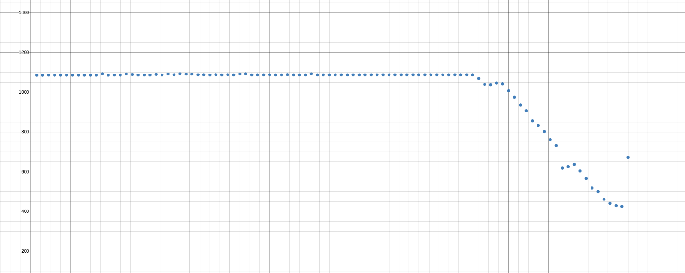

1. **Total RAM**: 7117652 _kB_
2. **Swap size**: 0 _kB_
3. **Page size** 4096 _kB_
4. **Mem free** 4568896 _kB_
5. **Free swap size**: 0 _kB_

### First test
#### 1.First stage
```
[ 5769.077913] Out of memory: Killed process 19499 (mem.bash)
total-vm:3900792kB, anon-rss:3893992kB, file-rss:0kB,
shmem-rss:0kB, UID:1000 pgtables:7668kB oom_score_adj:0
 [ 5769.355279] oom_reaper: reaped process 19499 (mem.bash),
 now anon-rss:0kB, file-rss:0kB, shmem-rss:0kB
 ```

**Last log line**: 49000000
```
MiB Mem :   6950.8 total,   2868.9 free,   2996.5 used,   1085.4 buff/cache
MiB Swap:      0.0 total,      0.0 free,      0.0 used.   3357.8 avail Mem
  35621 chopchop  20   0   23556  19652   2984 R 100.0   0.3   0:01.34 mem.bash
MiB Mem :   6950.8 total,   2830.2 free,   3035.2 used,   1085.4 buff/cache
MiB Swap:      0.0 total,      0.0 free,      0.0 used.   3319.1 avail Mem
  35621 chopchop  20   0   63816  59780   2984 R  99.7   0.8   0:04.35 mem.bash
MiB Mem :   6950.8 total,   2804.1 free,   3060.5 used,   1086.2 buff/cache
MiB Swap:      0.0 total,      0.0 free,      0.0 used.   3293.0 avail Mem
  35621 chopchop  20   0  101304  97268   2984 R 100.0   1.4   0:07.36 mem.bash
MiB Mem :   6950.8 total,   2766.1 free,   3099.0 used,   1085.8 buff/cache
MiB Swap:      0.0 total,      0.0 free,      0.0 used.   3255.0 avail Mem
  35621 chopchop  20   0  140244 136340   2984 R 100.0   1.9   0:10.37 mem.bash
MiB Mem :   6950.8 total,   2727.3 free,   3137.8 used,   1085.8 buff/cache
MiB Swap:      0.0 total,      0.0 free,      0.0 used.   3216.3 avail Mem
  35621 chopchop  20   0  179580 175676   2984 R  99.7   2.5   0:13.38 mem.bash
MiB Mem :   6950.8 total,   2695.9 free,   3169.1 used,   1085.8 buff/cache
MiB Swap:      0.0 total,      0.0 free,      0.0 used.   3183.9 avail Mem
  35621 chopchop  20   0  219180 215276   2984 R 100.0   3.0   0:16.39 mem.bash
MiB Mem :   6950.8 total,   2658.2 free,   3206.8 used,   1085.8 buff/cache
MiB Swap:      0.0 total,      0.0 free,      0.0 used.   3146.2 avail Mem
  35621 chopchop  20   0  258252 254348   2984 R  99.7   3.6   0:19.40 mem.bash
MiB Mem :   6950.8 total,   2621.9 free,   3243.1 used,   1085.8 buff/cache
MiB Swap:      0.0 total,      0.0 free,      0.0 used.   3109.9 avail Mem
  35621 chopchop  20   0  298116 294212   2984 R 100.0   4.1   0:22.41 mem.bash
MiB Mem :   6950.8 total,   2575.0 free,   3290.2 used,   1085.6 buff/cache
MiB Swap:      0.0 total,      0.0 free,      0.0 used.   3063.0 avail Mem
  35621 chopchop  20   0  335208 331172   2984 R  99.7   4.7   0:25.42 mem.bash
MiB Mem :   6950.8 total,   2544.6 free,   3320.6 used,   1085.6 buff/cache
MiB Swap:      0.0 total,      0.0 free,      0.0 used.   3032.6 avail Mem
  35621 chopchop  20   0  374940 371036   2984 R 100.0   5.2   0:28.44 mem.bash
MiB Mem :   6950.8 total,   2505.8 free,   3359.3 used,   1085.7 buff/cache
MiB Swap:      0.0 total,      0.0 free,      0.0 used.   2993.9 avail Mem
  35621 chopchop  20   0  414276 410372   2984 R 100.0   5.8   0:31.46 mem.bash
MiB Mem :   6950.8 total,   2448.0 free,   3410.0 used,   1092.8 buff/cache
MiB Swap:      0.0 total,      0.0 free,      0.0 used.   2937.1 avail Mem
  35621 chopchop  20   0  452160 448124   2984 R  99.3   6.3   0:34.46 mem.bash
MiB Mem :   6950.8 total,   2415.7 free,   3449.4 used,   1085.7 buff/cache
MiB Swap:      0.0 total,      0.0 free,      0.0 used.   2904.8 avail Mem
  35621 chopchop  20   0  491232 487196   2984 R 100.0   6.8   0:37.48 mem.bash
MiB Mem :   6950.8 total,   2373.0 free,   3491.3 used,   1086.5 buff/cache
MiB Swap:      0.0 total,      0.0 free,      0.0 used.   2862.2 avail Mem
  35621 chopchop  20   0  528720 524684   2984 R  99.7   7.4   0:40.49 mem.bash
MiB Mem :   6950.8 total,   2343.2 free,   3521.6 used,   1086.0 buff/cache
MiB Swap:      0.0 total,      0.0 free,      0.0 used.   2832.4 avail Mem
  35621 chopchop  20   0  565284 561380   2984 R 100.0   7.9   0:43.50 mem.bash
MiB Mem :   6950.8 total,   2298.9 free,   3560.0 used,   1091.9 buff/cache
MiB Swap:      0.0 total,      0.0 free,      0.0 used.   2788.1 avail Mem
  35621 chopchop  20   0  602112 598076   2984 R  99.7   8.4   0:46.51 mem.bash
MiB Mem :   6950.8 total,   2271.7 free,   3589.9 used,   1089.2 buff/cache
MiB Swap:      0.0 total,      0.0 free,      0.0 used.   2760.9 avail Mem
  35621 chopchop  20   0  638676 634772   2984 R  99.7   8.9   0:49.52 mem.bash
MiB Mem :   6950.8 total,   2239.9 free,   3624.5 used,   1086.4 buff/cache
MiB Swap:      0.0 total,      0.0 free,      0.0 used.   2730.4 avail Mem
  35621 chopchop  20   0  675768 671996   2984 R 100.0   9.4   0:52.53 mem.bash
MiB Mem :   6950.8 total,   2208.9 free,   3655.4 used,   1086.6 buff/cache
MiB Swap:      0.0 total,      0.0 free,      0.0 used.   2699.4 avail Mem
  35621 chopchop  20   0  712464 708428   2984 R  99.3  10.0   0:55.53 mem.bash
MiB Mem :   6950.8 total,   2170.3 free,   3694.2 used,   1086.3 buff/cache
MiB Swap:      0.0 total,      0.0 free,      0.0 used.   2660.9 avail Mem
  35621 chopchop  20   0  749292 745388   2984 R 100.0  10.5   0:58.55 mem.bash
MiB Mem :   6950.8 total,   2127.7 free,   3733.2 used,   1089.9 buff/cache
MiB Swap:      0.0 total,      0.0 free,      0.0 used.   2618.9 avail Mem
  35621 chopchop  20   0  785196 781292   2984 R  99.3  11.0   1:01.55 mem.bash
MiB Mem :   6950.8 total,   2094.6 free,   3769.5 used,   1086.8 buff/cache
MiB Swap:      0.0 total,      0.0 free,      0.0 used.   2585.8 avail Mem
  35621 chopchop  20   0  821100 817196   2984 R 100.0  11.5   1:04.57 mem.bash
MiB Mem :   6950.8 total,   2045.7 free,   3813.3 used,   1091.8 buff/cache
MiB Swap:      0.0 total,      0.0 free,      0.0 used.   2537.4 avail Mem
  35621 chopchop  20   0  856740 852836   2984 R  99.7  12.0   1:07.58 mem.bash
MiB Mem :   6950.8 total,   2012.9 free,   3850.1 used,   1087.8 buff/cache
MiB Swap:      0.0 total,      0.0 free,      0.0 used.   2504.7 avail Mem
  35621 chopchop  20   0  894096 890060   2984 R 100.0  12.5   1:10.59 mem.bash
MiB Mem :   6950.8 total,   1979.9 free,   3878.3 used,   1092.6 buff/cache
MiB Swap:      0.0 total,      0.0 free,      0.0 used.   2468.7 avail Mem
  35621 chopchop  20   0  931716 927812   2984 R  99.7  13.0   1:13.60 mem.bash
MiB Mem :   6950.8 total,   1959.8 free,   3899.7 used,   1091.3 buff/cache
MiB Swap:      0.0 total,      0.0 free,      0.0 used.   2448.7 avail Mem
  35621 chopchop  20   0  968280 964508   2984 R  99.7  13.6   1:16.61 mem.bash
MiB Mem :   6950.8 total,   1921.1 free,   3938.5 used,   1091.3 buff/cache
MiB Swap:      0.0 total,      0.0 free,      0.0 used.   2410.0 avail Mem
  35621 chopchop  20   0 1005372 978.0m   2984 R 100.0  14.1   1:19.62 mem.bash
MiB Mem :   6950.8 total,   1891.3 free,   3971.9 used,   1087.6 buff/cache
MiB Swap:      0.0 total,      0.0 free,      0.0 used.   2380.3 avail Mem
  35621 chopchop  20   0 1042728   1.0g   2984 R  99.7  14.6   1:22.63 mem.bash
MiB Mem :   6950.8 total,   1846.2 free,   4017.0 used,   1087.7 buff/cache
MiB Swap:      0.0 total,      0.0 free,      0.0 used.   2335.2 avail Mem
  35621 chopchop  20   0 1080084   1.0g   2984 R 100.0  15.1   1:25.65 mem.bash
MiB Mem :   6950.8 total,   1808.3 free,   4055.9 used,   1086.7 buff/cache
MiB Swap:      0.0 total,      0.0 free,      0.0 used.   2298.3 avail Mem
  35621 chopchop  20   0 1117836   1.1g   2984 R  99.3  15.7   1:28.65 mem.bash
MiB Mem :   6950.8 total,   1773.3 free,   4089.4 used,   1088.0 buff/cache
MiB Swap:      0.0 total,      0.0 free,      0.0 used.   2263.4 avail Mem
  35621 chopchop  20   0 1155852   1.1g   2984 R 100.0  16.2   1:31.67 mem.bash
MiB Mem :   6950.8 total,   1732.2 free,   4131.7 used,   1086.9 buff/cache
MiB Swap:      0.0 total,      0.0 free,      0.0 used.   2223.4 avail Mem
  35621 chopchop  20   0 1193604   1.1g   2984 R  99.7  16.7   1:34.67 mem.bash
MiB Mem :   6950.8 total,   1694.1 free,   4168.7 used,   1088.1 buff/cache
MiB Swap:      0.0 total,      0.0 free,      0.0 used.   2185.2 avail Mem
  35621 chopchop  20   0 1231884   1.2g   2984 R 100.0  17.3   1:37.68 mem.bash
MiB Mem :   6950.8 total,   1648.8 free,   4215.0 used,   1087.0 buff/cache
MiB Swap:      0.0 total,      0.0 free,      0.0 used.   2140.5 avail Mem
  35621 chopchop  20   0 1269108   1.2g   2984 R 100.0  17.8   1:40.69 mem.bash
MiB Mem :   6950.8 total,   1595.9 free,   4263.1 used,   1091.9 buff/cache
MiB Swap:      0.0 total,      0.0 free,      0.0 used.   2087.6 avail Mem
  35621 chopchop  20   0 1306728   1.2g   2984 R  99.7  18.3   1:43.70 mem.bash
MiB Mem :   6950.8 total,   1573.6 free,   4284.6 used,   1092.6 buff/cache
MiB Swap:      0.0 total,      0.0 free,      0.0 used.   2065.4 avail Mem
  35621 chopchop  20   0 1343820   1.3g   2984 R 100.0  18.8   1:46.71 mem.bash
MiB Mem :   6950.8 total,   1540.0 free,   4323.9 used,   1086.9 buff/cache
MiB Swap:      0.0 total,      0.0 free,      0.0 used.   2031.8 avail Mem
  35621 chopchop  20   0 1383156   1.3g   2984 R  99.7  19.4   1:49.72 mem.bash
MiB Mem :   6950.8 total,   1505.8 free,   4357.7 used,   1087.4 buff/cache
MiB Swap:      0.0 total,      0.0 free,      0.0 used.   1997.6 avail Mem
  35621 chopchop  20   0 1419192   1.3g   2984 R 100.0  19.9   1:52.73 mem.bash
MiB Mem :   6950.8 total,   1471.6 free,   4391.9 used,   1087.3 buff/cache
MiB Swap:      0.0 total,      0.0 free,      0.0 used.   1963.5 avail Mem
  35621 chopchop  20   0 1457736   1.4g   2984 R  99.7  20.4   1:55.74 mem.bash
MiB Mem :   6950.8 total,   1438.0 free,   4425.5 used,   1087.4 buff/cache
MiB Swap:      0.0 total,      0.0 free,      0.0 used.   1929.9 avail Mem
  35621 chopchop  20   0 1495356   1.4g   2984 R 100.0  21.0   1:58.75 mem.bash
MiB Mem :   6950.8 total,   1400.9 free,   4463.0 used,   1087.0 buff/cache
MiB Swap:      0.0 total,      0.0 free,      0.0 used.   1892.8 avail Mem
  35621 chopchop  20   0 1532976   1.5g   2984 R 100.0  21.5   2:01.76 mem.bash
MiB Mem :   6950.8 total,   1361.6 free,   4502.2 used,   1087.0 buff/cache
MiB Swap:      0.0 total,      0.0 free,      0.0 used.   1853.5 avail Mem
  35621 chopchop  20   0 1572180   1.5g   2984 R 100.0  22.0   2:04.77 mem.bash
MiB Mem :   6950.8 total,   1319.9 free,   4542.5 used,   1088.4 buff/cache
MiB Swap:      0.0 total,      0.0 free,      0.0 used.   1812.3 avail Mem
  35621 chopchop  20   0 1609932   1.5g   2984 R  99.7  22.6   2:07.78 mem.bash
MiB Mem :   6950.8 total,   1286.4 free,   4577.4 used,   1087.1 buff/cache
MiB Swap:      0.0 total,      0.0 free,      0.0 used.   1778.9 avail Mem
  35621 chopchop  20   0 1647816   1.6g   2984 R 100.0  23.1   2:10.79 mem.bash
MiB Mem :   6950.8 total,   1253.1 free,   4610.7 used,   1087.0 buff/cache
MiB Swap:      0.0 total,      0.0 free,      0.0 used.   1742.7 avail Mem
  35621 chopchop  20   0 1687680   1.6g   2984 R  99.7  23.7   2:13.80 mem.bash
MiB Mem :   6950.8 total,   1214.2 free,   4649.5 used,   1087.0 buff/cache
MiB Swap:      0.0 total,      0.0 free,      0.0 used.   1703.7 avail Mem
  35621 chopchop  20   0 1727412   1.6g   2984 R 100.0  24.2   2:16.81 mem.bash
MiB Mem :   6950.8 total,   1166.9 free,   4691.4 used,   1092.5 buff/cache
MiB Swap:      0.0 total,      0.0 free,      0.0 used.   1656.6 avail Mem
  35621 chopchop  20   0 1764636   1.7g   2984 R  99.7  24.7   2:19.82 mem.bash
MiB Mem :   6950.8 total,   1132.5 free,   4731.1 used,   1087.2 buff/cache
MiB Swap:      0.0 total,      0.0 free,      0.0 used.   1622.2 avail Mem
  35621 chopchop  20   0 1803444   1.7g   2984 R 100.0  25.3   2:22.83 mem.bash
MiB Mem :   6950.8 total,   1095.9 free,   4767.7 used,   1087.2 buff/cache
MiB Swap:      0.0 total,      0.0 free,      0.0 used.   1585.6 avail Mem
  35621 chopchop  20   0 1843044   1.8g   2984 R 100.0  25.8   2:25.84 mem.bash
MiB Mem :   6950.8 total,   1068.6 free,   4795.0 used,   1087.2 buff/cache
MiB Swap:      0.0 total,      0.0 free,      0.0 used.   1558.3 avail Mem
  35621 chopchop  20   0 1882512   1.8g   2984 R  99.7  26.4   2:28.85 mem.bash
MiB Mem :   6950.8 total,   1030.2 free,   4833.3 used,   1087.3 buff/cache
MiB Swap:      0.0 total,      0.0 free,      0.0 used.   1521.0 avail Mem
  35621 chopchop  20   0 1921848   1.8g   2984 R 100.0  26.9   2:31.86 mem.bash
MiB Mem :   6950.8 total,    991.9 free,   4871.7 used,   1087.3 buff/cache
MiB Swap:      0.0 total,      0.0 free,      0.0 used.   1482.6 avail Mem
  35621 chopchop  20   0 1961316   1.9g   2984 R 100.0  27.5   2:34.87 mem.bash
MiB Mem :   6950.8 total,    951.1 free,   4912.5 used,   1087.3 buff/cache
MiB Swap:      0.0 total,      0.0 free,      0.0 used.   1441.8 avail Mem
  35621 chopchop  20   0 2001444   1.9g   2984 R 100.0  28.1   2:37.88 mem.bash
MiB Mem :   6950.8 total,    912.4 free,   4951.1 used,   1087.3 buff/cache
MiB Swap:      0.0 total,      0.0 free,      0.0 used.   1403.2 avail Mem
  35621 chopchop  20   0 2040780   1.9g   2984 R  99.7  28.6   2:40.89 mem.bash
MiB Mem :   6950.8 total,    874.3 free,   4989.2 used,   1087.3 buff/cache
MiB Swap:      0.0 total,      0.0 free,      0.0 used.   1365.1 avail Mem
  35621 chopchop  20   0 2080908   2.0g   2984 R 100.0  29.2   2:43.91 mem.bash
MiB Mem :   6950.8 total,    829.5 free,   5034.0 used,   1087.3 buff/cache
MiB Swap:      0.0 total,      0.0 free,      0.0 used.   1320.3 avail Mem
  35621 chopchop  20   0 2120112   2.0g   2984 R  99.3  29.7   2:46.91 mem.bash
MiB Mem :   6950.8 total,    789.4 free,   5074.0 used,   1087.4 buff/cache
MiB Swap:      0.0 total,      0.0 free,      0.0 used.   1280.2 avail Mem
  35621 chopchop  20   0 2160240   2.1g   2984 R 100.0  30.3   2:49.92 mem.bash
MiB Mem :   6950.8 total,    751.1 free,   5112.4 used,   1087.4 buff/cache
MiB Swap:      0.0 total,      0.0 free,      0.0 used.   1241.9 avail Mem
  35621 chopchop  20   0 2199708   2.1g   2984 R 100.0  30.9   2:52.93 mem.bash
MiB Mem :   6950.8 total,    709.7 free,   5153.8 used,   1087.4 buff/cache
MiB Swap:      0.0 total,      0.0 free,      0.0 used.   1200.5 avail Mem
  35621 chopchop  20   0 2239704   2.1g   2984 R 100.0  31.4   2:55.95 mem.bash
MiB Mem :   6950.8 total,    675.0 free,   5188.5 used,   1087.4 buff/cache
MiB Swap:      0.0 total,      0.0 free,      0.0 used.   1165.8 avail Mem
  35621 chopchop  20   0 2279436   2.2g   2984 R 100.0  32.0   2:58.96 mem.bash
MiB Mem :   6950.8 total,    638.2 free,   5225.2 used,   1087.4 buff/cache
MiB Swap:      0.0 total,      0.0 free,      0.0 used.   1129.1 avail Mem
  35621 chopchop  20   0 2317716   2.2g   2984 R 100.0  32.5   3:01.97 mem.bash
MiB Mem :   6950.8 total,    598.4 free,   5265.0 used,   1087.4 buff/cache
MiB Swap:      0.0 total,      0.0 free,      0.0 used.   1089.3 avail Mem
  35621 chopchop  20   0 2354808   2.2g   2984 R  99.7  33.0   3:04.98 mem.bash
MiB Mem :   6950.8 total,    558.6 free,   5304.8 used,   1087.4 buff/cache
MiB Swap:      0.0 total,      0.0 free,      0.0 used.   1049.5 avail Mem
  35621 chopchop  20   0 2392428   2.3g   2984 R 100.0  33.6   3:07.99 mem.bash
MiB Mem :   6950.8 total,    520.4 free,   5342.9 used,   1087.5 buff/cache
MiB Swap:      0.0 total,      0.0 free,      0.0 used.   1011.3 avail Mem
  35621 chopchop  20   0 2430444   2.3g   2984 R  99.7  34.1   3:11.00 mem.bash
MiB Mem :   6950.8 total,    485.6 free,   5377.8 used,   1087.5 buff/cache
MiB Swap:      0.0 total,      0.0 free,      0.0 used.    975.0 avail Mem
  35621 chopchop  20   0 2468196   2.4g   2984 R 100.0  34.6   3:14.02 mem.bash
MiB Mem :   6950.8 total,    449.1 free,   5414.2 used,   1087.5 buff/cache
MiB Swap:      0.0 total,      0.0 free,      0.0 used.    938.6 avail Mem
  35621 chopchop  20   0 2505816   2.4g   2984 R  99.7  35.2   3:17.02 mem.bash
MiB Mem :   6950.8 total,    406.8 free,   5456.5 used,   1087.5 buff/cache
MiB Swap:      0.0 total,      0.0 free,      0.0 used.    896.3 avail Mem
  35621 chopchop  20   0 2545812   2.4g   2984 R 100.0  35.7   3:20.04 mem.bash
MiB Mem :   6950.8 total,    369.2 free,   5494.1 used,   1087.5 buff/cache
MiB Swap:      0.0 total,      0.0 free,      0.0 used.    858.6 avail Mem
  35621 chopchop  20   0 2585016   2.5g   2984 R  99.7  36.3   3:23.05 mem.bash
MiB Mem :   6950.8 total,    330.3 free,   5533.0 used,   1087.5 buff/cache
MiB Swap:      0.0 total,      0.0 free,      0.0 used.    819.8 avail Mem
  35621 chopchop  20   0 2625012   2.5g   2984 R 100.0  36.8   3:26.06 mem.bash
MiB Mem :   6950.8 total,    292.1 free,   5571.2 used,   1087.5 buff/cache
MiB Swap:      0.0 total,      0.0 free,      0.0 used.    782.1 avail Mem
  35621 chopchop  20   0 2664216   2.5g   2984 R  99.7  37.4   3:29.07 mem.bash
MiB Mem :   6950.8 total,    253.7 free,   5609.5 used,   1087.6 buff/cache
MiB Swap:      0.0 total,      0.0 free,      0.0 used.    743.7 avail Mem
  35621 chopchop  20   0 2704080   2.6g   2984 R 100.0  37.9   3:32.08 mem.bash
MiB Mem :   6950.8 total,    211.8 free,   5651.5 used,   1087.6 buff/cache
MiB Swap:      0.0 total,      0.0 free,      0.0 used.    701.8 avail Mem
  35621 chopchop  20   0 2743416   2.6g   2984 R  99.7  38.5   3:35.09 mem.bash
MiB Mem :   6950.8 total,    171.3 free,   5692.0 used,   1087.6 buff/cache
MiB Swap:      0.0 total,      0.0 free,      0.0 used.    662.2 avail Mem
  35621 chopchop  20   0 2783544   2.7g   2984 R 100.0  39.1   3:38.10 mem.bash
MiB Mem :   6950.8 total,    129.2 free,   5734.1 used,   1087.6 buff/cache
MiB Swap:      0.0 total,      0.0 free,      0.0 used.    620.2 avail Mem
  35621 chopchop  20   0 2822880   2.7g   2984 R  99.7  39.6   3:41.11 mem.bash
MiB Mem :   6950.8 total,    123.1 free,   5758.7 used,   1068.9 buff/cache
MiB Swap:      0.0 total,      0.0 free,      0.0 used.    599.8 avail Mem
  35621 chopchop  20   0 2863008   2.7g   2984 R 100.0  40.2   3:44.13 mem.bash
MiB Mem :   6950.8 total,    127.0 free,   5783.6 used,   1040.2 buff/cache
MiB Swap:      0.0 total,      0.0 free,      0.0 used.    575.0 avail Mem
  35621 chopchop  20   0 2902212   2.8g   2984 R  99.7  40.7   3:47.14 mem.bash
MiB Mem :   6950.8 total,    130.6 free,   5781.7 used,   1038.5 buff/cache
MiB Swap:      0.0 total,      0.0 free,      0.0 used.    576.9 avail Mem
  35621 chopchop  20   0 2942076   2.8g   2984 R 100.0  41.3   3:50.16 mem.bash
MiB Mem :   6950.8 total,    119.1 free,   5785.0 used,   1046.7 buff/cache
MiB Swap:      0.0 total,      0.0 free,      0.0 used.    573.5 avail Mem
  35621 chopchop  20   0 2980752   2.8g   2984 R 100.0  41.8   3:53.17 mem.bash
MiB Mem :   6950.8 total,    114.4 free,   5793.8 used,   1042.6 buff/cache
MiB Swap:      0.0 total,      0.0 free,      0.0 used.    564.9 avail Mem
  35621 chopchop  20   0 3020616   2.9g   2984 R  99.7  42.4   3:56.18 mem.bash
MiB Mem :   6950.8 total,    121.6 free,   5822.1 used,   1007.2 buff/cache
MiB Swap:      0.0 total,      0.0 free,      0.0 used.    536.6 avail Mem
  35621 chopchop  20   0 3059820   2.9g   2984 R 100.0  42.9   3:59.20 mem.bash
MiB Mem :   6950.8 total,    114.6 free,   5860.6 used,    975.6 buff/cache
MiB Swap:      0.0 total,      0.0 free,      0.0 used.    498.0 avail Mem
  35621 chopchop  20   0 3099552   3.0g   2984 R  99.7  43.5   4:02.21 mem.bash
MiB Mem :   6950.8 total,    124.5 free,   5890.8 used,    935.6 buff/cache
MiB Swap:      0.0 total,      0.0 free,      0.0 used.    467.0 avail Mem
  35621 chopchop  20   0 3138096   3.0g   2980 R  99.7  44.0   4:05.22 mem.bash
MiB Mem :   6950.8 total,    115.7 free,   5927.9 used,    907.3 buff/cache
MiB Swap:      0.0 total,      0.0 free,      0.0 used.    430.0 avail Mem
  35621 chopchop  20   0 3175188   3.0g   2980 R 100.0  44.6   4:08.24 mem.bash
MiB Mem :   6950.8 total,    134.7 free,   5959.6 used,    856.5 buff/cache
MiB Swap:      0.0 total,      0.0 free,      0.0 used.    397.5 avail Mem
  35621 chopchop  20   0 3211620   3.1g   2772 R  99.3  45.1   4:11.24 mem.bash
MiB Mem :   6950.8 total,    127.3 free,   5991.7 used,    831.8 buff/cache
MiB Swap:      0.0 total,      0.0 free,      0.0 used.    364.7 avail Mem
  35621 chopchop  20   0 3245280   3.1g   2772 R 100.0  45.5   4:14.25 mem.bash
MiB Mem :   6950.8 total,    121.8 free,   6026.6 used,    802.4 buff/cache
MiB Swap:      0.0 total,      0.0 free,      0.0 used.    330.0 avail Mem
  35621 chopchop  20   0 3279732   3.1g   2772 R 100.0  46.0   4:17.27 mem.bash
MiB Mem :   6950.8 total,    123.8 free,   6066.4 used,    760.6 buff/cache
MiB Swap:      0.0 total,      0.0 free,      0.0 used.    290.5 avail Mem
  35621 chopchop  20   0 3316428   3.2g   2768 R  99.3  46.5   4:20.27 mem.bash
MiB Mem :   6950.8 total,    129.1 free,   6089.7 used,    732.1 buff/cache
MiB Swap:      0.0 total,      0.0 free,      0.0 used.    267.5 avail Mem
  35621 chopchop  20   0 3352596   3.2g   2768 R 100.0  47.0   4:23.29 mem.bash
MiB Mem :   6950.8 total,    203.9 free,   6128.2 used,    618.7 buff/cache
MiB Swap:      0.0 total,      0.0 free,      0.0 used.    222.6 avail Mem
  35621 chopchop  20   0 3389556   3.2g   2272 R  99.3  47.6   4:26.29 mem.bash
MiB Mem :   6950.8 total,    167.4 free,   6158.3 used,    625.2 buff/cache
MiB Swap:      0.0 total,      0.0 free,      0.0 used.    197.1 avail Mem
  35621 chopchop  20   0 3426912   3.3g   2272 R 100.0  48.1   4:29.30 mem.bash
MiB Mem :   6950.8 total,    120.9 free,   6194.0 used,    635.9 buff/cache
MiB Swap:      0.0 total,      0.0 free,      0.0 used.    161.4 avail Mem
  35621 chopchop  20   0 3463608   3.3g   2272 R  99.7  48.6   4:32.31 mem.bash
MiB Mem :   6950.8 total,    123.6 free,   6222.7 used,    604.5 buff/cache
MiB Swap:      0.0 total,      0.0 free,      0.0 used.    132.9 avail Mem
  35621 chopchop  20   0 3500568   3.3g   2268 R 100.0  49.1   4:35.33 mem.bash
MiB Mem :   6950.8 total,    123.0 free,   6262.1 used,    565.7 buff/cache
MiB Swap:      0.0 total,      0.0 free,      0.0 used.    101.0 avail Mem
  35621 chopchop  20   0 3537396   3.4g   2208 R 100.0  49.6   4:38.34 mem.bash
MiB Mem :   6950.8 total,    136.0 free,   6297.6 used,    517.2 buff/cache
MiB Swap:      0.0 total,      0.0 free,      0.0 used.     89.3 avail Mem
  35621 chopchop  20   0 3574224   3.4g   2072 R  99.7  50.2   4:41.35 mem.bash
MiB Mem :   6950.8 total,    120.7 free,   6330.4 used,    499.7 buff/cache
MiB Swap:      0.0 total,      0.0 free,      0.0 used.     65.1 avail Mem
  35621 chopchop  20   0 3610524   3.4g   1556 R  99.7  50.7   4:44.36 mem.bash
MiB Mem :   6950.8 total,    124.7 free,   6365.0 used,    461.1 buff/cache
MiB Swap:      0.0 total,      0.0 free,      0.0 used.     49.7 avail Mem
  35621 chopchop  20   0 3645900   3.5g    508 R  99.7  51.1   4:47.37 mem.bash
MiB Mem :   6950.8 total,    115.0 free,   6394.9 used,    440.9 buff/cache
MiB Swap:      0.0 total,      0.0 free,      0.0 used.     30.7 avail Mem
  35621 chopchop  20   0 3677052   3.5g    488 R  98.7  51.6   4:50.34 mem.bash
MiB Mem :   6950.8 total,    106.5 free,   6415.2 used,    429.2 buff/cache
MiB Swap:      0.0 total,      0.0 free,      0.0 used.     16.7 avail Mem
  35621 chopchop  20   0 3697776   3.5g    392 R  92.1  51.9   4:53.12 mem.bash
MiB Mem :   6950.8 total,    106.0 free,   6419.5 used,    425.3 buff/cache
MiB Swap:      0.0 total,      0.0 free,      0.0 used.     14.3 avail Mem
  35621 chopchop  20   0 3703716   3.5g      0 D  58.0  51.9   4:54.89 mem.bash
MiB Mem :   6950.8 total,   3471.6 free,   2806.6 used,    672.7 buff/cache
MiB Swap:      0.0 total,      0.0 free,      0.0 used.   3543.9 avail Mem
```
```
[10770.413878] Out of memory: Killed process 35621 (mem.bash)
total-vm:3704112kB, anon-rss:3697320kB, file-rss:0kB, shmem-rss:0kB,
UID:1000 pgtables:7280kB oom_score_adj:0
[10770.645186] oom_reaper: reaped process 35621 (mem.bash),
now anon-rss:0kB, file-rss:0kB, shmem-rss:0kB
```
**Last log line**: 47000000
\
FreeMem

\
UsedMem

\
Buff

#### 2.Second stage
mem.bash
```
MiB Mem :   6950.8 total,   3325.3 free,   2914.3 used,    711.2 buff/cache
MiB Swap:      0.0 total,      0.0 free,      0.0 used.   3554.5 avail Mem
  43020 chopchop  20   0    8904   5128   2988 R 100.0   0.1   0:00.17 mem.bash
MiB Mem :   6950.8 total,   3249.1 free,   2984.8 used,    716.9 buff/cache
MiB Swap:      0.0 total,      0.0 free,      0.0 used.   3478.2 avail Mem
  43020 chopchop  20   0   44280  40240   2988 R 100.0   0.6   0:03.18 mem.bash
MiB Mem :   6950.8 total,   3174.4 free,   3064.8 used,    711.6 buff/cache
MiB Swap:      0.0 total,      0.0 free,      0.0 used.   3403.7 avail Mem
  43020 chopchop  20   0   80844  76936   2988 R  99.3   1.1   0:06.18 mem.bash
MiB Mem :   6950.8 total,   3101.1 free,   3137.5 used,    712.2 buff/cache
MiB Swap:      0.0 total,      0.0 free,      0.0 used.   3331.4 avail Mem
  43020 chopchop  20   0  116616 112576   2988 R  99.7   1.6   0:09.18 mem.bash
MiB Mem :   6950.8 total,   3018.0 free,   3216.0 used,    716.8 buff/cache
MiB Swap:      0.0 total,      0.0 free,      0.0 used.   3248.9 avail Mem
  43020 chopchop  20   0  151728 147952   2988 R 100.0   2.1   0:12.20 mem.bash
MiB Mem :   6950.8 total,   2964.4 free,   3274.4 used,    712.0 buff/cache
MiB Swap:      0.0 total,      0.0 free,      0.0 used.   3195.4 avail Mem
  43020 chopchop  20   0  186576 182536   2988 R  99.7   2.6   0:15.20 mem.bash
MiB Mem :   6950.8 total,   2887.5 free,   3349.7 used,    713.7 buff/cache
MiB Swap:      0.0 total,      0.0 free,      0.0 used.   3118.8 avail Mem
  43020 chopchop  20   0  220368 216328   2988 R 100.0   3.0   0:18.21 mem.bash
MiB Mem :   6950.8 total,   2827.1 free,   3411.5 used,    712.3 buff/cache
MiB Swap:      0.0 total,      0.0 free,      0.0 used.   3058.4 avail Mem
  43020 chopchop  20   0  256404 252496   2988 R  99.3   3.5   0:21.21 mem.bash
MiB Mem :   6950.8 total,   2755.0 free,   3483.6 used,    712.3 buff/cache
MiB Swap:      0.0 total,      0.0 free,      0.0 used.   2986.3 avail Mem
  43020 chopchop  20   0  292440 288664   2988 R 100.0   4.1   0:24.22 mem.bash
MiB Mem :   6950.8 total,   2677.0 free,   3561.5 used,    712.3 buff/cache
MiB Swap:      0.0 total,      0.0 free,      0.0 used.   2908.4 avail Mem
  43020 chopchop  20   0  328740 324832   2988 R  99.7   4.6   0:27.22 mem.bash
MiB Mem :   6950.8 total,   2610.0 free,   3628.5 used,    712.3 buff/cache
MiB Swap:      0.0 total,      0.0 free,      0.0 used.   2841.4 avail Mem
  43020 chopchop  20   0  365040 361000   2988 R 100.0   5.1   0:30.23 mem.bash
MiB Mem :   6950.8 total,   2538.9 free,   3699.6 used,    712.3 buff/cache
MiB Swap:      0.0 total,      0.0 free,      0.0 used.   2770.3 avail Mem
  43020 chopchop  20   0  401208 397168   2988 R 100.0   5.6   0:33.24 mem.bash
MiB Mem :   6950.8 total,   2466.9 free,   3771.6 used,    712.4 buff/cache
MiB Swap:      0.0 total,      0.0 free,      0.0 used.   2698.3 avail Mem
  43020 chopchop  20   0  437376 433336   2988 R 100.0   6.1   0:36.25 mem.bash
MiB Mem :   6950.8 total,   2426.9 free,   3811.5 used,    712.4 buff/cache
MiB Swap:      0.0 total,      0.0 free,      0.0 used.   2655.4 avail Mem
  43020 chopchop  20   0  472224 468184   2988 R  99.7   6.6   0:39.25 mem.bash
MiB Mem :   6950.8 total,   2361.5 free,   3877.0 used,    712.4 buff/cache
MiB Swap:      0.0 total,      0.0 free,      0.0 used.   2589.9 avail Mem
  43020 chopchop  20   0  508392 504352   2988 R 100.0   7.1   0:42.26 mem.bash
MiB Mem :   6950.8 total,   2291.1 free,   3947.3 used,    712.4 buff/cache
MiB Swap:      0.0 total,      0.0 free,      0.0 used.   2519.6 avail Mem
  43020 chopchop  20   0  544296 540256   2988 R 100.0   7.6   0:45.27 mem.bash
MiB Mem :   6950.8 total,   2217.8 free,   4020.6 used,    712.4 buff/cache
MiB Swap:      0.0 total,      0.0 free,      0.0 used.   2446.7 avail Mem
  43020 chopchop  20   0  579936 575896   2988 R  99.7   8.1   0:48.28 mem.bash
MiB Mem :   6950.8 total,   2137.7 free,   4100.7 used,    712.4 buff/cache
MiB Swap:      0.0 total,      0.0 free,      0.0 used.   2367.7 avail Mem
  43020 chopchop  20   0  615576 611800   2988 R 100.0   8.6   0:51.29 mem.bash
MiB Mem :   6950.8 total,   2067.7 free,   4171.0 used,    712.2 buff/cache
MiB Swap:      0.0 total,      0.0 free,      0.0 used.   2297.7 avail Mem
  43020 chopchop  20   0  651744 647968   2988 R 100.0   9.1   0:54.30 mem.bash
MiB Mem :   6950.8 total,   1991.6 free,   4247.1 used,    712.1 buff/cache
MiB Swap:      0.0 total,      0.0 free,      0.0 used.   2222.7 avail Mem
  43020 chopchop  20   0  688308 684400   2988 R 100.0   9.6   0:57.31 mem.bash
MiB Mem :   6950.8 total,   1916.4 free,   4320.3 used,    714.1 buff/cache
MiB Swap:      0.0 total,      0.0 free,      0.0 used.   2147.4 avail Mem
  43020 chopchop  20   0  723420 719512   2988 R 100.0  10.1   1:00.32 mem.bash
MiB Mem :   6950.8 total,   1845.4 free,   4393.0 used,    712.5 buff/cache
MiB Swap:      0.0 total,      0.0 free,      0.0 used.   2076.9 avail Mem
  43020 chopchop  20   0  758664 754888   2988 R  99.3  10.6   1:03.32 mem.bash
MiB Mem :   6950.8 total,   1766.8 free,   4471.8 used,    712.2 buff/cache
MiB Swap:      0.0 total,      0.0 free,      0.0 used.   1998.4 avail Mem
  43020 chopchop  20   0  794304 790528   2988 R 100.0  11.1   1:06.33 mem.bash
MiB Mem :   6950.8 total,   1704.3 free,   4534.3 used,    712.2 buff/cache
MiB Swap:      0.0 total,      0.0 free,      0.0 used.   1935.9 avail Mem
  43020 chopchop  20   0  830472 826696   2988 R 100.0  11.6   1:09.34 mem.bash
MiB Mem :   6950.8 total,   1629.8 free,   4608.8 used,    712.2 buff/cache
MiB Swap:      0.0 total,      0.0 free,      0.0 used.   1861.5 avail Mem
  43020 chopchop  20   0  866772 862864   2988 R 100.0  12.1   1:12.35 mem.bash
MiB Mem :   6950.8 total,   1557.4 free,   4681.2 used,    712.2 buff/cache
MiB Swap:      0.0 total,      0.0 free,      0.0 used.   1789.1 avail Mem
  43020 chopchop  20   0  902808 899032   2988 R 100.0  12.6   1:15.36 mem.bash
MiB Mem :   6950.8 total,   1484.6 free,   4754.0 used,    712.2 buff/cache
MiB Swap:      0.0 total,      0.0 free,      0.0 used.   1716.2 avail Mem
  43020 chopchop  20   0  938712 934672   2988 R  99.7  13.1   1:18.37 mem.bash
MiB Mem :   6950.8 total,   1415.5 free,   4823.1 used,    712.2 buff/cache
MiB Swap:      0.0 total,      0.0 free,      0.0 used.   1647.1 avail Mem
  43020 chopchop  20   0  973956 970048   2988 R  99.7  13.6   1:21.37 mem.bash
MiB Mem :   6950.8 total,   1342.2 free,   4896.4 used,    712.3 buff/cache
MiB Swap:      0.0 total,      0.0 free,      0.0 used.   1573.8 avail Mem
  43020 chopchop  20   0 1009596 982.1m   2988 R 100.0  14.1   1:24.38 mem.bash
MiB Mem :   6950.8 total,   1272.8 free,   4965.7 used,    712.3 buff/cache
MiB Swap:      0.0 total,      0.0 free,      0.0 used.   1504.5 avail Mem
  43020 chopchop  20   0 1045896   1.0g   2988 R 100.0  14.6   1:27.40 mem.bash
MiB Mem :   6950.8 total,   1204.3 free,   5034.3 used,    712.3 buff/cache
MiB Swap:      0.0 total,      0.0 free,      0.0 used.   1436.0 avail Mem
  43020 chopchop  20   0 1082196   1.0g   2988 R  99.7  15.1   1:30.41 mem.bash
MiB Mem :   6950.8 total,   1130.8 free,   5107.7 used,    712.3 buff/cache
MiB Swap:      0.0 total,      0.0 free,      0.0 used.   1362.5 avail Mem
  43020 chopchop  20   0 1118628   1.1g   2988 R 100.0  15.7   1:33.42 mem.bash
MiB Mem :   6950.8 total,   1060.2 free,   5178.3 used,    712.4 buff/cache
MiB Swap:      0.0 total,      0.0 free,      0.0 used.   1291.9 avail Mem
  43020 chopchop  20   0 1155192   1.1g   2988 R 100.0  16.2   1:36.44 mem.bash
MiB Mem :   6950.8 total,    991.0 free,   5247.5 used,    712.3 buff/cache
MiB Swap:      0.0 total,      0.0 free,      0.0 used.   1219.7 avail Mem
  43020 chopchop  20   0 1190568   1.1g   2988 R  99.3  16.7   1:39.44 mem.bash
MiB Mem :   6950.8 total,    918.3 free,   5320.2 used,    712.4 buff/cache
MiB Swap:      0.0 total,      0.0 free,      0.0 used.   1147.0 avail Mem
  43020 chopchop  20   0 1226472   1.2g   2988 R 100.0  17.2   1:42.46 mem.bash
MiB Mem :   6950.8 total,    851.3 free,   5387.2 used,    712.4 buff/cache
MiB Swap:      0.0 total,      0.0 free,      0.0 used.   1080.0 avail Mem
  43020 chopchop  20   0 1262376   1.2g   2988 R 100.0  17.7   1:45.47 mem.bash
MiB Mem :   6950.8 total,    780.9 free,   5457.5 used,    712.4 buff/cache
MiB Swap:      0.0 total,      0.0 free,      0.0 used.   1010.1 avail Mem
  43020 chopchop  20   0 1298676   1.2g   2988 R  99.7  18.2   1:48.48 mem.bash
MiB Mem :   6950.8 total,    708.3 free,   5530.1 used,    712.4 buff/cache
MiB Swap:      0.0 total,      0.0 free,      0.0 used.    938.5 avail Mem
  43020 chopchop  20   0 1335108   1.3g   2988 R 100.0  18.7   1:51.50 mem.bash
MiB Mem :   6950.8 total,    635.7 free,   5602.7 used,    712.4 buff/cache
MiB Swap:      0.0 total,      0.0 free,      0.0 used.    866.0 avail Mem
  43020 chopchop  20   0 1371408   1.3g   2988 R  99.7  19.2   1:54.50 mem.bash
MiB Mem :   6950.8 total,    555.7 free,   5682.7 used,    712.5 buff/cache
MiB Swap:      0.0 total,      0.0 free,      0.0 used.    786.0 avail Mem
  43020 chopchop  20   0 1407444   1.3g   2988 R 100.0  19.7   1:57.52 mem.bash
MiB Mem :   6950.8 total,    484.3 free,   5754.0 used,    712.5 buff/cache
MiB Swap:      0.0 total,      0.0 free,      0.0 used.    714.7 avail Mem
  43020 chopchop  20   0 1443744   1.4g   2988 R 100.0  20.2   2:00.53 mem.bash
MiB Mem :   6950.8 total,    413.2 free,   5825.1 used,    712.5 buff/cache
MiB Swap:      0.0 total,      0.0 free,      0.0 used.    644.6 avail Mem
  43020 chopchop  20   0 1479648   1.4g   2988 R  99.7  20.7   2:03.53 mem.bash
MiB Mem :   6950.8 total,    344.6 free,   5893.7 used,    712.5 buff/cache
MiB Swap:      0.0 total,      0.0 free,      0.0 used.    575.9 avail Mem
  43020 chopchop  20   0 1516080   1.4g   2988 R 100.0  21.2   2:06.54 mem.bash
MiB Mem :   6950.8 total,    276.6 free,   5961.7 used,    712.6 buff/cache
MiB Swap:      0.0 total,      0.0 free,      0.0 used.    508.5 avail Mem
  43020 chopchop  20   0 1552116   1.5g   2988 R  99.7  21.8   2:09.55 mem.bash
MiB Mem :   6950.8 total,    204.3 free,   6034.0 used,    712.6 buff/cache
MiB Swap:      0.0 total,      0.0 free,      0.0 used.    436.2 avail Mem
  43020 chopchop  20   0 1588152   1.5g   2988 R 100.0  22.3   2:12.56 mem.bash
MiB Mem :   6950.8 total,    135.4 free,   6102.8 used,    712.6 buff/cache
MiB Swap:      0.0 total,      0.0 free,      0.0 used.    367.3 avail Mem
  43020 chopchop  20   0 1624320   1.5g   2988 R 100.0  22.8   2:15.57 mem.bash
MiB Mem :   6950.8 total,    117.9 free,   6148.6 used,    684.3 buff/cache
MiB Swap:      0.0 total,      0.0 free,      0.0 used.    321.5 avail Mem
  43020 chopchop  20   0 1659828   1.6g   2988 R 100.0  23.3   2:18.58 mem.bash
MiB Mem :   6950.8 total,    113.1 free,   6219.1 used,    618.6 buff/cache
MiB Swap:      0.0 total,      0.0 free,      0.0 used.    251.2 avail Mem
  43020 chopchop  20   0 1695732   1.6g   2984 R  99.3  23.8   2:21.58 mem.bash
MiB Mem :   6950.8 total,    120.7 free,   6287.6 used,    542.5 buff/cache
MiB Swap:      0.0 total,      0.0 free,      0.0 used.    179.8 avail Mem
  43020 chopchop  20   0 1731900   1.6g   2708 R  99.7  24.3   2:24.58 mem.bash
MiB Mem :   6950.8 total,    121.8 free,   6358.4 used,    470.6 buff/cache
MiB Swap:      0.0 total,      0.0 free,      0.0 used.    108.7 avail Mem
  43020 chopchop  20   0 1767672   1.7g   2552 R 100.0  24.8   2:27.60 mem.bash
MiB Mem :   6950.8 total,    130.9 free,   6427.9 used,    392.0 buff/cache
MiB Swap:      0.0 total,      0.0 free,      0.0 used.     77.8 avail Mem
  43020 chopchop  20   0 1802916   1.7g   2268 R  99.7  25.3   2:30.60 mem.bash
MiB Mem :   6950.8 total,    115.6 free,   6497.5 used,    337.8 buff/cache
MiB Swap:      0.0 total,      0.0 free,      0.0 used.     35.3 avail Mem
  43020 chopchop  20   0 1839084   1.7g    520 R  99.7  25.7   2:33.61 mem.bash
MiB Mem :   6950.8 total,    106.2 free,   6532.3 used,    312.3 buff/cache
MiB Swap:      0.0 total,      0.0 free,      0.0 used.     12.9 avail Mem
  43020 chopchop  20   0       0      0      0 R  88.1   0.0   2:36.28 mem.bash
MiB Mem :   6950.8 total,   1717.2 free,   4764.3 used,    469.4 buff/cache
MiB Swap:      0.0 total,      0.0 free,      0.0 used.   1702.9 avail Mem
```
mem2.bash
```
MiB Mem :   6950.8 total,   3325.3 free,   2914.3 used,    711.2 buff/cache
MiB Swap:      0.0 total,      0.0 free,      0.0 used.   3554.5 avail Mem
  43022 chopchop  20   0    9168   4960   2820 R 100.0   0.1   0:00.17 mem2.bash
MiB Mem :   6950.8 total,   3249.1 free,   2984.8 used,    716.9 buff/cache
MiB Swap:      0.0 total,      0.0 free,      0.0 used.   3478.2 avail Mem
  43022 chopchop  20   0   44148  40072   2820 R  99.3   0.6   0:03.17 mem2.bash
MiB Mem :   6950.8 total,   3174.4 free,   3064.8 used,    711.6 buff/cache
MiB Swap:      0.0 total,      0.0 free,      0.0 used.   3403.7 avail Mem
  43022 chopchop  20   0   80580  76504   2820 R 100.0   1.1   0:06.18 mem2.bash
MiB Mem :   6950.8 total,   3100.6 free,   3138.0 used,    712.2 buff/cache
MiB Swap:      0.0 total,      0.0 free,      0.0 used.   3330.9 avail Mem
  43022 chopchop  20   0  116352 112144   2820 R 100.0   1.6   0:09.20 mem2.bash
MiB Mem :   6950.8 total,   3017.6 free,   3216.4 used,    716.8 buff/cache
MiB Swap:      0.0 total,      0.0 free,      0.0 used.   3248.6 avail Mem
  43022 chopchop  20   0  151728 147520   2820 R 100.0   2.1   0:12.22 mem2.bash
MiB Mem :   6950.8 total,   2964.1 free,   3274.7 used,    712.0 buff/cache
MiB Swap:      0.0 total,      0.0 free,      0.0 used.   3195.1 avail Mem
  43022 chopchop  20   0  186972 182896   2820 R  99.3   2.6   0:15.21 mem2.bash
MiB Mem :   6950.8 total,   2887.0 free,   3350.2 used,    713.7 buff/cache
MiB Swap:      0.0 total,      0.0 free,      0.0 used.   3118.3 avail Mem
  43022 chopchop  20   0  221160 216952   2820 R 100.0   3.0   0:18.22 mem2.bash
MiB Mem :   6950.8 total,   2826.6 free,   3412.0 used,    712.3 buff/cache
MiB Swap:      0.0 total,      0.0 free,      0.0 used.   3057.9 avail Mem
  43022 chopchop  20   0  256932 252856   2820 R 100.0   3.6   0:21.24 mem2.bash
MiB Mem :   6950.8 total,   2754.5 free,   3484.1 used,    712.3 buff/cache
MiB Swap:      0.0 total,      0.0 free,      0.0 used.   2985.8 avail Mem
  43022 chopchop  20   0  293232 289288   2820 R 100.0   4.1   0:24.25 mem2.bash
MiB Mem :   6950.8 total,   2676.0 free,   3562.5 used,    712.3 buff/cache
MiB Swap:      0.0 total,      0.0 free,      0.0 used.   2907.4 avail Mem
  43022 chopchop  20   0  329664 325456   2820 R 100.0   4.6   0:27.26 mem2.bash
MiB Mem :   6950.8 total,   2609.3 free,   3629.2 used,    712.3 buff/cache
MiB Swap:      0.0 total,      0.0 free,      0.0 used.   2840.7 avail Mem
  43022 chopchop  20   0  366096 361888   2820 R  99.7   5.1   0:30.27 mem2.bash
MiB Mem :   6950.8 total,   2538.1 free,   3700.4 used,    712.3 buff/cache
MiB Swap:      0.0 total,      0.0 free,      0.0 used.   2769.5 avail Mem
  43022 chopchop  20   0  402528 398320   2820 R  99.7   5.6   0:33.28 mem2.bash
MiB Mem :   6950.8 total,   2465.9 free,   3772.6 used,    712.4 buff/cache
MiB Swap:      0.0 total,      0.0 free,      0.0 used.   2697.3 avail Mem
  43022 chopchop  20   0  438828 434752   2820 R  99.7   6.1   0:36.29 mem2.bash
MiB Mem :   6950.8 total,   2425.7 free,   3812.8 used,    712.4 buff/cache
MiB Swap:      0.0 total,      0.0 free,      0.0 used.   2654.1 avail Mem
  43022 chopchop  20   0  474072 469864   2820 R 100.0   6.6   0:39.31 mem2.bash
MiB Mem :   6950.8 total,   2360.5 free,   3878.0 used,    712.4 buff/cache
MiB Swap:      0.0 total,      0.0 free,      0.0 used.   2588.9 avail Mem
  43022 chopchop  20   0  509844 505768   2820 R  99.7   7.1   0:42.31 mem2.bash
MiB Mem :   6950.8 total,   2289.9 free,   3948.5 used,    712.4 buff/cache
MiB Swap:      0.0 total,      0.0 free,      0.0 used.   2518.4 avail Mem
  43022 chopchop  20   0  545880 541672   2820 R 100.0   7.6   0:45.33 mem2.bash
MiB Mem :   6950.8 total,   2216.5 free,   4021.9 used,    712.4 buff/cache
MiB Swap:      0.0 total,      0.0 free,      0.0 used.   2445.5 avail Mem
  43022 chopchop  20   0  582312 578104   2820 R 100.0   8.1   0:48.34 mem2.bash
MiB Mem :   6950.8 total,   2136.7 free,   4101.6 used,    712.4 buff/cache
MiB Swap:      0.0 total,      0.0 free,      0.0 used.   2366.7 avail Mem
  43022 chopchop  20   0  618216 614272   2820 R  99.7   8.6   0:51.35 mem2.bash
MiB Mem :   6950.8 total,   2065.9 free,   4172.7 used,    712.2 buff/cache
MiB Swap:      0.0 total,      0.0 free,      0.0 used.   2295.9 avail Mem
  43022 chopchop  20   0  654516 650440   2820 R 100.0   9.1   0:54.36 mem2.bash
MiB Mem :   6950.8 total,   1990.2 free,   4248.6 used,    712.1 buff/cache
MiB Swap:      0.0 total,      0.0 free,      0.0 used.   2221.2 avail Mem
  43022 chopchop  20   0  690948 686872   2820 R 100.0   9.7   0:57.38 mem2.bash
MiB Mem :   6950.8 total,   1914.4 free,   4322.3 used,    714.1 buff/cache
MiB Swap:      0.0 total,      0.0 free,      0.0 used.   2145.4 avail Mem
  43022 chopchop  20   0  726060 721984   2820 R  99.7  10.1   1:00.39 mem2.bash
MiB Mem :   6950.8 total,   1843.7 free,   4394.7 used,    712.5 buff/cache
MiB Swap:      0.0 total,      0.0 free,      0.0 used.   2075.2 avail Mem
  43022 chopchop  20   0  761304 757096   2820 R 100.0  10.6   1:03.40 mem2.bash
MiB Mem :   6950.8 total,   1765.3 free,   4473.3 used,    712.2 buff/cache
MiB Swap:      0.0 total,      0.0 free,      0.0 used.   1996.9 avail Mem
  43022 chopchop  20   0  797076 793000   2820 R  99.7  11.1   1:06.41 mem2.bash
MiB Mem :   6950.8 total,   1702.4 free,   4536.3 used,    712.2 buff/cache
MiB Swap:      0.0 total,      0.0 free,      0.0 used.   1934.0 avail Mem
  43022 chopchop  20   0  833376 829168   2820 R  99.7  11.6   1:09.41 mem2.bash
MiB Mem :   6950.8 total,   1628.1 free,   4610.5 used,    712.2 buff/cache
MiB Swap:      0.0 total,      0.0 free,      0.0 used.   1859.7 avail Mem
  43022 chopchop  20   0  868752 864808   2820 R 100.0  12.2   1:12.42 mem2.bash
MiB Mem :   6950.8 total,   1555.5 free,   4683.1 used,    712.2 buff/cache
MiB Swap:      0.0 total,      0.0 free,      0.0 used.   1787.1 avail Mem
  43022 chopchop  20   0  904392 900184   2820 R 100.0  12.6   1:15.44 mem2.bash
MiB Mem :   6950.8 total,   1482.6 free,   4756.0 used,    712.2 buff/cache
MiB Swap:      0.0 total,      0.0 free,      0.0 used.   1714.3 avail Mem
  43022 chopchop  20   0  940032 935824   2820 R  99.3  13.1   1:18.44 mem2.bash
MiB Mem :   6950.8 total,   1413.8 free,   4824.8 used,    712.2 buff/cache
MiB Swap:      0.0 total,      0.0 free,      0.0 used.   1645.4 avail Mem
  43022 chopchop  20   0  975804 971728   2820 R 100.0  13.7   1:21.45 mem2.bash
MiB Mem :   6950.8 total,   1340.2 free,   4898.4 used,    712.3 buff/cache
MiB Swap:      0.0 total,      0.0 free,      0.0 used.   1571.9 avail Mem
  43022 chopchop  20   0 1011444 983.8m   2820 R 100.0  14.2   1:24.46 mem2.bash
MiB Mem :   6950.8 total,   1270.8 free,   4967.7 used,    712.3 buff/cache
MiB Swap:      0.0 total,      0.0 free,      0.0 used.   1502.5 avail Mem
  43022 chopchop  20   0 1046952   1.0g   2820 R  99.7  14.7   1:27.47 mem2.bash
MiB Mem :   6950.8 total,   1202.3 free,   5036.2 used,    712.3 buff/cache
MiB Swap:      0.0 total,      0.0 free,      0.0 used.   1434.0 avail Mem
  43022 chopchop  20   0 1082856   1.0g   2820 R  99.7  15.2   1:30.47 mem2.bash
MiB Mem :   6950.8 total,   1129.1 free,   5109.4 used,    712.3 buff/cache
MiB Swap:      0.0 total,      0.0 free,      0.0 used.   1360.8 avail Mem
  43022 chopchop  20   0 1118760   1.1g   2820 R 100.0  15.7   1:33.49 mem2.bash
MiB Mem :   6950.8 total,   1058.7 free,   5179.8 used,    712.4 buff/cache
MiB Swap:      0.0 total,      0.0 free,      0.0 used.   1290.5 avail Mem
  43022 chopchop  20   0 1154004   1.1g   2820 R 100.0  16.2   1:36.50 mem2.bash
MiB Mem :   6950.8 total,    989.3 free,   5249.2 used,    712.3 buff/cache
MiB Swap:      0.0 total,      0.0 free,      0.0 used.   1218.0 avail Mem
  43022 chopchop  20   0 1189512   1.1g   2820 R  99.7  16.7   1:39.51 mem2.bash
MiB Mem :   6950.8 total,    916.8 free,   5321.6 used,    712.4 buff/cache
MiB Swap:      0.0 total,      0.0 free,      0.0 used.   1145.6 avail Mem
  43022 chopchop  20   0 1224624   1.2g   2820 R 100.0  17.1   1:42.52 mem2.bash
MiB Mem :   6950.8 total,    850.2 free,   5388.2 used,    712.4 buff/cache
MiB Swap:      0.0 total,      0.0 free,      0.0 used.   1079.5 avail Mem
  43022 chopchop  20   0 1260396   1.2g   2820 R 100.0  17.7   1:45.53 mem2.bash
MiB Mem :   6950.8 total,    779.4 free,   5459.0 used,    712.4 buff/cache
MiB Swap:      0.0 total,      0.0 free,      0.0 used.   1008.7 avail Mem
  43022 chopchop  20   0 1296300   1.2g   2820 R 100.0  18.2   1:48.54 mem2.bash
MiB Mem :   6950.8 total,    706.6 free,   5531.9 used,    712.4 buff/cache
MiB Swap:      0.0 total,      0.0 free,      0.0 used.    936.9 avail Mem
  43022 chopchop  20   0 1332336   1.3g   2820 R  99.7  18.7   1:51.55 mem2.bash
MiB Mem :   6950.8 total,    634.2 free,   5604.2 used,    712.4 buff/cache
MiB Swap:      0.0 total,      0.0 free,      0.0 used.    864.5 avail Mem
  43022 chopchop  20   0 1368636   1.3g   2820 R 100.0  19.2   1:54.56 mem2.bash
MiB Mem :   6950.8 total,    554.5 free,   5683.9 used,    712.5 buff/cache
MiB Swap:      0.0 total,      0.0 free,      0.0 used.    784.8 avail Mem
  43022 chopchop  20   0 1404408   1.3g   2820 R 100.0  19.7   1:57.57 mem2.bash
MiB Mem :   6950.8 total,    482.8 free,   5755.5 used,    712.5 buff/cache
MiB Swap:      0.0 total,      0.0 free,      0.0 used.    713.2 avail Mem
  43022 chopchop  20   0 1440576   1.4g   2820 R  99.7  20.2   2:00.57 mem2.bash
MiB Mem :   6950.8 total,    412.0 free,   5826.3 used,    712.5 buff/cache
MiB Swap:      0.0 total,      0.0 free,      0.0 used.    643.3 avail Mem
  43022 chopchop  20   0 1476744   1.4g   2820 R  99.7  20.7   2:03.58 mem2.bash
MiB Mem :   6950.8 total,    343.1 free,   5895.2 used,    712.5 buff/cache
MiB Swap:      0.0 total,      0.0 free,      0.0 used.    574.5 avail Mem
  43022 chopchop  20   0 1512912   1.4g   2820 R 100.0  21.2   2:06.59 mem2.bash
MiB Mem :   6950.8 total,    275.3 free,   5962.9 used,    712.6 buff/cache
MiB Swap:      0.0 total,      0.0 free,      0.0 used.    507.3 avail Mem
  43022 chopchop  20   0 1548552   1.5g   2820 R 100.0  21.7   2:09.61 mem2.bash
MiB Mem :   6950.8 total,    203.0 free,   6035.2 used,    712.6 buff/cache
MiB Swap:      0.0 total,      0.0 free,      0.0 used.    435.0 avail Mem
  43022 chopchop  20   0 1584324   1.5g   2820 R  99.7  22.2   2:12.62 mem2.bash
MiB Mem :   6950.8 total,    133.7 free,   6104.6 used,    712.6 buff/cache
MiB Swap:      0.0 total,      0.0 free,      0.0 used.    365.6 avail Mem
  43022 chopchop  20   0 1620360   1.5g   2820 R  99.7  22.7   2:15.63 mem2.bash
MiB Mem :   6950.8 total,    116.4 free,   6149.9 used,    684.5 buff/cache
MiB Swap:      0.0 total,      0.0 free,      0.0 used.    320.2 avail Mem
  43022 chopchop  20   0 1655868   1.6g   2820 R  99.7  23.2   2:18.63 mem2.bash
MiB Mem :   6950.8 total,    128.6 free,   6221.2 used,    601.1 buff/cache
MiB Swap:      0.0 total,      0.0 free,      0.0 used.    249.1 avail Mem
  43022 chopchop  20   0 1691244   1.6g   2816 R 100.0  23.7   2:21.65 mem2.bash
MiB Mem :   6950.8 total,    118.7 free,   6289.2 used,    542.9 buff/cache
MiB Swap:      0.0 total,      0.0 free,      0.0 used.    178.0 avail Mem
  43022 chopchop  20   0 1727148   1.6g   2536 R 100.0  24.2   2:24.66 mem2.bash
MiB Mem :   6950.8 total,    120.0 free,   6360.1 used,    470.8 buff/cache
MiB Swap:      0.0 total,      0.0 free,      0.0 used.    107.3 avail Mem
  43022 chopchop  20   0 1763052   1.7g   2380 R  99.7  24.7   2:27.67 mem2.bash
MiB Mem :   6950.8 total,    128.5 free,   6430.1 used,    392.3 buff/cache
MiB Swap:      0.0 total,      0.0 free,      0.0 used.     75.5 avail Mem
  43022 chopchop  20   0 1799088   1.7g   2108 R  99.7  25.2   2:30.67 mem2.bash
MiB Mem :   6950.8 total,    125.0 free,   6498.2 used,    327.5 buff/cache
MiB Swap:      0.0 total,      0.0 free,      0.0 used.     39.6 avail Mem
  43022 chopchop  20   0 1834992   1.7g    512 R 100.0  25.7   2:33.69 mem2.bash
MiB Mem :   6950.8 total,    106.6 free,   6534.9 used,    309.3 buff/cache
MiB Swap:      0.0 total,      0.0 free,      0.0 used.     12.4 avail Mem
  43022 chopchop  20   0 1857432   1.8g    716 R  88.4  26.0   2:36.37 mem2.bash
MiB Mem :   6950.8 total,   1717.2 free,   4764.3 used,    469.4 buff/cache
MiB Swap:      0.0 total,      0.0 free,      0.0 used.   1702.9 avail Mem
  43022 chopchop  20   0 1895844   1.8g   1364 R  97.4  26.6   2:39.37 mem2.bash
MiB Mem :   6950.8 total,   1629.6 free,   4807.8 used,    513.4 buff/cache
MiB Swap:      0.0 total,      0.0 free,      0.0 used.   1659.3 avail Mem
  43022 chopchop  20   0 1933332   1.8g   1364 R 100.0  27.1   2:42.38 mem2.bash
```
dmesg
```
[ 5769.077284] mem.bash invoked oom-killer: gfp_mask=0x100cca(GFP_HIGHUSER_MOVABLE), order=0, oom_score_adj=0
[ 5769.077290] CPU: 1 PID: 19499 Comm: mem.bash Tainted: G        W         5.8.16-2-MANJARO #1
[ 5769.077881] [  19499]  1000 19499   975198   973498  7852032        0             0 mem.bash
[ 5769.077896] oom-kill:constraint=CONSTRAINT_NONE,nodemask=(null),cpuset=/,mems_allowed=0,global_oom,task_memcg=/user.slice/user-1000.slice/user@1000.service,task=mem.bash,pid=19499,uid=1000
[ 5769.077913] Out of memory: Killed process 19499 (mem.bash) total-vm:3900792kB, anon-rss:3893992kB, file-rss:0kB, shmem-rss:0kB, UID:1000 pgtables:7668kB oom_score_adj:0
[ 5769.355279] oom_reaper: reaped process 19499 (mem.bash), now anon-rss:0kB, file-rss:0kB, shmem-rss:0kB
[10770.413858] [  35621]  1000 35621   926028   924330  7454720        0             0 mem.bash
[10770.413868] oom-kill:constraint=CONSTRAINT_NONE,nodemask=(null),cpuset=/,mems_allowed=0,global_oom,task_memcg=/user.slice/user-1000.slice/user@1000.service,task=mem.bash,pid=35621,uid=1000
[10770.413878] Out of memory: Killed process 35621 (mem.bash) total-vm:3704112kB, anon-rss:3697320kB, file-rss:0kB, shmem-rss:0kB, UID:1000 pgtables:7280kB oom_score_adj:0
[10770.645186] oom_reaper: reaped process 35621 (mem.bash), now anon-rss:0kB, file-rss:0kB, shmem-rss:0kB
[11699.180682] [  38991]  1000 38991   275466   273758  2252800        0             0 mem.bash
[11699.180684] [  39156]  1000 39156   176796   175121  1454080        0             0 mem.bash
[11699.180686] [  39158]  1000 39158   184188   182490  1511424        0             0 mem2.bash
[11699.180696] [  39237]  1000 39237   101622    99920   851968        0             0 mem.bash
[11699.180700] [  39239]  1000 39239   138714   137021  1155072        0             0 mem2.bash
[11699.180715] [  39449]  1000 39449    33807    32117   303104        0             0 mem.bash
[11699.180719] [  39451]  1000 39451    36843    35159   335872        0             0 mem2.bash
[11699.180737] oom-kill:constraint=CONSTRAINT_NONE,nodemask=(null),cpuset=/,mems_allowed=0,global_oom,task_memcg=/user.slice/user-1000.slice/user@1000.service,task=mem.bash,pid=38991,uid=1000
[11699.180747] Out of memory: Killed process 38991 (mem.bash) total-vm:1101864kB, anon-rss:1095032kB, file-rss:0kB, shmem-rss:0kB, UID:1000 pgtables:2200kB oom_score_adj:0
[11699.237736] oom_reaper: reaped process 38991 (mem.bash), now anon-rss:0kB, file-rss:0kB, shmem-rss:0kB
[12525.704408] [  43020]  1000 43020   465414   463739  3764224        0             0 mem.bash
[12525.704412] [  43022]  1000 43022   464358   462665  3768320        0             0 mem2.bash
[12525.704431] oom-kill:constraint=CONSTRAINT_NONE,nodemask=(null),cpuset=/,mems_allowed=0,global_oom,task_memcg=/user.slice/user-1000.slice/user@1000.service,task=mem.bash,pid=43020,uid=1000
[12525.704443] Out of memory: Killed process 43020 (mem.bash) total-vm:1861656kB, anon-rss:1854956kB, file-rss:0kB, shmem-rss:0kB, UID:1000 pgtables:3676kB oom_score_adj:0
[12525.794398] oom_reaper: reaped process 43020 (mem.bash), now anon-rss:0kB, file-rss:0kB, shmem-rss:0kB
```
**report.log**: 23000000
\
**report2.log**: 24000000
\
FreeMem

\
UsedMem

\
Buff

### Second test
**N** = 47000000 / 30 = 1566666
